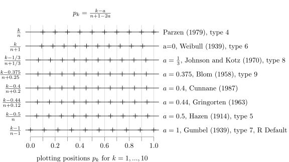

----------------------

This post is not yet finished. I post it here to get some input about how to improve it and round it up. Maybe there are some essential flaws in my thinking. Therefore I'm keen to hear from you what you think about the topic and whether my arguments are justified!

----------------------


There are many different ways to estimate the quantiles of an empirical distribution. R knows 9 different types (see help page of ```quantile()```). It is clear that for high $$n$$ the differences in these approaches become negligible. It is the low $$n$$ where they produce different estimations. All these methods where intruduced to optimize quantile estimation for sparse data sets, to get better estimations for the low $$n$$. There is a lof of mathematical argumentation and justification out there for each of these methods, but apparently non of them is convincing enough, that the whole statistical community would stick to that method. Every statistic software has different defaults and some have no alternative methods to choose from like R has.

Not accepting this state of uncertainty I wanted to find an answer that I can understand and comprehend, to the question "**which quantile estimation is best?**".

My first Idea was to find a way to visualize the differences between these nine types. So I thought about, how I could create input data for the ```quantile()``` function, that follows perferctly a theoretical distribution function---but is also discrete, featuring a limited $$n$$. 


What I came up with is illustrated in <a href="#theoretical-and-discrete-distribution-for-different-n">figure 1</a>. I devided the probability range into equal lengths. For $$n=3$$ for example I devided it into three sections, for $$n=10$$ into 10 sections (visualized in the graph with alternating gray and white areas). Each section will be represented by a probability located in the middle of the section. This is represented in the graph with the horizontal dotted lines. Where the horizontal lines cut the theoretical distribution funtion (in this case a normal distribution) defines the value of the quantile corresponding to this probability. The quantiles can be read from the x-axis. Notice how the horizontal lines (the probabilities) are equidistant. The vertical lines (the quantiles) follow the distribution function which causes the outermost quantiles beeing further apart than the central ones.


<a name="theoretical-and-discrete-distribution-for-different-n"></a>

This method generates discrete values that behave like a perfect representation of the theoretical distribution function. In contrast to using a random generator, which gives us values that jump around the theoretical distribution function  (like is illustrated in the $$n=30$$ plot above) and approach the theoretical distribution only for very high $$n$$.


Mathematically this process is done like this: You define your $$n$$. For example $$n=10$$. Now you calculate the probabilities:

$$p_k = \frac{1}{2n} + \frac{k-1}{n}$$

The last value is 

$$p_n = \frac{1}{2n} + \frac{n-1}{n}= 1-\frac{1}{2n}$$

In R this can be implemented like this:


n <- 10
k <- 1:n
(p_k <- 1/(2*n) + (k-1)/n)




##  [1] 0.05 0.15 0.25 0.35 0.45 0.55 0.65 0.75 0.85 0.95


Or like this:



(p_k <- seq(1/(n*2), 1-1/(n*2), length.out=n))




##  [1] 0.05 0.15 0.25 0.35 0.45 0.55 0.65 0.75 0.85 0.95


We then have to convert the probabilities $$p_k$$ to the quantiles. For example with a normal distribution:


qnorm(p_k)




##  [1] -1.6448536 -1.0364334 -0.6744898 -0.3853205 -0.1256613  0.1256613
##  [7]  0.3853205  0.6744898  1.0364334  1.6448536



With this method I was able to produce the following graph. 
It shows the result of the `quantile()` function executed with different `type` argument. Estimated are the quantiles  corresponding to probabilities $$p_k = 0.125, 0.25, 0.375, 0.5, 0.625, 0.75$$ and $$0.875$$. You can see that the results differ for different $$n$$ (varied on the x-axis).

For very high $$n$$ all these estimations end up where the theoretical quantiles are located (compare secondary axis on the right). The difference is how fast they approach this value for low $$n$$.


First the very obvious, which is clear already without any calculation or plotting: For a distribution consisting only of a single value no real "distribution" can be calculated. For the case $$n=1$$ all quantiles are $$0$$. 

For $$n=2$$ the inner $$50\%$$ of the quantiles can already be calculated quite accurate by some methods. The spread of the outer quantiles is underestimated by all methods for $$n=2$$. 

For $$n\approx4$$ to $$20$$ some methods overestimate the spread of the outer quantiles. Others (type 3 and 4) estimate all quantiles lower in value than they actually are. Type 7 is special in that it never overestimates the spread of the quantiles, only underestimates.

The extreme low and upmost quantiles are apparently hardest to estimate. You need very high $$n$$ to estimate them within reasonable precision.

In the region $$n<100$$ the different types show different deviations from the theoretical quantiles. There are the methods of type 1 to 3 that are made for easy calculation in pre-computer days which jump up and down with every change in $$n$$. Type 4 estimates all quantiles lower than they actually are for low $$n$$, resulting in a rising of all estimated quantiles with rising $$n$$. Type 7, which is the R default, underestimates the spread of all quantiles in the lower $$n$$. Then there are the methods 5, 6, 8 and 9 which for very low $$n$$ come to a good estimation of the inner quantiles. But they all overshoot and overestimate the spread of the outer quantiles, especially type 6. This overshoot shifts to the outer quantiles with rising $$n$$, while simultaniously the overestimation settles for the inner quantiles.

Type 5 seems to have the best performance of all methods, since it comes to a fairly good estimation of the inner $$50\%$$ of quantiles for $$n=2$$ and for the inner $$75\%$$ for $$n=4$$. Both estimations don't change much if $$n$$ is further increased (like is the case for types 8, 9 and especially 6).

## A valid approach for evaluating the performance of the different quantile estimations?

Having this informative graphic the question remains, whether the chosen discrete distribution is in any way capable of representing a theretical distribution function and therefore beeing able to evalueate the performance of the different quantile calculation types.

To justify my approach I couldn't come up with some fancy math, so I threw in bare processing power and calculated the quantiles of repeated generation of random numbers. The function ```rnorm()``` in R for example gives random numbers that stick to the probabilities of a normal function. To estimate the quantiles from a limited $$n$$ of these random numbers should lead to random deviation from the theoretical quantiles, but the mean of a high repetition of this process should equal out the statistical errors and hence result in the theoretical quantiles. -- Unless there is an inherent systematical error in the approach used to estimate the quantiles.

So I created the next figure starting with a single estimation with 10 random numbers, repeating the process up to a 1,000 times and calculating the cumulative mean of the repeated estimation with ever new random seeds. Since the quantiles of most types apparently don't change much after 100 repetitions I concluded that the mean of 1,000 repetitions should show where this approach would end with an infinite repetition of the process. And: apparently the error is not statistical, but systematic. For most methods the cumulative means don't end up at the theoretical quantiles (secondary axis on the right) drawn in gray.


The systematics of the deviation can be seen in the next figure in red circles. And: Bingo!, they match the deviations from my first thoght experiment with the discrete theoretical distributions (black circles) quite well. This approves, that this approach was a reasonable way to investigate the systematics behind the different quantile estimation methods.

Every approach shows different deviations. Type 4 shows the already discussed overall underestimation of the quantiles, but also shows that the outer quantiles show even greater deviation than the inner. Type 7 shows overestimation of the lower quantiles and underestimation of the higher quantiles, resulting in a underestimation of the spread of the distribution. For type 5, 6, 8 and 9 it is the other way around. For $$n=10$$ they overestimate the spread especially of the outermost quantiles. This effect is strongest for type 6 and the weakest for type 5 which again seems to be the most reliable way to estimate the quantiles. Type 1 to 3 show jumping deviations. Here the deviations (with our first graph in mind) should be entirely different for $$n=11$$. For all methods the deviations should disappear with high $$n$$, but some methods, show already quite accurate estimation of the inner quantiles. Type 8 and 9 show high deviations only for the $$0.125$$ and $$0.875$$ quantiles and type 5 seems to be accurate even for these quantiles.


As further tests show (next graphics), the deviations of the random repetition test with other $$n$$ again match the deviation that our first graphic (with the discrete theretical distribution) shows. For $$n=20$$ the deviations for the $$0.125$$ and $$0.875$$ quantiles for types 8 and 9 disappear as could be estimated from the curve of the discrete theoretical distributions. For $$n=100$$ all types get to quite good estimations, the systematic errors seem to become unsignificant. This is also apparent, since the running mean of the repeated calculations doesn't change much after only $$10$$ repetitions.

For $$n=20$$ the deviations of type 2 are quite low. But this is just, because the zig-zag, apparent in the discrete distribution plot, coincidal is right at the theoretical quantile. $$n=21$$ shows again much higher deviation, so the rise of $$n$$ not necessarily results in a better estimation for the types 1 to 3. This makes them kind of unreliable: If only one additional value is taken into the calculation the quantile estimation could be significantly different.


Finally there is yet another method that sort of calculates quantiles. The box of a boxplot marks the 0.25, 0.5 and 0.75 quantiles. But the calculation is yet again different to all the other methods. Using again our above established method of visualizing the calculated quantiles with a discrete normal distribution, we can see that the upper and lower hinge jump up and down with every data point we add to the distribution. From the help page of `boxplot.stats` we can read that "The hinges equal the quartiles for odd n" and differ for even n. The wiggling is neglectable above around $$n=20$$. The upper and lower whisker spread more and more until they reach their set maximum of 1.5 times the inter quantile range (IQR) from the hinges.  After the whiskers first reach their maximum, they jump down and up again several times.


# Conclusion

... still to be written ...


----------------------------

# Appendix


[Since 2004](https://stat.ethz.ch/pipermail/r-announce/2004/000427.html) R has implemented 9 types of quantile estimation recommended by <a id='cite-Hyndman_1996'></a><a href='#bib-Hyndman_1996'>Hyndman and Fan (1996)</a>:

> $$Q_i(p)= (1-\gamma) x_j ++ \gamma x_{j+1}$$
>
> where $$1 ≤ i ≤ 9$$, $$(j-m)/n ≤ p < (j-m+1)/n$$, $$x_j$$ is the $$j$$th order statistic, $$n$$ is the sample size, the value of $$\gamma$$ is a function of $$j = floor(np + m)$$ and $$g = np + m - j$$, and $$m$$ is a constant determined by the sample quantile type.
>
> ### Discontinuous sample quantile types 1, 2, and 3
>
> For types 1, 2 and 3, $$Q_i(p)$$ is a discontinuous function of $$p$$, with $$m = 0$$ when $$i = 1$$ and $$i = 2$$, and $$m = -1/2$$ when $$i = 3$$.
>
> Type&nbsp;1: | Inverse of empirical distribution function. $$\gamma = 0$$ if $$g = 0$$, and $$1$$ otherwise.
> Type&nbsp;2: | Similar to type 1 but with averaging at discontinuities. $$\gamma = 0.5$$ if $$g = 0$$, and $$1$$ otherwise.
> Type&nbsp;3: | SAS definition: nearest even order statistic. $$\gamma = 0$$ if $$g = 0$$ and $$j$$ is even, and $$1$$ otherwise.
>
> ### Continuous sample quantile types 4 through 9
> 
> For types 4 through 9, $$Q_i(p)$$ is a continuous function of $$p$$, with $$\gamma = g$$ and $$m$$ given below. The sample quantiles can be obtained equivalently by linear interpolation between the points $$(p_k,x_k)$$ where $$x_k$$ is the $$k$$th order statistic. Specific expressions for $$p_k$$ are given below.
>
> Type&nbsp;4: | <a id='cite-Parzen_1979'></a><a href='#bib-Parzen_1979'>Parzen (1979)</a> | $$m = 0$$ | $$p_k = \frac{k}{n}$$ | That is, linear interpolation of the empirical cdf.
> Type&nbsp;5: | <a id='cite-hazen1914storage'></a><a href='#bib-hazen1914storage'>Hazen (1914)</a> | $$m = \frac{1}{2}$$ | $$p_k = \frac{k - 0.5}{n}$$ | That is a piecewise linear function where the knots are the values midway through the steps of the empirical cdf. This is popular amongst hydrologists.
> Type&nbsp;6: | <a id='cite-weibull1939phenomenon'></a><a href='#bib-weibull1939phenomenon'>Weibull (1939)</a>, <a id='cite-gumbel1939probabilite'></a><a href='#bib-gumbel1939probabilite'>Gumbel (1939)</a> | $$m = p$$ | $$p_k = \frac{k}{n + 1}$$ | Thus $$p_k = E[F(x[k])]$$. This is used by Minitab and by SPSS.
> Type&nbsp;7: | <a href='#bib-gumbel1939probabilite'>Gumbel (1939)</a> | $$m = 1-p$$ |  $$p_k = \frac{k - 1}{n - 1}$$ | In this case, $$p_k = mode[F(x[k])]$$. This is used by S and by R < 2.0.0.
> Type&nbsp;8: | <a id='cite-johnson1970'></a><a href='#bib-johnson1970'>Johnson and Kotz (1970)</a> |$$m = \frac{p+1}{3}$$ | $$p_k = \frac{k - 1/3}{n + 1/3}$$ | Then $$p_k \approx median[F(x[k])]$$. The resulting quantile estimates are approximately median-unbiased regardless of the distribution of $$x$$.
> Type&nbsp;9: | <a id='cite-blom1958'></a><a href='#bib-blom1958'>Blom (1958)</a> | $$m = \frac{p}{4} + \frac{3}{8}$$ | $$p_k = \frac{k - 3/8}{n + 1/4}$$ | The resulting quantile estimates are approximately unbiased for the expected order statistics if $$x$$ is normally distributed.
>
> Further details are provided in <a href='#bib-Hyndman_1996'>Hyndman and Fan (1996)</a> who recommended type 8. The default method is type 7, as used by S and by R < 2.0.0.

<a name="plotting-positions"></a>




--------------------

# References

<p><a id='bib-blom1958'></a><a href="#cite-blom1958">[1]</a><cite>
G. Blom.
<em>Statistical estimates and transformed beta-variables</em>.
New York: John Wiley, 1958.</cite></p>

<p><a id='bib-gumbel1939probabilite'></a><a href="#cite-gumbel1939probabilite">[2]</a><cite>
E. Gumbel.
&ldquo;La probabilite des hypotheses&rdquo;.
In: <em>Comptes Rendus de l’Académie des Sciences (Paris)</em> 209 (1939), pp. 645&ndash;647.</cite></p>

<p><a id='bib-hazen1914storage'></a><a href="#cite-hazen1914storage">[3]</a><cite>
A. Hazen.
&ldquo;Storage to be provided in impounding municipal water supply&rdquo;.
In: <em>Transactions of the American Society of Civil Engineers</em> 77.1 (1914), pp. 1539&ndash;1640.</cite></p>

<p><a id='bib-Hyndman_1996'></a><a href="#cite-Hyndman_1996">[4]</a><cite>
R. J. Hyndman and Y. Fan.
&ldquo;Sample Quantiles in Statistical Packages&rdquo;.
In: <em>The American Statistician</em> 50.4 (Nov. 1996), p. 361.
DOI: <a href="http://dx.doi.org/10.2307/2684934">10.2307/2684934</a>.
URL: <a href="http://dx.doi.org/10.2307/2684934">http://dx.doi.org/10.2307/2684934</a>.</cite></p>

<p><a id='bib-johnson1970'></a><a href="#cite-johnson1970">[5]</a><cite>
N. L. Johnson and S. Kotz.
<em>Discrete Distributions: Continuous Univariate Distributions-1</em>.
Houghton Mifflin, 1970.</cite></p>

<p><a id='bib-Parzen_1979'></a><a href="#cite-Parzen_1979">[6]</a><cite>
E. Parzen.
&ldquo;Nonparametric Statistical Data Modeling&rdquo;.
In: <em>Journal of the American Statistical Association</em> 74.365 (1979), pp. 105&ndash;121.
DOI: <a href="http://dx.doi.org/10.1080/01621459.1979.10481621">10.1080/01621459.1979.10481621</a>.
URL: <a href="http://dx.doi.org/10.1080/01621459.1979.10481621">http://dx.doi.org/10.1080/01621459.1979.10481621</a>.</cite></p>

<p><a id='bib-weibull1939phenomenon'></a><a href="#cite-weibull1939phenomenon">[7]</a><cite>
W. Weibull.
<em>The Phenomenon of Rupture in Solids</em>.
Vol. 153.
Ingeniörs Vetenskaps Akademien Handlingar 17.
Generalstabena Litografiska Anstalts Forlag, 1939.</cite></p>


