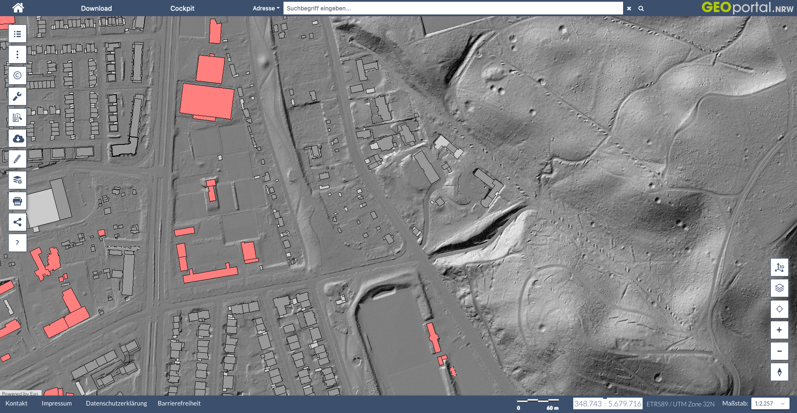

* auto-gen TOC:
{:toc}


If you work with shapefiles a common practice is to use data provided by environment agencies or other official sources. Often you have to download complete shapefiles with national or county extent. A common theme is that you have to either download huge files and crop out the area of your interest or download a bunch of files that you have to piece together to get to the coverage you need. 

The [**Web Feature Service (WFS)**](http://www.opengeospatial.org/standards/wfs){:target="_blank"} standardized by the Open Geospatial Consortium (OGC) works like a database query for shapefiles. It allows you to download precisely what you need and you can limit the results to your study area.


We will be working with data from the German state Nordrhein-Westfalen (NRW). They provide a Web Feature Service for all their basic geo-data. This includes shapefiles of counties, streets, rivers, buildings etc. All those services can be previewed by going to [geoportal.nrw](https://www.geoportal.nrw/){:target="_blank"}. More can be read in their [manual about wfs](https://www.bezreg-koeln.nrw.de/system/files/media/document/file/geobasis_webdienste_anleitung_wfs.pdf){:target="_blank"} (German text).



# the wsf query

Let's start by loading all the packages that we need for this tutorial:



library(tmap)      # for plotting maps
library(stringr)   # for string manipulations
library(sf)        # for working with shapefiles
library(plyr)      # for apply functions
library(dplyr)     # for the pipe operator
library(osmdata)   # for getting locations of landmarks
library(units)     # used by osmdata


We will start by downloading the [buildings data product](https://www.bezreg-koeln.nrw.de/geobasis-nrw/produkte-und-dienste/liegenschaftskataster/liegenschaftskataster-zentraler-5
){:target="_blank"}.

The base url for this service is `https://www.wfs.nrw.de/geobasis/wfs_nw_alkis_vereinfacht`. We will add the following options to the query:

- `Service=WFS` tells the server that we want to use the Web Feature Service
- `REQUEST=GetFeature` is the request type
- `VERSION=2.0.0` tells which version of the service we want to use
- `TYPENAMES=ave:GebaeudeBauwerk` or `TYPENAMES=ave:Flurstueck` defines the feature type we want to download.
- `COUNT=10000` limits the query and prevents downloads of huge data files. Omit this if you want to download all data.
- `BBOX=356037,5644775,357053,5645791,urn:ogc:def:crs:EPSG::25832` defines the bounding box of the data download. This includes information about the coordinate reference system (crs) in which these coordinates are stated.

# get a bounding box

To get a bounding box we will use the handy `getbb()` function of the [osmdata package](https://docs.ropensci.org/osmdata/){:target="_blank"}. We can give this function a name of a landmark or area and it queries the openstreetmap database and returns a polygon. We than calculate the center of that polygon and add a buffer of 500m around it.



# define coordinate systems that we will be using
UTM_crs <- st_crs(25832)
WGS_crs <- st_crs(4326)

# get polygon of the building "Kölner Dom" which is the central cathedral in Cologne, Germany.
Dom <- getbb("Kölner Dom", featuretype="building", format_out = "sf_polygon", limit=1)

# calculate the center of the polygon
Dom_location <- Dom %>% st_centroid()

# add a buffer of 500m around the center
Dom_location_500m_buffer <- Dom_location %>%
  st_buffer(dist = set_units(500, "m")) 

# calculate bounding box of the buffered zone in the original coordinates
Dom_location_500m_buffer %>% st_bbox()




##      xmin      ymin      xmax      ymax 
##  6.950857 50.936741  6.965317 50.945869




# transform to UTM coordinates as required by the wfs query
Dom_bbox_UTM <- Dom_location_500m_buffer %>%
  st_transform(UTM_crs) %>%
  st_bbox() %>%
  round()

Dom_bbox_UTM




##    xmin    ymin    xmax    ymax 
##  356038 5644775  357054 5645792




# convert to a text line that we can use later
Dom_bbox_UTM_txt <- Dom_bbox_UTM %>% paste(collapse = ",")

Dom_bbox_UTM_txt




## [1] "356038,5644775,357054,5645792"


# download wfs data

We will use the `str_glue()` function of the [stringr package](https://stringr.tidyverse.org){:target="_blank"}. This allows us to insert the coordinates into the http request by using curly braces notation like for example `{insert_here}`. We pass the generated url directly to [`read_sf()`](https://r-spatial.github.io/sf/reference/st_read.html) function of the [sf package](https://r-spatial.github.io/sf/index.html){:target="_blank"}.



buildings <- read_sf(str_glue("https://www.wfs.nrw.de/geobasis/wfs_nw_alkis_vereinfacht?Service=WFS&REQUEST=GetFeature&VERSION=2.0.0&TYPENAMES=ave:GebaeudeBauwerk&COUNT=10000&BBOX={Dom_bbox_UTM_txt},urn:ogc:def:crs:EPSG::25832"))

property_lines <- read_sf(str_glue("https://www.wfs.nrw.de/geobasis/wfs_nw_alkis_vereinfacht?Service=WFS&REQUEST=GetFeature&VERSION=2.0.0&TYPENAMES=ave:Flurstueck&COUNT=10000&BBOX={Dom_bbox_UTM_txt},urn:ogc:def:crs:EPSG::25832"))


# plot data

With the [tmap package](https://r-tmap.github.io/tmap/){:target="_blank"} we can produce a nice plot of this feature set:



tmap_mode("plot")

tm_shape(property_lines) +
  tm_graticules() +
  tm_borders() +
  tm_shape(buildings) +
  tm_fill(col="red")



# get capabilities

If you discover a new wfs service it is often not clear how it works. Every wfs service has a builtin function to describe it's capabilities, the `GetCapabilities` request. This returns an xml file that we can process in R in the following way:



library(xml2)

capabilities <- read_xml("https://www.wfs.nrw.de/geobasis/wfs_nw_alkis_vereinfacht?VERSION=2.0.0&SERVICE=WFS&REQUEST=GetCapabilities") 




#remotes::install_git("https://git.rud.is/hrbrmstr/htmltidy.git")
library(htmltidy)

xml_view(capabilities)


<style>
pre.highlight{
  max-height: 400px;
}
</style>

```xml
<?xml version="1.0" encoding="utf-8"?>
<wfs:WFS_Capabilities xmlns:ows="http://www.opengis.net/ows/1.1" xmlns:xsd="http://www.w3.org/2001/XMLSchema" xmlns:wfs="http://www.opengis.net/wfs/2.0" xmlns:gml="http://www.opengis.net/gml/3.2" xmlns:fes="http://www.opengis.net/fes/2.0" xmlns:xlink="http://www.w3.org/1999/xlink" xmlns:xsi="http://www.w3.org/2001/XMLSchema-instance" xmlns:inspire_common="http://inspire.ec.europa.eu/schemas/common/1.0" xmlns:inspire_dls="http://inspire.ec.europa.eu/schemas/inspire_dls/1.0" xsi:schemaLocation="http://www.opengis.net/wfs/2.0 http://www.wfs.nrw.de/aaa-suite/schema/ogc/wfs/2.0/wfs.xsd http://inspire.ec.europa.eu/schemas/inspire_dls/1.0 http://www.wfs.nrw.de/aaa-suite/schema/inspire/inspire_dls/1.0/inspire_dls.xsd" version="2.0.0">
<ows:ServiceIdentification>
<ows:Title>INSPIRE-WFS NW Verkehrsnetze ATKIS Basis-DLM</ows:Title>
<ows:Abstract>Dieser Dienst stellt für das INSPIRE-Thema Verkehrsnetze aus ATKIS Basis-DLM umgesetzte Daten bereit.</ows:Abstract>
<ows:Keywords>
<ows:Keyword>Geobasisdaten</ows:Keyword>
<ows:Keyword>AdV</ows:Keyword>
<ows:Keyword>WFS</ows:Keyword>
<ows:Keyword>AdV-OWS-Basisprofil</ows:Keyword>
<ows:Keyword>AdV-WFS-Profil 2.0.0</ows:Keyword>
<ows:Keyword>AdV-INSPIRE-Produktspezifikation (Version 1.0.0)</ows:Keyword>
<ows:Keyword>NW</ows:Keyword>
<ows:Keyword>Nordrhein-Westfalen</ows:Keyword>
<ows:Keyword>inspireidentifiziert</ows:Keyword>
<ows:Keyword>infoFeatureAccessService</ows:Keyword>
<ows:Keyword>INSPIRE-WFS_NW_Verkehrsnetze_ATKIS_Basis-DLM</ows:Keyword>
<ows:Keyword>ATKIS</ows:Keyword>
<ows:Keyword>Basis-DLM</ows:Keyword>
<ows:Keyword>Amtliches Topographisch-Kartographisches Informationssystem</ows:Keyword>
<ows:Keyword>Digitales Basis-Landschaftsmodell</ows:Keyword>
<ows:Keyword>Verkehrsnetze</ows:Keyword>
<ows:Keyword>Transport Networks</ows:Keyword>
</ows:Keywords>
<ows:ServiceType>WFS</ows:ServiceType>
<ows:ServiceTypeVersion>2.0.0</ows:ServiceTypeVersion>
<ows:Fees>Nutzungsbedingungen: Es gelten die durch den IT-Planungsrat im Datenportal f&#252;r Deutschland (GovData) ver&#246;ffentlichten einheitlichen Lizenzbedingungen „Datenlizenz Deutschland - Zero“  (https://www.govdata.de/dl-de/zero-2-0). Jede Nutzung ist ohne Einschr&#228;nkungen oder Bedingungen zul&#228;ssig. Eine Haftung f&#252;r die zur Verf&#252;gung gestellten Daten und Dienste wird ausgeschlossen. Dies gilt insbesondere f&#252;r deren Aktualit&#228;t, Richtigkeit, Verf&#252;gbarkeit, Qualität und Vollst&#228;ndigkeit sowie die Kompatibilit&#228;t und Interoperabilit&#228;t mit den Systemen des Nutzers. Vom Haftungsausschluss ausgenommen sind gesetzliche Schadensersatzansprüche f&#252;r eine Verletzung des Lebens, des K&#246;rpers und der Gesundheit sowie die gesetzliche Haftung f&#252;r sonstige Sch&#228;den, soweit diese auf einer vors&#228;tzlichen oder grob fahrl&#228;ssigen Pflichtverletzung beruhen.</ows:Fees>
<ows:AccessConstraints>NONE</ows:AccessConstraints>
</ows:ServiceIdentification>
<ows:ServiceProvider>
<ows:ProviderName>Geobasis NRW</ows:ProviderName>
<ows:ProviderSite/>
<ows:ServiceContact>
<ows:IndividualName>N.N.</ows:IndividualName>
<ows:PositionName>Geobasis Hotline</ows:PositionName>
<ows:ContactInfo>
<ows:Phone>
<ows:Voice>+49 (0) 221-147-4994</ows:Voice>
<ows:Facsimile>+49 (0) 221-147-4874</ows:Facsimile>
</ows:Phone>
<ows:Address>
<ows:DeliveryPoint>Muffendorfer Str. 19-21</ows:DeliveryPoint>
<ows:City>Bonn</ows:City>
<ows:AdministrativeArea>Nordrhein-Westfalen</ows:AdministrativeArea>
<ows:PostalCode>53177</ows:PostalCode>
<ows:Country>Deutschland</ows:Country>
<ows:ElectronicMailAddress>geobasis@brk.nrw.de</ows:ElectronicMailAddress>
</ows:Address>
<ows:OnlineResource xlink:href="http://www.brk.nrw.de/brk_internet/geobasis/index.html"/>
<ows:HoursOfService>09:00 - 15:00 Mon - Fri</ows:HoursOfService>
</ows:ContactInfo>
<ows:Role>pointOfContact</ows:Role>
</ows:ServiceContact>
</ows:ServiceProvider>
<ows:OperationsMetadata>
<ows:Operation name="GetCapabilities">
<ows:DCP>
<ows:HTTP>
<ows:Get xlink:href="https://www.wfs.nrw.de/geobasis/wfs_nw_inspire-verkehrsnetze_atkis-basis-dlm?"/>
<ows:Post xlink:href="https://www.wfs.nrw.de/geobasis/wfs_nw_inspire-verkehrsnetze_atkis-basis-dlm"/>
</ows:HTTP>
</ows:DCP>
<ows:Parameter name="AcceptVersions">
<ows:AllowedValues>
<ows:Value>2.0.0</ows:Value>
</ows:AllowedValues>
</ows:Parameter>
<ows:Parameter name="AcceptFormats">
<ows:AllowedValues>
<ows:Value>text/xml</ows:Value>
</ows:AllowedValues>
</ows:Parameter>
<ows:Parameter name="Sections">
<ows:AllowedValues>
<ows:Value>ServiceIdentification</ows:Value>
<ows:Value>ServiceProvider</ows:Value>
<ows:Value>OperationsMetadata</ows:Value>
<ows:Value>FeatureTypeList</ows:Value>
<ows:Value>Filter_Capabilities</ows:Value>
</ows:AllowedValues>
</ows:Parameter>
</ows:Operation>
<ows:Operation name="DescribeFeatureType">
<ows:DCP>
<ows:HTTP>
<ows:Get xlink:href="https://www.wfs.nrw.de/geobasis/wfs_nw_inspire-verkehrsnetze_atkis-basis-dlm?"/>
<ows:Post xlink:href="https://www.wfs.nrw.de/geobasis/wfs_nw_inspire-verkehrsnetze_atkis-basis-dlm"/>
</ows:HTTP>
</ows:DCP>
<ows:Parameter name="outputFormat">
<ows:AllowedValues>
<ows:Value>text/xml; subtype=gml/3.2.1</ows:Value>
<ows:Value>application/gml+xml; version=3.2</ows:Value>
</ows:AllowedValues>
</ows:Parameter>
</ows:Operation>
<ows:Operation name="GetFeature">
<ows:DCP>
<ows:HTTP>
<ows:Get xlink:href="https://www.wfs.nrw.de/geobasis/wfs_nw_inspire-verkehrsnetze_atkis-basis-dlm?"/>
<ows:Post xlink:href="https://www.wfs.nrw.de/geobasis/wfs_nw_inspire-verkehrsnetze_atkis-basis-dlm"/>
</ows:HTTP>
</ows:DCP>
<ows:Parameter name="resolve">
<ows:AllowedValues>
<ows:Value>none</ows:Value>
<ows:Value>local</ows:Value>
</ows:AllowedValues>
</ows:Parameter>
<ows:Parameter name="resultType">
<ows:AllowedValues>
<ows:Value>results</ows:Value>
<ows:Value>hits</ows:Value>
</ows:AllowedValues>
</ows:Parameter>
<ows:Parameter name="outputFormat">
<ows:AllowedValues>
<ows:Value>text/xml; subtype=gml/3.2.1</ows:Value>
<ows:Value>application/gml+xml; version=3.2</ows:Value>
</ows:AllowedValues>
</ows:Parameter>
</ows:Operation>
<ows:Operation name="GetPropertyValue">
<ows:DCP>
<ows:HTTP>
<ows:Get xlink:href="https://www.wfs.nrw.de/geobasis/wfs_nw_inspire-verkehrsnetze_atkis-basis-dlm?"/>
<ows:Post xlink:href="https://www.wfs.nrw.de/geobasis/wfs_nw_inspire-verkehrsnetze_atkis-basis-dlm"/>
</ows:HTTP>
</ows:DCP>
<ows:Parameter name="resolve">
<ows:AllowedValues>
<ows:Value>none</ows:Value>
<ows:Value>local</ows:Value>
</ows:AllowedValues>
</ows:Parameter>
<ows:Parameter name="outputFormat">
<ows:AllowedValues>
<ows:Value>text/xml; subtype=gml/3.2.1</ows:Value>
<ows:Value>application/gml+xml; version=3.2</ows:Value>
</ows:AllowedValues>
</ows:Parameter>
</ows:Operation>
<ows:Operation name="ListStoredQueries">
<ows:DCP>
<ows:HTTP>
<ows:Get xlink:href="https://www.wfs.nrw.de/geobasis/wfs_nw_inspire-verkehrsnetze_atkis-basis-dlm?"/>
<ows:Post xlink:href="https://www.wfs.nrw.de/geobasis/wfs_nw_inspire-verkehrsnetze_atkis-basis-dlm"/>
</ows:HTTP>
</ows:DCP>
</ows:Operation>
<ows:Operation name="DescribeStoredQueries">
<ows:DCP>
<ows:HTTP>
<ows:Get xlink:href="https://www.wfs.nrw.de/geobasis/wfs_nw_inspire-verkehrsnetze_atkis-basis-dlm?"/>
<ows:Post xlink:href="https://www.wfs.nrw.de/geobasis/wfs_nw_inspire-verkehrsnetze_atkis-basis-dlm"/>
</ows:HTTP>
</ows:DCP>
</ows:Operation>
<ows:Operation name="CreateStoredQuery">
<ows:DCP>
<ows:HTTP>
<ows:Get xlink:href="https://www.wfs.nrw.de/geobasis/wfs_nw_inspire-verkehrsnetze_atkis-basis-dlm?"/>
<ows:Post xlink:href="https://www.wfs.nrw.de/geobasis/wfs_nw_inspire-verkehrsnetze_atkis-basis-dlm"/>
</ows:HTTP>
</ows:DCP>
<ows:Parameter name="language">
<ows:AllowedValues>
<ows:Value>urn:ogc:def:queryLanguage:OGC-WFS::WFSQueryExpression</ows:Value>
</ows:AllowedValues>
</ows:Parameter>
</ows:Operation>
<ows:Operation name="DropStoredQuery">
<ows:DCP>
<ows:HTTP>
<ows:Get xlink:href="https://www.wfs.nrw.de/geobasis/wfs_nw_inspire-verkehrsnetze_atkis-basis-dlm?"/>
<ows:Post xlink:href="https://www.wfs.nrw.de/geobasis/wfs_nw_inspire-verkehrsnetze_atkis-basis-dlm"/>
</ows:HTTP>
</ows:DCP>
</ows:Operation>
<ows:Parameter name="version">
<ows:AllowedValues>
<ows:Value>2.0.0</ows:Value>
</ows:AllowedValues>
</ows:Parameter>
<ows:Parameter name="srsName">
<ows:AllowedValues>
<ows:Value>urn:ogc:def:crs:EPSG::25832</ows:Value>
<ows:Value>urn:ogc:def:crs:EPSG::25833</ows:Value>
<ows:Value>urn:ogc:def:crs:EPSG::3034</ows:Value>
<ows:Value>urn:ogc:def:crs:EPSG::3857</ows:Value>
<ows:Value>urn:ogc:def:crs:EPSG::4258</ows:Value>
<ows:Value>urn:ogc:def:crs:EPSG::4326</ows:Value>
<ows:Value>urn:ogc:def:crs:EPSG::900913</ows:Value>
<ows:Value>http://www.opengis.net/def/crs/EPSG/0/25832</ows:Value>
<ows:Value>http://www.opengis.net/def/crs/EPSG/0/25833</ows:Value>
<ows:Value>http://www.opengis.net/def/crs/EPSG/0/3034</ows:Value>
<ows:Value>http://www.opengis.net/def/crs/EPSG/0/3857</ows:Value>
<ows:Value>http://www.opengis.net/def/crs/EPSG/0/4258</ows:Value>
<ows:Value>http://www.opengis.net/def/crs/EPSG/0/4326</ows:Value>
<ows:Value>http://www.opengis.net/def/crs/EPSG/0/900913</ows:Value>
</ows:AllowedValues>
</ows:Parameter>
<ows:Constraint name="ImplementsSimpleWFS">
<ows:NoValues/>
<ows:DefaultValue>TRUE</ows:DefaultValue>
</ows:Constraint>
<ows:Constraint name="ImplementsBasicWFS">
<ows:NoValues/>
<ows:DefaultValue>TRUE</ows:DefaultValue>
</ows:Constraint>
<ows:Constraint name="ImplementsTransactionalWFS">
<ows:NoValues/>
<ows:DefaultValue>FALSE</ows:DefaultValue>
</ows:Constraint>
<ows:Constraint name="ImplementsLockingWFS">
<ows:NoValues/>
<ows:DefaultValue>FALSE</ows:DefaultValue>
</ows:Constraint>
<ows:Constraint name="KVPEncoding">
<ows:NoValues/>
<ows:DefaultValue>TRUE</ows:DefaultValue>
</ows:Constraint>
<ows:Constraint name="XMLEncoding">
<ows:NoValues/>
<ows:DefaultValue>TRUE</ows:DefaultValue>
</ows:Constraint>
<ows:Constraint name="SOAPEncoding">
<ows:NoValues/>
<ows:DefaultValue>FALSE</ows:DefaultValue>
</ows:Constraint>
<ows:Constraint name="ImplementsInheritance">
<ows:NoValues/>
<ows:DefaultValue>TRUE</ows:DefaultValue>
</ows:Constraint>
<ows:Constraint name="ImplementsRemoteResolve">
<ows:NoValues/>
<ows:DefaultValue>FALSE</ows:DefaultValue>
</ows:Constraint>
<ows:Constraint name="ImplementsResultPaging">
<ows:NoValues/>
<ows:DefaultValue>FALSE</ows:DefaultValue>
</ows:Constraint>
<ows:Constraint name="ImplementsStandardJoins">
<ows:NoValues/>
<ows:DefaultValue>FALSE</ows:DefaultValue>
</ows:Constraint>
<ows:Constraint name="ImplementsSpatialJoins">
<ows:NoValues/>
<ows:DefaultValue>FALSE</ows:DefaultValue>
</ows:Constraint>
<ows:Constraint name="ImplementsTemporalJoins">
<ows:NoValues/>
<ows:DefaultValue>FALSE</ows:DefaultValue>
</ows:Constraint>
<ows:Constraint name="ImplementsFeatureVersioning">
<ows:NoValues/>
<ows:DefaultValue>FALSE</ows:DefaultValue>
</ows:Constraint>
<ows:Constraint name="ManageStoredQueries">
<ows:NoValues/>
<ows:DefaultValue>TRUE</ows:DefaultValue>
</ows:Constraint>
<ows:Constraint name="AutomaticDataLocking">
<ows:NoValues/>
<ows:DefaultValue>TRUE</ows:DefaultValue>
</ows:Constraint>
<ows:Constraint name="PreservesSiblingOrder">
<ows:NoValues/>
<ows:DefaultValue>TRUE</ows:DefaultValue>
</ows:Constraint>
<ows:Constraint name="CountDefault">
<ows:NoValues/>
<ows:DefaultValue>100000</ows:DefaultValue>
</ows:Constraint>
<ows:Constraint name="ResolveLocalScope">
<ows:NoValues/>
<ows:DefaultValue>*</ows:DefaultValue>
</ows:Constraint>
<ows:Constraint name="QueryExpressions">
<ows:AllowedValues>
<ows:Value>wfs:Query</ows:Value>
<ows:Value>wfs:StoredQuery</ows:Value>
</ows:AllowedValues>
</ows:Constraint>
<ows:ExtendedCapabilities>
<inspire_dls:ExtendedCapabilities>
<inspire_common:MetadataUrl>
<inspire_common:URL>https://apps.geoportal.nrw.de/csw/service?Service=CSW&#038;Request=GetRecordById&#038;Version=2.0.2&#038;outputSchema=http://www.isotc211.org/2005/gmd&#038;elementSetName=full&#038;id=b5419353-8ceb-4a0e-8514-fa19f3e5babd</inspire_common:URL>
</inspire_common:MetadataUrl>
<inspire_common:SupportedLanguages>
<inspire_common:DefaultLanguage>
<inspire_common:Language>ger</inspire_common:Language>
</inspire_common:DefaultLanguage>
</inspire_common:SupportedLanguages>
<inspire_common:ResponseLanguage>
<inspire_common:Language>ger</inspire_common:Language>
</inspire_common:ResponseLanguage>
<inspire_dls:SpatialDataSetIdentifier>
<inspire_common:Code>https://registry.gdi-de.org/id/de.nw/inspire-tn-basis-dlm</inspire_common:Code>
</inspire_dls:SpatialDataSetIdentifier>
</inspire_dls:ExtendedCapabilities>
</ows:ExtendedCapabilities>
</ows:OperationsMetadata>
<wfs:FeatureTypeList>
<wfs:FeatureType xmlns:net="http://inspire.ec.europa.eu/schemas/net/4.0">
<wfs:Name>net:Network</wfs:Name>
<wfs:Title>Netz</wfs:Title>
<wfs:Abstract>Ein Netz ist eine Gruppe von Netzelementen.</wfs:Abstract>
<ows:Keywords>
<ows:Keyword>Netz</ows:Keyword>
<ows:Keyword>Network</ows:Keyword>
</ows:Keywords>
<wfs:DefaultCRS>urn:ogc:def:crs:EPSG::25832</wfs:DefaultCRS>
<wfs:OtherCRS>http://www.opengis.net/def/crs/EPSG/0/25832</wfs:OtherCRS>
<wfs:OtherCRS>http://www.opengis.net/def/crs/EPSG/0/25833</wfs:OtherCRS>
<wfs:OtherCRS>http://www.opengis.net/def/crs/EPSG/0/3034</wfs:OtherCRS>
<wfs:OtherCRS>http://www.opengis.net/def/crs/EPSG/0/3857</wfs:OtherCRS>
<wfs:OtherCRS>http://www.opengis.net/def/crs/EPSG/0/4258</wfs:OtherCRS>
<wfs:OtherCRS>http://www.opengis.net/def/crs/EPSG/0/4326</wfs:OtherCRS>
<wfs:OtherCRS>http://www.opengis.net/def/crs/EPSG/0/900913</wfs:OtherCRS>
<wfs:OtherCRS>urn:ogc:def:crs:EPSG::25833</wfs:OtherCRS>
<wfs:OtherCRS>urn:ogc:def:crs:EPSG::3034</wfs:OtherCRS>
<wfs:OtherCRS>urn:ogc:def:crs:EPSG::3857</wfs:OtherCRS>
<wfs:OtherCRS>urn:ogc:def:crs:EPSG::4258</wfs:OtherCRS>
<wfs:OtherCRS>urn:ogc:def:crs:EPSG::4326</wfs:OtherCRS>
<wfs:OtherCRS>urn:ogc:def:crs:EPSG::900913</wfs:OtherCRS>
<ows:WGS84BoundingBox>
<ows:LowerCorner>5.60719400147395 50.2373512078443</ows:LowerCorner>
<ows:UpperCorner>9.59059953291114 52.6005473870064</ows:UpperCorner>
</ows:WGS84BoundingBox>
<wfs:MetadataURL xlink:type="simple" xlink:href="https://apps.geoportal.nrw.de/csw/service?Service=CSW&#038;Request=GetRecordById&#038;Version=2.0.2&#038;outputSchema=http://www.isotc211.org/2005/gmd&#038;elementSetName=full&#038;id=552109b8-4c8f-41f4-83b0-9d7de8e22fa7"/>
</wfs:FeatureType>
<wfs:FeatureType xmlns:tn-a="http://inspire.ec.europa.eu/schemas/tn-a/4.0">
<wfs:Name>tn-a:AerodromeArea</wfs:Name>
<wfs:Title>Flugplatzgelände</wfs:Title>
<wfs:Abstract>Ein abgegrenztes Gebiet auf dem Land oder einem Gewässer (einschließlich Gebäuden, Anlagen und Ausrüstung), das entweder ganz oder teilweise für die Ankunft, den Abflug und die Bewegungen von Flugzeugen und/oder Hubschraubern am Boden bestimmt ist.</wfs:Abstract>
<ows:Keywords>
<ows:Keyword>Flugplatzgelände</ows:Keyword>
<ows:Keyword>Aerodrome Area</ows:Keyword>
</ows:Keywords>
<wfs:DefaultCRS>urn:ogc:def:crs:EPSG::25832</wfs:DefaultCRS>
<wfs:OtherCRS>http://www.opengis.net/def/crs/EPSG/0/25832</wfs:OtherCRS>
<wfs:OtherCRS>http://www.opengis.net/def/crs/EPSG/0/25833</wfs:OtherCRS>
<wfs:OtherCRS>http://www.opengis.net/def/crs/EPSG/0/3034</wfs:OtherCRS>
<wfs:OtherCRS>http://www.opengis.net/def/crs/EPSG/0/3857</wfs:OtherCRS>
<wfs:OtherCRS>http://www.opengis.net/def/crs/EPSG/0/4258</wfs:OtherCRS>
<wfs:OtherCRS>http://www.opengis.net/def/crs/EPSG/0/4326</wfs:OtherCRS>
<wfs:OtherCRS>http://www.opengis.net/def/crs/EPSG/0/900913</wfs:OtherCRS>
<wfs:OtherCRS>urn:ogc:def:crs:EPSG::25833</wfs:OtherCRS>
<wfs:OtherCRS>urn:ogc:def:crs:EPSG::3034</wfs:OtherCRS>
<wfs:OtherCRS>urn:ogc:def:crs:EPSG::3857</wfs:OtherCRS>
<wfs:OtherCRS>urn:ogc:def:crs:EPSG::4258</wfs:OtherCRS>
<wfs:OtherCRS>urn:ogc:def:crs:EPSG::4326</wfs:OtherCRS>
<wfs:OtherCRS>urn:ogc:def:crs:EPSG::900913</wfs:OtherCRS>
<ows:WGS84BoundingBox>
<ows:LowerCorner>5.60719400147395 50.2373512078443</ows:LowerCorner>
<ows:UpperCorner>9.59059953291114 52.6005473870064</ows:UpperCorner>
</ows:WGS84BoundingBox>
<wfs:MetadataURL xlink:type="simple" xlink:href="https://apps.geoportal.nrw.de/csw/service?Service=CSW&#038;Request=GetRecordById&#038;Version=2.0.2&#038;outputSchema=http://www.isotc211.org/2005/gmd&#038;elementSetName=full&#038;id=552109b8-4c8f-41f4-83b0-9d7de8e22fa7"/>
</wfs:FeatureType>
<wfs:FeatureType xmlns:tn-a="http://inspire.ec.europa.eu/schemas/tn-a/4.0">
<wfs:Name>tn-a:AerodromeCategory</wfs:Name>
<wfs:Title>Flugplatzkategorie</wfs:Title>
<wfs:Abstract>Kategorie des Flugplatzes nach Umfang und Bedeutung der Flugdienste, die von und zum Flugplatz angeboten werden.</wfs:Abstract>
<ows:Keywords>
<ows:Keyword>Flugplatzkategorie</ows:Keyword>
<ows:Keyword>Aerodrome Category</ows:Keyword>
</ows:Keywords>
<wfs:DefaultCRS>urn:ogc:def:crs:EPSG::25832</wfs:DefaultCRS>
<wfs:OtherCRS>http://www.opengis.net/def/crs/EPSG/0/25832</wfs:OtherCRS>
<wfs:OtherCRS>http://www.opengis.net/def/crs/EPSG/0/25833</wfs:OtherCRS>
<wfs:OtherCRS>http://www.opengis.net/def/crs/EPSG/0/3034</wfs:OtherCRS>
<wfs:OtherCRS>http://www.opengis.net/def/crs/EPSG/0/3857</wfs:OtherCRS>
<wfs:OtherCRS>http://www.opengis.net/def/crs/EPSG/0/4258</wfs:OtherCRS>
<wfs:OtherCRS>http://www.opengis.net/def/crs/EPSG/0/4326</wfs:OtherCRS>
<wfs:OtherCRS>http://www.opengis.net/def/crs/EPSG/0/900913</wfs:OtherCRS>
<wfs:OtherCRS>urn:ogc:def:crs:EPSG::25833</wfs:OtherCRS>
<wfs:OtherCRS>urn:ogc:def:crs:EPSG::3034</wfs:OtherCRS>
<wfs:OtherCRS>urn:ogc:def:crs:EPSG::3857</wfs:OtherCRS>
<wfs:OtherCRS>urn:ogc:def:crs:EPSG::4258</wfs:OtherCRS>
<wfs:OtherCRS>urn:ogc:def:crs:EPSG::4326</wfs:OtherCRS>
<wfs:OtherCRS>urn:ogc:def:crs:EPSG::900913</wfs:OtherCRS>
<ows:WGS84BoundingBox>
<ows:LowerCorner>5.60719400147395 50.2373512078443</ows:LowerCorner>
<ows:UpperCorner>9.59059953291114 52.6005473870064</ows:UpperCorner>
</ows:WGS84BoundingBox>
<wfs:MetadataURL xlink:type="simple" xlink:href="https://apps.geoportal.nrw.de/csw/service?Service=CSW&#038;Request=GetRecordById&#038;Version=2.0.2&#038;outputSchema=http://www.isotc211.org/2005/gmd&#038;elementSetName=full&#038;id=552109b8-4c8f-41f4-83b0-9d7de8e22fa7"/>
</wfs:FeatureType>
<wfs:FeatureType xmlns:tn-a="http://inspire.ec.europa.eu/schemas/tn-a/4.0">
<wfs:Name>tn-a:AerodromeType</wfs:Name>
<wfs:Title></wfs:Title>
<wfs:DefaultCRS>urn:ogc:def:crs:EPSG::25832</wfs:DefaultCRS>
<wfs:OtherCRS>http://www.opengis.net/def/crs/EPSG/0/25832</wfs:OtherCRS>
<wfs:OtherCRS>http://www.opengis.net/def/crs/EPSG/0/25833</wfs:OtherCRS>
<wfs:OtherCRS>http://www.opengis.net/def/crs/EPSG/0/3034</wfs:OtherCRS>
<wfs:OtherCRS>http://www.opengis.net/def/crs/EPSG/0/3857</wfs:OtherCRS>
<wfs:OtherCRS>http://www.opengis.net/def/crs/EPSG/0/4258</wfs:OtherCRS>
<wfs:OtherCRS>http://www.opengis.net/def/crs/EPSG/0/4326</wfs:OtherCRS>
<wfs:OtherCRS>http://www.opengis.net/def/crs/EPSG/0/900913</wfs:OtherCRS>
<wfs:OtherCRS>urn:ogc:def:crs:EPSG::25833</wfs:OtherCRS>
<wfs:OtherCRS>urn:ogc:def:crs:EPSG::3034</wfs:OtherCRS>
<wfs:OtherCRS>urn:ogc:def:crs:EPSG::3857</wfs:OtherCRS>
<wfs:OtherCRS>urn:ogc:def:crs:EPSG::4258</wfs:OtherCRS>
<wfs:OtherCRS>urn:ogc:def:crs:EPSG::4326</wfs:OtherCRS>
<wfs:OtherCRS>urn:ogc:def:crs:EPSG::900913</wfs:OtherCRS>
<ows:WGS84BoundingBox>
<ows:LowerCorner>5.60719400147395 50.2373512078443</ows:LowerCorner>
<ows:UpperCorner>9.59059953291114 52.6005473870064</ows:UpperCorner>
</ows:WGS84BoundingBox>
<wfs:MetadataURL xlink:type="simple" xlink:href="https://apps.geoportal.nrw.de/csw/service?Service=CSW&#038;Request=GetRecordById&#038;Version=2.0.2&#038;outputSchema=http://www.isotc211.org/2005/gmd&#038;elementSetName=full&#038;id=552109b8-4c8f-41f4-83b0-9d7de8e22fa7"/>
</wfs:FeatureType>
<wfs:FeatureType xmlns:tn-a="http://inspire.ec.europa.eu/schemas/tn-a/4.0">
<wfs:Name>tn-a:ApronArea</wfs:Name>
<wfs:Title>Vorfeldgelände</wfs:Title>
<wfs:Abstract>Ein festgelegtes Gelände auf einem an Land befindlichen Flugplatz/Heliport zum Ein- und Aussteigen von Passagieren, Be- und Entladen von Sendungen und Fracht sowie zum Betanken, Parken und zur Wartung von Flugzeugen/Hubschraubern.</wfs:Abstract>
<ows:Keywords>
<ows:Keyword>Vorfeldgelände</ows:Keyword>
<ows:Keyword>Apron Area</ows:Keyword>
</ows:Keywords>
<wfs:DefaultCRS>urn:ogc:def:crs:EPSG::25832</wfs:DefaultCRS>
<wfs:OtherCRS>http://www.opengis.net/def/crs/EPSG/0/25832</wfs:OtherCRS>
<wfs:OtherCRS>http://www.opengis.net/def/crs/EPSG/0/25833</wfs:OtherCRS>
<wfs:OtherCRS>http://www.opengis.net/def/crs/EPSG/0/3034</wfs:OtherCRS>
<wfs:OtherCRS>http://www.opengis.net/def/crs/EPSG/0/3857</wfs:OtherCRS>
<wfs:OtherCRS>http://www.opengis.net/def/crs/EPSG/0/4258</wfs:OtherCRS>
<wfs:OtherCRS>http://www.opengis.net/def/crs/EPSG/0/4326</wfs:OtherCRS>
<wfs:OtherCRS>http://www.opengis.net/def/crs/EPSG/0/900913</wfs:OtherCRS>
<wfs:OtherCRS>urn:ogc:def:crs:EPSG::25833</wfs:OtherCRS>
<wfs:OtherCRS>urn:ogc:def:crs:EPSG::3034</wfs:OtherCRS>
<wfs:OtherCRS>urn:ogc:def:crs:EPSG::3857</wfs:OtherCRS>
<wfs:OtherCRS>urn:ogc:def:crs:EPSG::4258</wfs:OtherCRS>
<wfs:OtherCRS>urn:ogc:def:crs:EPSG::4326</wfs:OtherCRS>
<wfs:OtherCRS>urn:ogc:def:crs:EPSG::900913</wfs:OtherCRS>
<ows:WGS84BoundingBox>
<ows:LowerCorner>5.60719400147395 50.2373512078443</ows:LowerCorner>
<ows:UpperCorner>9.59059953291114 52.6005473870064</ows:UpperCorner>
</ows:WGS84BoundingBox>
<wfs:MetadataURL xlink:type="simple" xlink:href="https://apps.geoportal.nrw.de/csw/service?Service=CSW&#038;Request=GetRecordById&#038;Version=2.0.2&#038;outputSchema=http://www.isotc211.org/2005/gmd&#038;elementSetName=full&#038;id=552109b8-4c8f-41f4-83b0-9d7de8e22fa7"/>
</wfs:FeatureType>
<wfs:FeatureType xmlns:tn-a="http://inspire.ec.europa.eu/schemas/tn-a/4.0">
<wfs:Name>tn-a:ConditionOfAirFacility</wfs:Name>
<wfs:Title>Zustand der Fluganlage</wfs:Title>
<wfs:Abstract>Status eines Luftverkehrselements hinsichtlich seiner Fertigstellung und Verwendung.</wfs:Abstract>
<ows:Keywords>
<ows:Keyword>Zustand der Fluganlage</ows:Keyword>
<ows:Keyword>Condition Of Air Facility</ows:Keyword>
</ows:Keywords>
<wfs:DefaultCRS>urn:ogc:def:crs:EPSG::25832</wfs:DefaultCRS>
<wfs:OtherCRS>http://www.opengis.net/def/crs/EPSG/0/25832</wfs:OtherCRS>
<wfs:OtherCRS>http://www.opengis.net/def/crs/EPSG/0/25833</wfs:OtherCRS>
<wfs:OtherCRS>http://www.opengis.net/def/crs/EPSG/0/3034</wfs:OtherCRS>
<wfs:OtherCRS>http://www.opengis.net/def/crs/EPSG/0/3857</wfs:OtherCRS>
<wfs:OtherCRS>http://www.opengis.net/def/crs/EPSG/0/4258</wfs:OtherCRS>
<wfs:OtherCRS>http://www.opengis.net/def/crs/EPSG/0/4326</wfs:OtherCRS>
<wfs:OtherCRS>http://www.opengis.net/def/crs/EPSG/0/900913</wfs:OtherCRS>
<wfs:OtherCRS>urn:ogc:def:crs:EPSG::25833</wfs:OtherCRS>
<wfs:OtherCRS>urn:ogc:def:crs:EPSG::3034</wfs:OtherCRS>
<wfs:OtherCRS>urn:ogc:def:crs:EPSG::3857</wfs:OtherCRS>
<wfs:OtherCRS>urn:ogc:def:crs:EPSG::4258</wfs:OtherCRS>
<wfs:OtherCRS>urn:ogc:def:crs:EPSG::4326</wfs:OtherCRS>
<wfs:OtherCRS>urn:ogc:def:crs:EPSG::900913</wfs:OtherCRS>
<ows:WGS84BoundingBox>
<ows:LowerCorner>5.60719400147395 50.2373512078443</ows:LowerCorner>
<ows:UpperCorner>9.59059953291114 52.6005473870064</ows:UpperCorner>
</ows:WGS84BoundingBox>
<wfs:MetadataURL xlink:type="simple" xlink:href="https://apps.geoportal.nrw.de/csw/service?Service=CSW&#038;Request=GetRecordById&#038;Version=2.0.2&#038;outputSchema=http://www.isotc211.org/2005/gmd&#038;elementSetName=full&#038;id=552109b8-4c8f-41f4-83b0-9d7de8e22fa7"/>
</wfs:FeatureType>
<wfs:FeatureType xmlns:tn-a="http://inspire.ec.europa.eu/schemas/tn-a/4.0">
<wfs:Name>tn-a:ElementWidth</wfs:Name>
<wfs:Title>Breite des Elements</wfs:Title>
<wfs:Abstract>Die physische Breite des Elements.</wfs:Abstract>
<ows:Keywords>
<ows:Keyword>Breite des Elements</ows:Keyword>
<ows:Keyword>Element Width</ows:Keyword>
</ows:Keywords>
<wfs:DefaultCRS>urn:ogc:def:crs:EPSG::25832</wfs:DefaultCRS>
<wfs:OtherCRS>http://www.opengis.net/def/crs/EPSG/0/25832</wfs:OtherCRS>
<wfs:OtherCRS>http://www.opengis.net/def/crs/EPSG/0/25833</wfs:OtherCRS>
<wfs:OtherCRS>http://www.opengis.net/def/crs/EPSG/0/3034</wfs:OtherCRS>
<wfs:OtherCRS>http://www.opengis.net/def/crs/EPSG/0/3857</wfs:OtherCRS>
<wfs:OtherCRS>http://www.opengis.net/def/crs/EPSG/0/4258</wfs:OtherCRS>
<wfs:OtherCRS>http://www.opengis.net/def/crs/EPSG/0/4326</wfs:OtherCRS>
<wfs:OtherCRS>http://www.opengis.net/def/crs/EPSG/0/900913</wfs:OtherCRS>
<wfs:OtherCRS>urn:ogc:def:crs:EPSG::25833</wfs:OtherCRS>
<wfs:OtherCRS>urn:ogc:def:crs:EPSG::3034</wfs:OtherCRS>
<wfs:OtherCRS>urn:ogc:def:crs:EPSG::3857</wfs:OtherCRS>
<wfs:OtherCRS>urn:ogc:def:crs:EPSG::4258</wfs:OtherCRS>
<wfs:OtherCRS>urn:ogc:def:crs:EPSG::4326</wfs:OtherCRS>
<wfs:OtherCRS>urn:ogc:def:crs:EPSG::900913</wfs:OtherCRS>
<ows:WGS84BoundingBox>
<ows:LowerCorner>5.60719400147395 50.2373512078443</ows:LowerCorner>
<ows:UpperCorner>9.59059953291114 52.6005473870064</ows:UpperCorner>
</ows:WGS84BoundingBox>
<wfs:MetadataURL xlink:type="simple" xlink:href="https://apps.geoportal.nrw.de/csw/service?Service=CSW&#038;Request=GetRecordById&#038;Version=2.0.2&#038;outputSchema=http://www.isotc211.org/2005/gmd&#038;elementSetName=full&#038;id=552109b8-4c8f-41f4-83b0-9d7de8e22fa7"/>
</wfs:FeatureType>
<wfs:FeatureType xmlns:tn-a="http://inspire.ec.europa.eu/schemas/tn-a/4.0">
<wfs:Name>tn-a:RunwayArea</wfs:Name>
<wfs:Title>Landebahngelände</wfs:Title>
<wfs:Abstract>Ein abgegrenztes rechtwinkliges Gelände auf einem an Land befindlichen Flugplatz/Heliport, das für die Landung und den Start von Luftfahrzeugen bestimmt ist.</wfs:Abstract>
<ows:Keywords>
<ows:Keyword>Landebahngelände</ows:Keyword>
<ows:Keyword>Runway Area</ows:Keyword>
</ows:Keywords>
<wfs:DefaultCRS>urn:ogc:def:crs:EPSG::25832</wfs:DefaultCRS>
<wfs:OtherCRS>http://www.opengis.net/def/crs/EPSG/0/25832</wfs:OtherCRS>
<wfs:OtherCRS>http://www.opengis.net/def/crs/EPSG/0/25833</wfs:OtherCRS>
<wfs:OtherCRS>http://www.opengis.net/def/crs/EPSG/0/3034</wfs:OtherCRS>
<wfs:OtherCRS>http://www.opengis.net/def/crs/EPSG/0/3857</wfs:OtherCRS>
<wfs:OtherCRS>http://www.opengis.net/def/crs/EPSG/0/4258</wfs:OtherCRS>
<wfs:OtherCRS>http://www.opengis.net/def/crs/EPSG/0/4326</wfs:OtherCRS>
<wfs:OtherCRS>http://www.opengis.net/def/crs/EPSG/0/900913</wfs:OtherCRS>
<wfs:OtherCRS>urn:ogc:def:crs:EPSG::25833</wfs:OtherCRS>
<wfs:OtherCRS>urn:ogc:def:crs:EPSG::3034</wfs:OtherCRS>
<wfs:OtherCRS>urn:ogc:def:crs:EPSG::3857</wfs:OtherCRS>
<wfs:OtherCRS>urn:ogc:def:crs:EPSG::4258</wfs:OtherCRS>
<wfs:OtherCRS>urn:ogc:def:crs:EPSG::4326</wfs:OtherCRS>
<wfs:OtherCRS>urn:ogc:def:crs:EPSG::900913</wfs:OtherCRS>
<ows:WGS84BoundingBox>
<ows:LowerCorner>5.60719400147395 50.2373512078443</ows:LowerCorner>
<ows:UpperCorner>9.59059953291114 52.6005473870064</ows:UpperCorner>
</ows:WGS84BoundingBox>
<wfs:MetadataURL xlink:type="simple" xlink:href="https://apps.geoportal.nrw.de/csw/service?Service=CSW&#038;Request=GetRecordById&#038;Version=2.0.2&#038;outputSchema=http://www.isotc211.org/2005/gmd&#038;elementSetName=full&#038;id=552109b8-4c8f-41f4-83b0-9d7de8e22fa7"/>
</wfs:FeatureType>
<wfs:FeatureType xmlns:tn-a="http://inspire.ec.europa.eu/schemas/tn-a/4.0">
<wfs:Name>tn-a:SurfaceComposition</wfs:Name>
<wfs:Title>Oberflächenbelag</wfs:Title>
<wfs:Abstract>Die Art des Oberflächenbelags eines Flugplatzes/Heliports.</wfs:Abstract>
<ows:Keywords>
<ows:Keyword>Oberflächenbelag</ows:Keyword>
<ows:Keyword>Surface Composition</ows:Keyword>
</ows:Keywords>
<wfs:DefaultCRS>urn:ogc:def:crs:EPSG::25832</wfs:DefaultCRS>
<wfs:OtherCRS>http://www.opengis.net/def/crs/EPSG/0/25832</wfs:OtherCRS>
<wfs:OtherCRS>http://www.opengis.net/def/crs/EPSG/0/25833</wfs:OtherCRS>
<wfs:OtherCRS>http://www.opengis.net/def/crs/EPSG/0/3034</wfs:OtherCRS>
<wfs:OtherCRS>http://www.opengis.net/def/crs/EPSG/0/3857</wfs:OtherCRS>
<wfs:OtherCRS>http://www.opengis.net/def/crs/EPSG/0/4258</wfs:OtherCRS>
<wfs:OtherCRS>http://www.opengis.net/def/crs/EPSG/0/4326</wfs:OtherCRS>
<wfs:OtherCRS>http://www.opengis.net/def/crs/EPSG/0/900913</wfs:OtherCRS>
<wfs:OtherCRS>urn:ogc:def:crs:EPSG::25833</wfs:OtherCRS>
<wfs:OtherCRS>urn:ogc:def:crs:EPSG::3034</wfs:OtherCRS>
<wfs:OtherCRS>urn:ogc:def:crs:EPSG::3857</wfs:OtherCRS>
<wfs:OtherCRS>urn:ogc:def:crs:EPSG::4258</wfs:OtherCRS>
<wfs:OtherCRS>urn:ogc:def:crs:EPSG::4326</wfs:OtherCRS>
<wfs:OtherCRS>urn:ogc:def:crs:EPSG::900913</wfs:OtherCRS>
<ows:WGS84BoundingBox>
<ows:LowerCorner>5.60719400147395 50.2373512078443</ows:LowerCorner>
<ows:UpperCorner>9.59059953291114 52.6005473870064</ows:UpperCorner>
</ows:WGS84BoundingBox>
<wfs:MetadataURL xlink:type="simple" xlink:href="https://apps.geoportal.nrw.de/csw/service?Service=CSW&#038;Request=GetRecordById&#038;Version=2.0.2&#038;outputSchema=http://www.isotc211.org/2005/gmd&#038;elementSetName=full&#038;id=552109b8-4c8f-41f4-83b0-9d7de8e22fa7"/>
</wfs:FeatureType>
<wfs:FeatureType xmlns:tn-a="http://inspire.ec.europa.eu/schemas/tn-a/4.0">
<wfs:Name>tn-a:TaxiwayArea</wfs:Name>
<wfs:Title>Rollweggelände</wfs:Title>
<wfs:Abstract>Eine festgelegte Strecke auf einem Flugplatz/Heliport, die für den Rollverkehr von Flugzeugen/Hubschraubern eingerichtet wurde und einen Teil des Flugplatzes mit einem anderen verbindet.</wfs:Abstract>
<ows:Keywords>
<ows:Keyword>Rollweggelände</ows:Keyword>
<ows:Keyword>Taxiway Area</ows:Keyword>
</ows:Keywords>
<wfs:DefaultCRS>urn:ogc:def:crs:EPSG::25832</wfs:DefaultCRS>
<wfs:OtherCRS>http://www.opengis.net/def/crs/EPSG/0/25832</wfs:OtherCRS>
<wfs:OtherCRS>http://www.opengis.net/def/crs/EPSG/0/25833</wfs:OtherCRS>
<wfs:OtherCRS>http://www.opengis.net/def/crs/EPSG/0/3034</wfs:OtherCRS>
<wfs:OtherCRS>http://www.opengis.net/def/crs/EPSG/0/3857</wfs:OtherCRS>
<wfs:OtherCRS>http://www.opengis.net/def/crs/EPSG/0/4258</wfs:OtherCRS>
<wfs:OtherCRS>http://www.opengis.net/def/crs/EPSG/0/4326</wfs:OtherCRS>
<wfs:OtherCRS>http://www.opengis.net/def/crs/EPSG/0/900913</wfs:OtherCRS>
<wfs:OtherCRS>urn:ogc:def:crs:EPSG::25833</wfs:OtherCRS>
<wfs:OtherCRS>urn:ogc:def:crs:EPSG::3034</wfs:OtherCRS>
<wfs:OtherCRS>urn:ogc:def:crs:EPSG::3857</wfs:OtherCRS>
<wfs:OtherCRS>urn:ogc:def:crs:EPSG::4258</wfs:OtherCRS>
<wfs:OtherCRS>urn:ogc:def:crs:EPSG::4326</wfs:OtherCRS>
<wfs:OtherCRS>urn:ogc:def:crs:EPSG::900913</wfs:OtherCRS>
<ows:WGS84BoundingBox>
<ows:LowerCorner>5.60719400147395 50.2373512078443</ows:LowerCorner>
<ows:UpperCorner>9.59059953291114 52.6005473870064</ows:UpperCorner>
</ows:WGS84BoundingBox>
<wfs:MetadataURL xlink:type="simple" xlink:href="https://apps.geoportal.nrw.de/csw/service?Service=CSW&#038;Request=GetRecordById&#038;Version=2.0.2&#038;outputSchema=http://www.isotc211.org/2005/gmd&#038;elementSetName=full&#038;id=552109b8-4c8f-41f4-83b0-9d7de8e22fa7"/>
</wfs:FeatureType>
<wfs:FeatureType xmlns:tn-a="http://inspire.ec.europa.eu/schemas/tn-a/4.0">
<wfs:Name>tn-a:UseRestriction</wfs:Name>
<wfs:Title>Nutzungsbeschränkung</wfs:Title>
<wfs:Abstract>Die Beschränkungen, denen die Nutzung eines Objekts im Luftverkehrsnetz unterliegt.</wfs:Abstract>
<ows:Keywords>
<ows:Keyword>Nutzungsbeschränkung</ows:Keyword>
<ows:Keyword>Use Restriction</ows:Keyword>
</ows:Keywords>
<wfs:DefaultCRS>urn:ogc:def:crs:EPSG::25832</wfs:DefaultCRS>
<wfs:OtherCRS>http://www.opengis.net/def/crs/EPSG/0/25832</wfs:OtherCRS>
<wfs:OtherCRS>http://www.opengis.net/def/crs/EPSG/0/25833</wfs:OtherCRS>
<wfs:OtherCRS>http://www.opengis.net/def/crs/EPSG/0/3034</wfs:OtherCRS>
<wfs:OtherCRS>http://www.opengis.net/def/crs/EPSG/0/3857</wfs:OtherCRS>
<wfs:OtherCRS>http://www.opengis.net/def/crs/EPSG/0/4258</wfs:OtherCRS>
<wfs:OtherCRS>http://www.opengis.net/def/crs/EPSG/0/4326</wfs:OtherCRS>
<wfs:OtherCRS>http://www.opengis.net/def/crs/EPSG/0/900913</wfs:OtherCRS>
<wfs:OtherCRS>urn:ogc:def:crs:EPSG::25833</wfs:OtherCRS>
<wfs:OtherCRS>urn:ogc:def:crs:EPSG::3034</wfs:OtherCRS>
<wfs:OtherCRS>urn:ogc:def:crs:EPSG::3857</wfs:OtherCRS>
<wfs:OtherCRS>urn:ogc:def:crs:EPSG::4258</wfs:OtherCRS>
<wfs:OtherCRS>urn:ogc:def:crs:EPSG::4326</wfs:OtherCRS>
<wfs:OtherCRS>urn:ogc:def:crs:EPSG::900913</wfs:OtherCRS>
<ows:WGS84BoundingBox>
<ows:LowerCorner>5.60719400147395 50.2373512078443</ows:LowerCorner>
<ows:UpperCorner>9.59059953291114 52.6005473870064</ows:UpperCorner>
</ows:WGS84BoundingBox>
<wfs:MetadataURL xlink:type="simple" xlink:href="https://apps.geoportal.nrw.de/csw/service?Service=CSW&#038;Request=GetRecordById&#038;Version=2.0.2&#038;outputSchema=http://www.isotc211.org/2005/gmd&#038;elementSetName=full&#038;id=552109b8-4c8f-41f4-83b0-9d7de8e22fa7"/>
</wfs:FeatureType>
<wfs:FeatureType xmlns:tn-c="http://inspire.ec.europa.eu/schemas/tn-c/4.0">
<wfs:Name>tn-c:CablewayLink</wfs:Name>
<wfs:Title>Seilbahnverbindung</wfs:Title>
<wfs:Abstract>Ein lineares Geo-Objekt, das die Geometrie und Konnektivität eines Seilbahnnetzes zwischen zwei Punkten im Netz beschreibt.</wfs:Abstract>
<ows:Keywords>
<ows:Keyword>Seilbahnverbindung</ows:Keyword>
<ows:Keyword>Cableway Link</ows:Keyword>
</ows:Keywords>
<wfs:DefaultCRS>urn:ogc:def:crs:EPSG::25832</wfs:DefaultCRS>
<wfs:OtherCRS>http://www.opengis.net/def/crs/EPSG/0/25832</wfs:OtherCRS>
<wfs:OtherCRS>http://www.opengis.net/def/crs/EPSG/0/25833</wfs:OtherCRS>
<wfs:OtherCRS>http://www.opengis.net/def/crs/EPSG/0/3034</wfs:OtherCRS>
<wfs:OtherCRS>http://www.opengis.net/def/crs/EPSG/0/3857</wfs:OtherCRS>
<wfs:OtherCRS>http://www.opengis.net/def/crs/EPSG/0/4258</wfs:OtherCRS>
<wfs:OtherCRS>http://www.opengis.net/def/crs/EPSG/0/4326</wfs:OtherCRS>
<wfs:OtherCRS>http://www.opengis.net/def/crs/EPSG/0/900913</wfs:OtherCRS>
<wfs:OtherCRS>urn:ogc:def:crs:EPSG::25833</wfs:OtherCRS>
<wfs:OtherCRS>urn:ogc:def:crs:EPSG::3034</wfs:OtherCRS>
<wfs:OtherCRS>urn:ogc:def:crs:EPSG::3857</wfs:OtherCRS>
<wfs:OtherCRS>urn:ogc:def:crs:EPSG::4258</wfs:OtherCRS>
<wfs:OtherCRS>urn:ogc:def:crs:EPSG::4326</wfs:OtherCRS>
<wfs:OtherCRS>urn:ogc:def:crs:EPSG::900913</wfs:OtherCRS>
<ows:WGS84BoundingBox>
<ows:LowerCorner>5.60719400147395 50.2373512078443</ows:LowerCorner>
<ows:UpperCorner>9.59059953291114 52.6005473870064</ows:UpperCorner>
</ows:WGS84BoundingBox>
<wfs:MetadataURL xlink:type="simple" xlink:href="https://apps.geoportal.nrw.de/csw/service?Service=CSW&#038;Request=GetRecordById&#038;Version=2.0.2&#038;outputSchema=http://www.isotc211.org/2005/gmd&#038;elementSetName=full&#038;id=552109b8-4c8f-41f4-83b0-9d7de8e22fa7"/>
</wfs:FeatureType>
<wfs:FeatureType xmlns:tn-ra="http://inspire.ec.europa.eu/schemas/tn-ra/4.0">
<wfs:Name>tn-ra:NominalTrackGauge</wfs:Name>
<wfs:Title>Standardspurweite</wfs:Title>
<wfs:Abstract>Der nominelle Abstand zwischen den beiden äußeren Schienen (der Spur) eines Bahngleises.</wfs:Abstract>
<ows:Keywords>
<ows:Keyword>Standardspurweite</ows:Keyword>
<ows:Keyword>Nominal Track Gauge</ows:Keyword>
</ows:Keywords>
<wfs:DefaultCRS>urn:ogc:def:crs:EPSG::25832</wfs:DefaultCRS>
<wfs:OtherCRS>http://www.opengis.net/def/crs/EPSG/0/25832</wfs:OtherCRS>
<wfs:OtherCRS>http://www.opengis.net/def/crs/EPSG/0/25833</wfs:OtherCRS>
<wfs:OtherCRS>http://www.opengis.net/def/crs/EPSG/0/3034</wfs:OtherCRS>
<wfs:OtherCRS>http://www.opengis.net/def/crs/EPSG/0/3857</wfs:OtherCRS>
<wfs:OtherCRS>http://www.opengis.net/def/crs/EPSG/0/4258</wfs:OtherCRS>
<wfs:OtherCRS>http://www.opengis.net/def/crs/EPSG/0/4326</wfs:OtherCRS>
<wfs:OtherCRS>http://www.opengis.net/def/crs/EPSG/0/900913</wfs:OtherCRS>
<wfs:OtherCRS>urn:ogc:def:crs:EPSG::25833</wfs:OtherCRS>
<wfs:OtherCRS>urn:ogc:def:crs:EPSG::3034</wfs:OtherCRS>
<wfs:OtherCRS>urn:ogc:def:crs:EPSG::3857</wfs:OtherCRS>
<wfs:OtherCRS>urn:ogc:def:crs:EPSG::4258</wfs:OtherCRS>
<wfs:OtherCRS>urn:ogc:def:crs:EPSG::4326</wfs:OtherCRS>
<wfs:OtherCRS>urn:ogc:def:crs:EPSG::900913</wfs:OtherCRS>
<ows:WGS84BoundingBox>
<ows:LowerCorner>5.60719400147395 50.2373512078443</ows:LowerCorner>
<ows:UpperCorner>9.59059953291114 52.6005473870064</ows:UpperCorner>
</ows:WGS84BoundingBox>
<wfs:MetadataURL xlink:type="simple" xlink:href="https://apps.geoportal.nrw.de/csw/service?Service=CSW&#038;Request=GetRecordById&#038;Version=2.0.2&#038;outputSchema=http://www.isotc211.org/2005/gmd&#038;elementSetName=full&#038;id=552109b8-4c8f-41f4-83b0-9d7de8e22fa7"/>
</wfs:FeatureType>
<wfs:FeatureType xmlns:tn-ra="http://inspire.ec.europa.eu/schemas/tn-ra/4.0">
<wfs:Name>tn-ra:NumberOfTracks</wfs:Name>
<wfs:Title>Anzahl der Gleise</wfs:Title>
<wfs:Abstract>Die Anzahl der Gleise auf einer Bahnstrecke.</wfs:Abstract>
<ows:Keywords>
<ows:Keyword>Anzahl der Gleise</ows:Keyword>
<ows:Keyword>Number Of Tracks</ows:Keyword>
</ows:Keywords>
<wfs:DefaultCRS>urn:ogc:def:crs:EPSG::25832</wfs:DefaultCRS>
<wfs:OtherCRS>http://www.opengis.net/def/crs/EPSG/0/25832</wfs:OtherCRS>
<wfs:OtherCRS>http://www.opengis.net/def/crs/EPSG/0/25833</wfs:OtherCRS>
<wfs:OtherCRS>http://www.opengis.net/def/crs/EPSG/0/3034</wfs:OtherCRS>
<wfs:OtherCRS>http://www.opengis.net/def/crs/EPSG/0/3857</wfs:OtherCRS>
<wfs:OtherCRS>http://www.opengis.net/def/crs/EPSG/0/4258</wfs:OtherCRS>
<wfs:OtherCRS>http://www.opengis.net/def/crs/EPSG/0/4326</wfs:OtherCRS>
<wfs:OtherCRS>http://www.opengis.net/def/crs/EPSG/0/900913</wfs:OtherCRS>
<wfs:OtherCRS>urn:ogc:def:crs:EPSG::25833</wfs:OtherCRS>
<wfs:OtherCRS>urn:ogc:def:crs:EPSG::3034</wfs:OtherCRS>
<wfs:OtherCRS>urn:ogc:def:crs:EPSG::3857</wfs:OtherCRS>
<wfs:OtherCRS>urn:ogc:def:crs:EPSG::4258</wfs:OtherCRS>
<wfs:OtherCRS>urn:ogc:def:crs:EPSG::4326</wfs:OtherCRS>
<wfs:OtherCRS>urn:ogc:def:crs:EPSG::900913</wfs:OtherCRS>
<ows:WGS84BoundingBox>
<ows:LowerCorner>5.60719400147395 50.2373512078443</ows:LowerCorner>
<ows:UpperCorner>9.59059953291114 52.6005473870064</ows:UpperCorner>
</ows:WGS84BoundingBox>
<wfs:MetadataURL xlink:type="simple" xlink:href="https://apps.geoportal.nrw.de/csw/service?Service=CSW&#038;Request=GetRecordById&#038;Version=2.0.2&#038;outputSchema=http://www.isotc211.org/2005/gmd&#038;elementSetName=full&#038;id=552109b8-4c8f-41f4-83b0-9d7de8e22fa7"/>
</wfs:FeatureType>
<wfs:FeatureType xmlns:tn-ra="http://inspire.ec.europa.eu/schemas/tn-ra/4.0">
<wfs:Name>tn-ra:RailwayArea</wfs:Name>
<wfs:Title>Bahngelände</wfs:Title>
<wfs:Abstract>Gelände, auf dem sich eine Gleisanlage befindet, einschließlich des Oberbaus.</wfs:Abstract>
<ows:Keywords>
<ows:Keyword>Bahngelände</ows:Keyword>
<ows:Keyword>Railway Area</ows:Keyword>
</ows:Keywords>
<wfs:DefaultCRS>urn:ogc:def:crs:EPSG::25832</wfs:DefaultCRS>
<wfs:OtherCRS>http://www.opengis.net/def/crs/EPSG/0/25832</wfs:OtherCRS>
<wfs:OtherCRS>http://www.opengis.net/def/crs/EPSG/0/25833</wfs:OtherCRS>
<wfs:OtherCRS>http://www.opengis.net/def/crs/EPSG/0/3034</wfs:OtherCRS>
<wfs:OtherCRS>http://www.opengis.net/def/crs/EPSG/0/3857</wfs:OtherCRS>
<wfs:OtherCRS>http://www.opengis.net/def/crs/EPSG/0/4258</wfs:OtherCRS>
<wfs:OtherCRS>http://www.opengis.net/def/crs/EPSG/0/4326</wfs:OtherCRS>
<wfs:OtherCRS>http://www.opengis.net/def/crs/EPSG/0/900913</wfs:OtherCRS>
<wfs:OtherCRS>urn:ogc:def:crs:EPSG::25833</wfs:OtherCRS>
<wfs:OtherCRS>urn:ogc:def:crs:EPSG::3034</wfs:OtherCRS>
<wfs:OtherCRS>urn:ogc:def:crs:EPSG::3857</wfs:OtherCRS>
<wfs:OtherCRS>urn:ogc:def:crs:EPSG::4258</wfs:OtherCRS>
<wfs:OtherCRS>urn:ogc:def:crs:EPSG::4326</wfs:OtherCRS>
<wfs:OtherCRS>urn:ogc:def:crs:EPSG::900913</wfs:OtherCRS>
<ows:WGS84BoundingBox>
<ows:LowerCorner>5.60719400147395 50.2373512078443</ows:LowerCorner>
<ows:UpperCorner>9.59059953291114 52.6005473870064</ows:UpperCorner>
</ows:WGS84BoundingBox>
<wfs:MetadataURL xlink:type="simple" xlink:href="https://apps.geoportal.nrw.de/csw/service?Service=CSW&#038;Request=GetRecordById&#038;Version=2.0.2&#038;outputSchema=http://www.isotc211.org/2005/gmd&#038;elementSetName=full&#038;id=552109b8-4c8f-41f4-83b0-9d7de8e22fa7"/>
</wfs:FeatureType>
<wfs:FeatureType xmlns:tn-ra="http://inspire.ec.europa.eu/schemas/tn-ra/4.0">
<wfs:Name>tn-ra:RailwayElectrification</wfs:Name>
<wfs:Title>Bahnelektrifizierung</wfs:Title>
<wfs:Abstract>Gibt an, ob die Bahnstrecke mit einem System zur Stromversorgung der sich darauf bewegenden Fahrzeuge ausgestattet ist.</wfs:Abstract>
<ows:Keywords>
<ows:Keyword>Bahnelektrifizierung</ows:Keyword>
<ows:Keyword>Railway Electrification</ows:Keyword>
</ows:Keywords>
<wfs:DefaultCRS>urn:ogc:def:crs:EPSG::25832</wfs:DefaultCRS>
<wfs:OtherCRS>http://www.opengis.net/def/crs/EPSG/0/25832</wfs:OtherCRS>
<wfs:OtherCRS>http://www.opengis.net/def/crs/EPSG/0/25833</wfs:OtherCRS>
<wfs:OtherCRS>http://www.opengis.net/def/crs/EPSG/0/3034</wfs:OtherCRS>
<wfs:OtherCRS>http://www.opengis.net/def/crs/EPSG/0/3857</wfs:OtherCRS>
<wfs:OtherCRS>http://www.opengis.net/def/crs/EPSG/0/4258</wfs:OtherCRS>
<wfs:OtherCRS>http://www.opengis.net/def/crs/EPSG/0/4326</wfs:OtherCRS>
<wfs:OtherCRS>http://www.opengis.net/def/crs/EPSG/0/900913</wfs:OtherCRS>
<wfs:OtherCRS>urn:ogc:def:crs:EPSG::25833</wfs:OtherCRS>
<wfs:OtherCRS>urn:ogc:def:crs:EPSG::3034</wfs:OtherCRS>
<wfs:OtherCRS>urn:ogc:def:crs:EPSG::3857</wfs:OtherCRS>
<wfs:OtherCRS>urn:ogc:def:crs:EPSG::4258</wfs:OtherCRS>
<wfs:OtherCRS>urn:ogc:def:crs:EPSG::4326</wfs:OtherCRS>
<wfs:OtherCRS>urn:ogc:def:crs:EPSG::900913</wfs:OtherCRS>
<ows:WGS84BoundingBox>
<ows:LowerCorner>5.60719400147395 50.2373512078443</ows:LowerCorner>
<ows:UpperCorner>9.59059953291114 52.6005473870064</ows:UpperCorner>
</ows:WGS84BoundingBox>
<wfs:MetadataURL xlink:type="simple" xlink:href="https://apps.geoportal.nrw.de/csw/service?Service=CSW&#038;Request=GetRecordById&#038;Version=2.0.2&#038;outputSchema=http://www.isotc211.org/2005/gmd&#038;elementSetName=full&#038;id=552109b8-4c8f-41f4-83b0-9d7de8e22fa7"/>
</wfs:FeatureType>
<wfs:FeatureType xmlns:tn-ra="http://inspire.ec.europa.eu/schemas/tn-ra/4.0">
<wfs:Name>tn-ra:RailwayLine</wfs:Name>
<wfs:Title>Bahnstrecke</wfs:Title>
<wfs:Abstract>Eine Gruppe von Eisenbahnverbindungssequenzen und/oder einzelnen Eisenbahnverbindungen, die durch einen oder mehrere thematische Identifikatoren und/oder eine oder mehrere Eigenschaften gekennzeichnet ist.</wfs:Abstract>
<ows:Keywords>
<ows:Keyword>Bahnstrecke</ows:Keyword>
<ows:Keyword>Railway Line</ows:Keyword>
</ows:Keywords>
<wfs:DefaultCRS>urn:ogc:def:crs:EPSG::25832</wfs:DefaultCRS>
<wfs:OtherCRS>http://www.opengis.net/def/crs/EPSG/0/25832</wfs:OtherCRS>
<wfs:OtherCRS>http://www.opengis.net/def/crs/EPSG/0/25833</wfs:OtherCRS>
<wfs:OtherCRS>http://www.opengis.net/def/crs/EPSG/0/3034</wfs:OtherCRS>
<wfs:OtherCRS>http://www.opengis.net/def/crs/EPSG/0/3857</wfs:OtherCRS>
<wfs:OtherCRS>http://www.opengis.net/def/crs/EPSG/0/4258</wfs:OtherCRS>
<wfs:OtherCRS>http://www.opengis.net/def/crs/EPSG/0/4326</wfs:OtherCRS>
<wfs:OtherCRS>http://www.opengis.net/def/crs/EPSG/0/900913</wfs:OtherCRS>
<wfs:OtherCRS>urn:ogc:def:crs:EPSG::25833</wfs:OtherCRS>
<wfs:OtherCRS>urn:ogc:def:crs:EPSG::3034</wfs:OtherCRS>
<wfs:OtherCRS>urn:ogc:def:crs:EPSG::3857</wfs:OtherCRS>
<wfs:OtherCRS>urn:ogc:def:crs:EPSG::4258</wfs:OtherCRS>
<wfs:OtherCRS>urn:ogc:def:crs:EPSG::4326</wfs:OtherCRS>
<wfs:OtherCRS>urn:ogc:def:crs:EPSG::900913</wfs:OtherCRS>
<ows:WGS84BoundingBox>
<ows:LowerCorner>5.60719400147395 50.2373512078443</ows:LowerCorner>
<ows:UpperCorner>9.59059953291114 52.6005473870064</ows:UpperCorner>
</ows:WGS84BoundingBox>
<wfs:MetadataURL xlink:type="simple" xlink:href="https://apps.geoportal.nrw.de/csw/service?Service=CSW&#038;Request=GetRecordById&#038;Version=2.0.2&#038;outputSchema=http://www.isotc211.org/2005/gmd&#038;elementSetName=full&#038;id=552109b8-4c8f-41f4-83b0-9d7de8e22fa7"/>
</wfs:FeatureType>
<wfs:FeatureType xmlns:tn-ra="http://inspire.ec.europa.eu/schemas/tn-ra/4.0">
<wfs:Name>tn-ra:RailwayLink</wfs:Name>
<wfs:Title>Eisenbahnverbindung</wfs:Title>
<wfs:Abstract>Ein lineares Geo-Objekt, das die Geometrie und Konnektivität eines Schienennetzes zwischen zwei Punkten im Netz beschreibt.</wfs:Abstract>
<ows:Keywords>
<ows:Keyword>Eisenbahnverbindung</ows:Keyword>
<ows:Keyword>Railway Link</ows:Keyword>
</ows:Keywords>
<wfs:DefaultCRS>urn:ogc:def:crs:EPSG::25832</wfs:DefaultCRS>
<wfs:OtherCRS>http://www.opengis.net/def/crs/EPSG/0/25832</wfs:OtherCRS>
<wfs:OtherCRS>http://www.opengis.net/def/crs/EPSG/0/25833</wfs:OtherCRS>
<wfs:OtherCRS>http://www.opengis.net/def/crs/EPSG/0/3034</wfs:OtherCRS>
<wfs:OtherCRS>http://www.opengis.net/def/crs/EPSG/0/3857</wfs:OtherCRS>
<wfs:OtherCRS>http://www.opengis.net/def/crs/EPSG/0/4258</wfs:OtherCRS>
<wfs:OtherCRS>http://www.opengis.net/def/crs/EPSG/0/4326</wfs:OtherCRS>
<wfs:OtherCRS>http://www.opengis.net/def/crs/EPSG/0/900913</wfs:OtherCRS>
<wfs:OtherCRS>urn:ogc:def:crs:EPSG::25833</wfs:OtherCRS>
<wfs:OtherCRS>urn:ogc:def:crs:EPSG::3034</wfs:OtherCRS>
<wfs:OtherCRS>urn:ogc:def:crs:EPSG::3857</wfs:OtherCRS>
<wfs:OtherCRS>urn:ogc:def:crs:EPSG::4258</wfs:OtherCRS>
<wfs:OtherCRS>urn:ogc:def:crs:EPSG::4326</wfs:OtherCRS>
<wfs:OtherCRS>urn:ogc:def:crs:EPSG::900913</wfs:OtherCRS>
<ows:WGS84BoundingBox>
<ows:LowerCorner>5.60719400147395 50.2373512078443</ows:LowerCorner>
<ows:UpperCorner>9.59059953291114 52.6005473870064</ows:UpperCorner>
</ows:WGS84BoundingBox>
<wfs:MetadataURL xlink:type="simple" xlink:href="https://apps.geoportal.nrw.de/csw/service?Service=CSW&#038;Request=GetRecordById&#038;Version=2.0.2&#038;outputSchema=http://www.isotc211.org/2005/gmd&#038;elementSetName=full&#038;id=552109b8-4c8f-41f4-83b0-9d7de8e22fa7"/>
</wfs:FeatureType>
<wfs:FeatureType xmlns:tn-ra="http://inspire.ec.europa.eu/schemas/tn-ra/4.0">
<wfs:Name>tn-ra:RailwayNode</wfs:Name>
<wfs:Title></wfs:Title>
<wfs:DefaultCRS>urn:ogc:def:crs:EPSG::25832</wfs:DefaultCRS>
<wfs:OtherCRS>http://www.opengis.net/def/crs/EPSG/0/25832</wfs:OtherCRS>
<wfs:OtherCRS>http://www.opengis.net/def/crs/EPSG/0/25833</wfs:OtherCRS>
<wfs:OtherCRS>http://www.opengis.net/def/crs/EPSG/0/3034</wfs:OtherCRS>
<wfs:OtherCRS>http://www.opengis.net/def/crs/EPSG/0/3857</wfs:OtherCRS>
<wfs:OtherCRS>http://www.opengis.net/def/crs/EPSG/0/4258</wfs:OtherCRS>
<wfs:OtherCRS>http://www.opengis.net/def/crs/EPSG/0/4326</wfs:OtherCRS>
<wfs:OtherCRS>http://www.opengis.net/def/crs/EPSG/0/900913</wfs:OtherCRS>
<wfs:OtherCRS>urn:ogc:def:crs:EPSG::25833</wfs:OtherCRS>
<wfs:OtherCRS>urn:ogc:def:crs:EPSG::3034</wfs:OtherCRS>
<wfs:OtherCRS>urn:ogc:def:crs:EPSG::3857</wfs:OtherCRS>
<wfs:OtherCRS>urn:ogc:def:crs:EPSG::4258</wfs:OtherCRS>
<wfs:OtherCRS>urn:ogc:def:crs:EPSG::4326</wfs:OtherCRS>
<wfs:OtherCRS>urn:ogc:def:crs:EPSG::900913</wfs:OtherCRS>
<ows:WGS84BoundingBox>
<ows:LowerCorner>5.60719400147395 50.2373512078443</ows:LowerCorner>
<ows:UpperCorner>9.59059953291114 52.6005473870064</ows:UpperCorner>
</ows:WGS84BoundingBox>
<wfs:MetadataURL xlink:type="simple" xlink:href="https://apps.geoportal.nrw.de/csw/service?Service=CSW&#038;Request=GetRecordById&#038;Version=2.0.2&#038;outputSchema=http://www.isotc211.org/2005/gmd&#038;elementSetName=full&#038;id=552109b8-4c8f-41f4-83b0-9d7de8e22fa7"/>
</wfs:FeatureType>
<wfs:FeatureType xmlns:tn-ra="http://inspire.ec.europa.eu/schemas/tn-ra/4.0">
<wfs:Name>tn-ra:RailwayStationArea</wfs:Name>
<wfs:Title>Bahnhofsgelände</wfs:Title>
<wfs:Abstract>Ein flächenförmiges Geo-Objekt, das die topografischen Grenzen der Betriebseinrichtungen eines Bahnhofs abbildet (Gebäude, Rangierbahnhöfe, Anlagen und Ausrüstungen).</wfs:Abstract>
<ows:Keywords>
<ows:Keyword>Bahnhofsgelände</ows:Keyword>
<ows:Keyword>Railway Station Area</ows:Keyword>
</ows:Keywords>
<wfs:DefaultCRS>urn:ogc:def:crs:EPSG::25832</wfs:DefaultCRS>
<wfs:OtherCRS>http://www.opengis.net/def/crs/EPSG/0/25832</wfs:OtherCRS>
<wfs:OtherCRS>http://www.opengis.net/def/crs/EPSG/0/25833</wfs:OtherCRS>
<wfs:OtherCRS>http://www.opengis.net/def/crs/EPSG/0/3034</wfs:OtherCRS>
<wfs:OtherCRS>http://www.opengis.net/def/crs/EPSG/0/3857</wfs:OtherCRS>
<wfs:OtherCRS>http://www.opengis.net/def/crs/EPSG/0/4258</wfs:OtherCRS>
<wfs:OtherCRS>http://www.opengis.net/def/crs/EPSG/0/4326</wfs:OtherCRS>
<wfs:OtherCRS>http://www.opengis.net/def/crs/EPSG/0/900913</wfs:OtherCRS>
<wfs:OtherCRS>urn:ogc:def:crs:EPSG::25833</wfs:OtherCRS>
<wfs:OtherCRS>urn:ogc:def:crs:EPSG::3034</wfs:OtherCRS>
<wfs:OtherCRS>urn:ogc:def:crs:EPSG::3857</wfs:OtherCRS>
<wfs:OtherCRS>urn:ogc:def:crs:EPSG::4258</wfs:OtherCRS>
<wfs:OtherCRS>urn:ogc:def:crs:EPSG::4326</wfs:OtherCRS>
<wfs:OtherCRS>urn:ogc:def:crs:EPSG::900913</wfs:OtherCRS>
<ows:WGS84BoundingBox>
<ows:LowerCorner>5.60719400147395 50.2373512078443</ows:LowerCorner>
<ows:UpperCorner>9.59059953291114 52.6005473870064</ows:UpperCorner>
</ows:WGS84BoundingBox>
<wfs:MetadataURL xlink:type="simple" xlink:href="https://apps.geoportal.nrw.de/csw/service?Service=CSW&#038;Request=GetRecordById&#038;Version=2.0.2&#038;outputSchema=http://www.isotc211.org/2005/gmd&#038;elementSetName=full&#038;id=552109b8-4c8f-41f4-83b0-9d7de8e22fa7"/>
</wfs:FeatureType>
<wfs:FeatureType xmlns:tn-ra="http://inspire.ec.europa.eu/schemas/tn-ra/4.0">
<wfs:Name>tn-ra:RailwayStationCode</wfs:Name>
<wfs:Title>Bahnhofscode</wfs:Title>
<wfs:Abstract>Der einem Bahnhof zugewiesene eindeutige Code.</wfs:Abstract>
<ows:Keywords>
<ows:Keyword>Bahnhofscode</ows:Keyword>
<ows:Keyword>Railway Station Code</ows:Keyword>
</ows:Keywords>
<wfs:DefaultCRS>urn:ogc:def:crs:EPSG::25832</wfs:DefaultCRS>
<wfs:OtherCRS>http://www.opengis.net/def/crs/EPSG/0/25832</wfs:OtherCRS>
<wfs:OtherCRS>http://www.opengis.net/def/crs/EPSG/0/25833</wfs:OtherCRS>
<wfs:OtherCRS>http://www.opengis.net/def/crs/EPSG/0/3034</wfs:OtherCRS>
<wfs:OtherCRS>http://www.opengis.net/def/crs/EPSG/0/3857</wfs:OtherCRS>
<wfs:OtherCRS>http://www.opengis.net/def/crs/EPSG/0/4258</wfs:OtherCRS>
<wfs:OtherCRS>http://www.opengis.net/def/crs/EPSG/0/4326</wfs:OtherCRS>
<wfs:OtherCRS>http://www.opengis.net/def/crs/EPSG/0/900913</wfs:OtherCRS>
<wfs:OtherCRS>urn:ogc:def:crs:EPSG::25833</wfs:OtherCRS>
<wfs:OtherCRS>urn:ogc:def:crs:EPSG::3034</wfs:OtherCRS>
<wfs:OtherCRS>urn:ogc:def:crs:EPSG::3857</wfs:OtherCRS>
<wfs:OtherCRS>urn:ogc:def:crs:EPSG::4258</wfs:OtherCRS>
<wfs:OtherCRS>urn:ogc:def:crs:EPSG::4326</wfs:OtherCRS>
<wfs:OtherCRS>urn:ogc:def:crs:EPSG::900913</wfs:OtherCRS>
<ows:WGS84BoundingBox>
<ows:LowerCorner>5.60719400147395 50.2373512078443</ows:LowerCorner>
<ows:UpperCorner>9.59059953291114 52.6005473870064</ows:UpperCorner>
</ows:WGS84BoundingBox>
<wfs:MetadataURL xlink:type="simple" xlink:href="https://apps.geoportal.nrw.de/csw/service?Service=CSW&#038;Request=GetRecordById&#038;Version=2.0.2&#038;outputSchema=http://www.isotc211.org/2005/gmd&#038;elementSetName=full&#038;id=552109b8-4c8f-41f4-83b0-9d7de8e22fa7"/>
</wfs:FeatureType>
<wfs:FeatureType xmlns:tn-ra="http://inspire.ec.europa.eu/schemas/tn-ra/4.0">
<wfs:Name>tn-ra:RailwayStationNode</wfs:Name>
<wfs:Title>Bahnhofsknotenpunkt</wfs:Title>
<wfs:Abstract>Ein Bahnknotenpunkt, der die Lage eines Bahnhofs im Schienennetz darstellt.</wfs:Abstract>
<ows:Keywords>
<ows:Keyword>Bahnhofsknotenpunkt</ows:Keyword>
<ows:Keyword>Railway Station Node</ows:Keyword>
</ows:Keywords>
<wfs:DefaultCRS>urn:ogc:def:crs:EPSG::25832</wfs:DefaultCRS>
<wfs:OtherCRS>http://www.opengis.net/def/crs/EPSG/0/25832</wfs:OtherCRS>
<wfs:OtherCRS>http://www.opengis.net/def/crs/EPSG/0/25833</wfs:OtherCRS>
<wfs:OtherCRS>http://www.opengis.net/def/crs/EPSG/0/3034</wfs:OtherCRS>
<wfs:OtherCRS>http://www.opengis.net/def/crs/EPSG/0/3857</wfs:OtherCRS>
<wfs:OtherCRS>http://www.opengis.net/def/crs/EPSG/0/4258</wfs:OtherCRS>
<wfs:OtherCRS>http://www.opengis.net/def/crs/EPSG/0/4326</wfs:OtherCRS>
<wfs:OtherCRS>http://www.opengis.net/def/crs/EPSG/0/900913</wfs:OtherCRS>
<wfs:OtherCRS>urn:ogc:def:crs:EPSG::25833</wfs:OtherCRS>
<wfs:OtherCRS>urn:ogc:def:crs:EPSG::3034</wfs:OtherCRS>
<wfs:OtherCRS>urn:ogc:def:crs:EPSG::3857</wfs:OtherCRS>
<wfs:OtherCRS>urn:ogc:def:crs:EPSG::4258</wfs:OtherCRS>
<wfs:OtherCRS>urn:ogc:def:crs:EPSG::4326</wfs:OtherCRS>
<wfs:OtherCRS>urn:ogc:def:crs:EPSG::900913</wfs:OtherCRS>
<ows:WGS84BoundingBox>
<ows:LowerCorner>5.60719400147395 50.2373512078443</ows:LowerCorner>
<ows:UpperCorner>9.59059953291114 52.6005473870064</ows:UpperCorner>
</ows:WGS84BoundingBox>
<wfs:MetadataURL xlink:type="simple" xlink:href="https://apps.geoportal.nrw.de/csw/service?Service=CSW&#038;Request=GetRecordById&#038;Version=2.0.2&#038;outputSchema=http://www.isotc211.org/2005/gmd&#038;elementSetName=full&#038;id=552109b8-4c8f-41f4-83b0-9d7de8e22fa7"/>
</wfs:FeatureType>
<wfs:FeatureType xmlns:tn-ra="http://inspire.ec.europa.eu/schemas/tn-ra/4.0">
<wfs:Name>tn-ra:RailwayType</wfs:Name>
<wfs:Title></wfs:Title>
<wfs:DefaultCRS>urn:ogc:def:crs:EPSG::25832</wfs:DefaultCRS>
<wfs:OtherCRS>http://www.opengis.net/def/crs/EPSG/0/25832</wfs:OtherCRS>
<wfs:OtherCRS>http://www.opengis.net/def/crs/EPSG/0/25833</wfs:OtherCRS>
<wfs:OtherCRS>http://www.opengis.net/def/crs/EPSG/0/3034</wfs:OtherCRS>
<wfs:OtherCRS>http://www.opengis.net/def/crs/EPSG/0/3857</wfs:OtherCRS>
<wfs:OtherCRS>http://www.opengis.net/def/crs/EPSG/0/4258</wfs:OtherCRS>
<wfs:OtherCRS>http://www.opengis.net/def/crs/EPSG/0/4326</wfs:OtherCRS>
<wfs:OtherCRS>http://www.opengis.net/def/crs/EPSG/0/900913</wfs:OtherCRS>
<wfs:OtherCRS>urn:ogc:def:crs:EPSG::25833</wfs:OtherCRS>
<wfs:OtherCRS>urn:ogc:def:crs:EPSG::3034</wfs:OtherCRS>
<wfs:OtherCRS>urn:ogc:def:crs:EPSG::3857</wfs:OtherCRS>
<wfs:OtherCRS>urn:ogc:def:crs:EPSG::4258</wfs:OtherCRS>
<wfs:OtherCRS>urn:ogc:def:crs:EPSG::4326</wfs:OtherCRS>
<wfs:OtherCRS>urn:ogc:def:crs:EPSG::900913</wfs:OtherCRS>
<ows:WGS84BoundingBox>
<ows:LowerCorner>5.60719400147395 50.2373512078443</ows:LowerCorner>
<ows:UpperCorner>9.59059953291114 52.6005473870064</ows:UpperCorner>
</ows:WGS84BoundingBox>
<wfs:MetadataURL xlink:type="simple" xlink:href="https://apps.geoportal.nrw.de/csw/service?Service=CSW&#038;Request=GetRecordById&#038;Version=2.0.2&#038;outputSchema=http://www.isotc211.org/2005/gmd&#038;elementSetName=full&#038;id=552109b8-4c8f-41f4-83b0-9d7de8e22fa7"/>
</wfs:FeatureType>
<wfs:FeatureType xmlns:tn-ra="http://inspire.ec.europa.eu/schemas/tn-ra/4.0">
<wfs:Name>tn-ra:RailwayUse</wfs:Name>
<wfs:Title>Schienennutzung</wfs:Title>
<wfs:Abstract>Die gegenwärtige Nutzung einer Bahnlinie.</wfs:Abstract>
<ows:Keywords>
<ows:Keyword>Schienennutzung</ows:Keyword>
<ows:Keyword>Railway Use</ows:Keyword>
</ows:Keywords>
<wfs:DefaultCRS>urn:ogc:def:crs:EPSG::25832</wfs:DefaultCRS>
<wfs:OtherCRS>http://www.opengis.net/def/crs/EPSG/0/25832</wfs:OtherCRS>
<wfs:OtherCRS>http://www.opengis.net/def/crs/EPSG/0/25833</wfs:OtherCRS>
<wfs:OtherCRS>http://www.opengis.net/def/crs/EPSG/0/3034</wfs:OtherCRS>
<wfs:OtherCRS>http://www.opengis.net/def/crs/EPSG/0/3857</wfs:OtherCRS>
<wfs:OtherCRS>http://www.opengis.net/def/crs/EPSG/0/4258</wfs:OtherCRS>
<wfs:OtherCRS>http://www.opengis.net/def/crs/EPSG/0/4326</wfs:OtherCRS>
<wfs:OtherCRS>http://www.opengis.net/def/crs/EPSG/0/900913</wfs:OtherCRS>
<wfs:OtherCRS>urn:ogc:def:crs:EPSG::25833</wfs:OtherCRS>
<wfs:OtherCRS>urn:ogc:def:crs:EPSG::3034</wfs:OtherCRS>
<wfs:OtherCRS>urn:ogc:def:crs:EPSG::3857</wfs:OtherCRS>
<wfs:OtherCRS>urn:ogc:def:crs:EPSG::4258</wfs:OtherCRS>
<wfs:OtherCRS>urn:ogc:def:crs:EPSG::4326</wfs:OtherCRS>
<wfs:OtherCRS>urn:ogc:def:crs:EPSG::900913</wfs:OtherCRS>
<ows:WGS84BoundingBox>
<ows:LowerCorner>5.60719400147395 50.2373512078443</ows:LowerCorner>
<ows:UpperCorner>9.59059953291114 52.6005473870064</ows:UpperCorner>
</ows:WGS84BoundingBox>
<wfs:MetadataURL xlink:type="simple" xlink:href="https://apps.geoportal.nrw.de/csw/service?Service=CSW&#038;Request=GetRecordById&#038;Version=2.0.2&#038;outputSchema=http://www.isotc211.org/2005/gmd&#038;elementSetName=full&#038;id=552109b8-4c8f-41f4-83b0-9d7de8e22fa7"/>
</wfs:FeatureType>
<wfs:FeatureType xmlns:tn-ro="http://inspire.ec.europa.eu/schemas/tn-ro/4.0">
<wfs:Name>tn-ro:ERoad</wfs:Name>
<wfs:Title>Europastraße</wfs:Title>
<wfs:Abstract>Eine durch ihre Europastraßennummer gekennzeichnete Gruppe von Straßenrouten und/oder einzelnen Straßenabschnitten, die eine Strecke bilden, die Teil des internationalen Europastraßennetzes ist.</wfs:Abstract>
<ows:Keywords>
<ows:Keyword>Europastraße</ows:Keyword>
<ows:Keyword>E-Road</ows:Keyword>
</ows:Keywords>
<wfs:DefaultCRS>urn:ogc:def:crs:EPSG::25832</wfs:DefaultCRS>
<wfs:OtherCRS>http://www.opengis.net/def/crs/EPSG/0/25832</wfs:OtherCRS>
<wfs:OtherCRS>http://www.opengis.net/def/crs/EPSG/0/25833</wfs:OtherCRS>
<wfs:OtherCRS>http://www.opengis.net/def/crs/EPSG/0/3034</wfs:OtherCRS>
<wfs:OtherCRS>http://www.opengis.net/def/crs/EPSG/0/3857</wfs:OtherCRS>
<wfs:OtherCRS>http://www.opengis.net/def/crs/EPSG/0/4258</wfs:OtherCRS>
<wfs:OtherCRS>http://www.opengis.net/def/crs/EPSG/0/4326</wfs:OtherCRS>
<wfs:OtherCRS>http://www.opengis.net/def/crs/EPSG/0/900913</wfs:OtherCRS>
<wfs:OtherCRS>urn:ogc:def:crs:EPSG::25833</wfs:OtherCRS>
<wfs:OtherCRS>urn:ogc:def:crs:EPSG::3034</wfs:OtherCRS>
<wfs:OtherCRS>urn:ogc:def:crs:EPSG::3857</wfs:OtherCRS>
<wfs:OtherCRS>urn:ogc:def:crs:EPSG::4258</wfs:OtherCRS>
<wfs:OtherCRS>urn:ogc:def:crs:EPSG::4326</wfs:OtherCRS>
<wfs:OtherCRS>urn:ogc:def:crs:EPSG::900913</wfs:OtherCRS>
<ows:WGS84BoundingBox>
<ows:LowerCorner>5.60719400147395 50.2373512078443</ows:LowerCorner>
<ows:UpperCorner>9.59059953291114 52.6005473870064</ows:UpperCorner>
</ows:WGS84BoundingBox>
<wfs:MetadataURL xlink:type="simple" xlink:href="https://apps.geoportal.nrw.de/csw/service?Service=CSW&#038;Request=GetRecordById&#038;Version=2.0.2&#038;outputSchema=http://www.isotc211.org/2005/gmd&#038;elementSetName=full&#038;id=552109b8-4c8f-41f4-83b0-9d7de8e22fa7"/>
</wfs:FeatureType>
<wfs:FeatureType xmlns:tn-ro="http://inspire.ec.europa.eu/schemas/tn-ro/4.0">
<wfs:Name>tn-ro:FormOfWay</wfs:Name>
<wfs:Title>Nutzungsart der Straße</wfs:Title>
<wfs:Abstract>Eine Klassifikation, die auf den physischen Eigenschaften des Straßenabschnitts beruht.</wfs:Abstract>
<ows:Keywords>
<ows:Keyword>Nutzungsart der Straße</ows:Keyword>
<ows:Keyword>Form Of Way</ows:Keyword>
</ows:Keywords>
<wfs:DefaultCRS>urn:ogc:def:crs:EPSG::25832</wfs:DefaultCRS>
<wfs:OtherCRS>http://www.opengis.net/def/crs/EPSG/0/25832</wfs:OtherCRS>
<wfs:OtherCRS>http://www.opengis.net/def/crs/EPSG/0/25833</wfs:OtherCRS>
<wfs:OtherCRS>http://www.opengis.net/def/crs/EPSG/0/3034</wfs:OtherCRS>
<wfs:OtherCRS>http://www.opengis.net/def/crs/EPSG/0/3857</wfs:OtherCRS>
<wfs:OtherCRS>http://www.opengis.net/def/crs/EPSG/0/4258</wfs:OtherCRS>
<wfs:OtherCRS>http://www.opengis.net/def/crs/EPSG/0/4326</wfs:OtherCRS>
<wfs:OtherCRS>http://www.opengis.net/def/crs/EPSG/0/900913</wfs:OtherCRS>
<wfs:OtherCRS>urn:ogc:def:crs:EPSG::25833</wfs:OtherCRS>
<wfs:OtherCRS>urn:ogc:def:crs:EPSG::3034</wfs:OtherCRS>
<wfs:OtherCRS>urn:ogc:def:crs:EPSG::3857</wfs:OtherCRS>
<wfs:OtherCRS>urn:ogc:def:crs:EPSG::4258</wfs:OtherCRS>
<wfs:OtherCRS>urn:ogc:def:crs:EPSG::4326</wfs:OtherCRS>
<wfs:OtherCRS>urn:ogc:def:crs:EPSG::900913</wfs:OtherCRS>
<ows:WGS84BoundingBox>
<ows:LowerCorner>5.60719400147395 50.2373512078443</ows:LowerCorner>
<ows:UpperCorner>9.59059953291114 52.6005473870064</ows:UpperCorner>
</ows:WGS84BoundingBox>
<wfs:MetadataURL xlink:type="simple" xlink:href="https://apps.geoportal.nrw.de/csw/service?Service=CSW&#038;Request=GetRecordById&#038;Version=2.0.2&#038;outputSchema=http://www.isotc211.org/2005/gmd&#038;elementSetName=full&#038;id=552109b8-4c8f-41f4-83b0-9d7de8e22fa7"/>
</wfs:FeatureType>
<wfs:FeatureType xmlns:tn-ro="http://inspire.ec.europa.eu/schemas/tn-ro/4.0">
<wfs:Name>tn-ro:FunctionalRoadClass</wfs:Name>
<wfs:Title>Funktionsklasse der Straße</wfs:Title>
<wfs:Abstract>Eine Klassifikation, die auf der Bedeutung der Funktion beruht, die der Straße im Straßenverkehrsnetz zukommt.</wfs:Abstract>
<ows:Keywords>
<ows:Keyword>Funktionsklasse der Straße</ows:Keyword>
<ows:Keyword>Functional Road Class</ows:Keyword>
</ows:Keywords>
<wfs:DefaultCRS>urn:ogc:def:crs:EPSG::25832</wfs:DefaultCRS>
<wfs:OtherCRS>http://www.opengis.net/def/crs/EPSG/0/25832</wfs:OtherCRS>
<wfs:OtherCRS>http://www.opengis.net/def/crs/EPSG/0/25833</wfs:OtherCRS>
<wfs:OtherCRS>http://www.opengis.net/def/crs/EPSG/0/3034</wfs:OtherCRS>
<wfs:OtherCRS>http://www.opengis.net/def/crs/EPSG/0/3857</wfs:OtherCRS>
<wfs:OtherCRS>http://www.opengis.net/def/crs/EPSG/0/4258</wfs:OtherCRS>
<wfs:OtherCRS>http://www.opengis.net/def/crs/EPSG/0/4326</wfs:OtherCRS>
<wfs:OtherCRS>http://www.opengis.net/def/crs/EPSG/0/900913</wfs:OtherCRS>
<wfs:OtherCRS>urn:ogc:def:crs:EPSG::25833</wfs:OtherCRS>
<wfs:OtherCRS>urn:ogc:def:crs:EPSG::3034</wfs:OtherCRS>
<wfs:OtherCRS>urn:ogc:def:crs:EPSG::3857</wfs:OtherCRS>
<wfs:OtherCRS>urn:ogc:def:crs:EPSG::4258</wfs:OtherCRS>
<wfs:OtherCRS>urn:ogc:def:crs:EPSG::4326</wfs:OtherCRS>
<wfs:OtherCRS>urn:ogc:def:crs:EPSG::900913</wfs:OtherCRS>
<ows:WGS84BoundingBox>
<ows:LowerCorner>5.60719400147395 50.2373512078443</ows:LowerCorner>
<ows:UpperCorner>9.59059953291114 52.6005473870064</ows:UpperCorner>
</ows:WGS84BoundingBox>
<wfs:MetadataURL xlink:type="simple" xlink:href="https://apps.geoportal.nrw.de/csw/service?Service=CSW&#038;Request=GetRecordById&#038;Version=2.0.2&#038;outputSchema=http://www.isotc211.org/2005/gmd&#038;elementSetName=full&#038;id=552109b8-4c8f-41f4-83b0-9d7de8e22fa7"/>
</wfs:FeatureType>
<wfs:FeatureType xmlns:tn-ro="http://inspire.ec.europa.eu/schemas/tn-ro/4.0">
<wfs:Name>tn-ro:NumberOfLanes</wfs:Name>
<wfs:Title>Anzahl der Fahrstreifen</wfs:Title>
<wfs:Abstract>Die Anzahl der Fahrstreifen eines Straßenabschnitts.</wfs:Abstract>
<ows:Keywords>
<ows:Keyword>Anzahl der Fahrstreifen</ows:Keyword>
<ows:Keyword>Number Of Lanes</ows:Keyword>
</ows:Keywords>
<wfs:DefaultCRS>urn:ogc:def:crs:EPSG::25832</wfs:DefaultCRS>
<wfs:OtherCRS>http://www.opengis.net/def/crs/EPSG/0/25832</wfs:OtherCRS>
<wfs:OtherCRS>http://www.opengis.net/def/crs/EPSG/0/25833</wfs:OtherCRS>
<wfs:OtherCRS>http://www.opengis.net/def/crs/EPSG/0/3034</wfs:OtherCRS>
<wfs:OtherCRS>http://www.opengis.net/def/crs/EPSG/0/3857</wfs:OtherCRS>
<wfs:OtherCRS>http://www.opengis.net/def/crs/EPSG/0/4258</wfs:OtherCRS>
<wfs:OtherCRS>http://www.opengis.net/def/crs/EPSG/0/4326</wfs:OtherCRS>
<wfs:OtherCRS>http://www.opengis.net/def/crs/EPSG/0/900913</wfs:OtherCRS>
<wfs:OtherCRS>urn:ogc:def:crs:EPSG::25833</wfs:OtherCRS>
<wfs:OtherCRS>urn:ogc:def:crs:EPSG::3034</wfs:OtherCRS>
<wfs:OtherCRS>urn:ogc:def:crs:EPSG::3857</wfs:OtherCRS>
<wfs:OtherCRS>urn:ogc:def:crs:EPSG::4258</wfs:OtherCRS>
<wfs:OtherCRS>urn:ogc:def:crs:EPSG::4326</wfs:OtherCRS>
<wfs:OtherCRS>urn:ogc:def:crs:EPSG::900913</wfs:OtherCRS>
<ows:WGS84BoundingBox>
<ows:LowerCorner>5.60719400147395 50.2373512078443</ows:LowerCorner>
<ows:UpperCorner>9.59059953291114 52.6005473870064</ows:UpperCorner>
</ows:WGS84BoundingBox>
<wfs:MetadataURL xlink:type="simple" xlink:href="https://apps.geoportal.nrw.de/csw/service?Service=CSW&#038;Request=GetRecordById&#038;Version=2.0.2&#038;outputSchema=http://www.isotc211.org/2005/gmd&#038;elementSetName=full&#038;id=552109b8-4c8f-41f4-83b0-9d7de8e22fa7"/>
</wfs:FeatureType>
<wfs:FeatureType xmlns:tn-ro="http://inspire.ec.europa.eu/schemas/tn-ro/4.0">
<wfs:Name>tn-ro:Road</wfs:Name>
<wfs:Title>Straße</wfs:Title>
<wfs:Abstract>Eine Gruppe von Straßenrouten und/oder einzelnen Straßenabschnitten, die durch einen oder mehrere thematische Identifikatoren und/oder eine oder mehrere Eigenschaften gekennzeichnet ist.</wfs:Abstract>
<ows:Keywords>
<ows:Keyword>Straße</ows:Keyword>
<ows:Keyword>Road</ows:Keyword>
</ows:Keywords>
<wfs:DefaultCRS>urn:ogc:def:crs:EPSG::25832</wfs:DefaultCRS>
<wfs:OtherCRS>http://www.opengis.net/def/crs/EPSG/0/25832</wfs:OtherCRS>
<wfs:OtherCRS>http://www.opengis.net/def/crs/EPSG/0/25833</wfs:OtherCRS>
<wfs:OtherCRS>http://www.opengis.net/def/crs/EPSG/0/3034</wfs:OtherCRS>
<wfs:OtherCRS>http://www.opengis.net/def/crs/EPSG/0/3857</wfs:OtherCRS>
<wfs:OtherCRS>http://www.opengis.net/def/crs/EPSG/0/4258</wfs:OtherCRS>
<wfs:OtherCRS>http://www.opengis.net/def/crs/EPSG/0/4326</wfs:OtherCRS>
<wfs:OtherCRS>http://www.opengis.net/def/crs/EPSG/0/900913</wfs:OtherCRS>
<wfs:OtherCRS>urn:ogc:def:crs:EPSG::25833</wfs:OtherCRS>
<wfs:OtherCRS>urn:ogc:def:crs:EPSG::3034</wfs:OtherCRS>
<wfs:OtherCRS>urn:ogc:def:crs:EPSG::3857</wfs:OtherCRS>
<wfs:OtherCRS>urn:ogc:def:crs:EPSG::4258</wfs:OtherCRS>
<wfs:OtherCRS>urn:ogc:def:crs:EPSG::4326</wfs:OtherCRS>
<wfs:OtherCRS>urn:ogc:def:crs:EPSG::900913</wfs:OtherCRS>
<ows:WGS84BoundingBox>
<ows:LowerCorner>5.60719400147395 50.2373512078443</ows:LowerCorner>
<ows:UpperCorner>9.59059953291114 52.6005473870064</ows:UpperCorner>
</ows:WGS84BoundingBox>
<wfs:MetadataURL xlink:type="simple" xlink:href="https://apps.geoportal.nrw.de/csw/service?Service=CSW&#038;Request=GetRecordById&#038;Version=2.0.2&#038;outputSchema=http://www.isotc211.org/2005/gmd&#038;elementSetName=full&#038;id=552109b8-4c8f-41f4-83b0-9d7de8e22fa7"/>
</wfs:FeatureType>
<wfs:FeatureType xmlns:tn-ro="http://inspire.ec.europa.eu/schemas/tn-ro/4.0">
<wfs:Name>tn-ro:RoadArea</wfs:Name>
<wfs:Title>Straßenfläche</wfs:Title>
<wfs:Abstract>Das Gelände innerhalb der Straßenränder einschließlich des Verkehrsbereichs und anderer Teile der Straße.</wfs:Abstract>
<ows:Keywords>
<ows:Keyword>Straßenfläche</ows:Keyword>
<ows:Keyword>Road Area</ows:Keyword>
</ows:Keywords>
<wfs:DefaultCRS>urn:ogc:def:crs:EPSG::25832</wfs:DefaultCRS>
<wfs:OtherCRS>http://www.opengis.net/def/crs/EPSG/0/25832</wfs:OtherCRS>
<wfs:OtherCRS>http://www.opengis.net/def/crs/EPSG/0/25833</wfs:OtherCRS>
<wfs:OtherCRS>http://www.opengis.net/def/crs/EPSG/0/3034</wfs:OtherCRS>
<wfs:OtherCRS>http://www.opengis.net/def/crs/EPSG/0/3857</wfs:OtherCRS>
<wfs:OtherCRS>http://www.opengis.net/def/crs/EPSG/0/4258</wfs:OtherCRS>
<wfs:OtherCRS>http://www.opengis.net/def/crs/EPSG/0/4326</wfs:OtherCRS>
<wfs:OtherCRS>http://www.opengis.net/def/crs/EPSG/0/900913</wfs:OtherCRS>
<wfs:OtherCRS>urn:ogc:def:crs:EPSG::25833</wfs:OtherCRS>
<wfs:OtherCRS>urn:ogc:def:crs:EPSG::3034</wfs:OtherCRS>
<wfs:OtherCRS>urn:ogc:def:crs:EPSG::3857</wfs:OtherCRS>
<wfs:OtherCRS>urn:ogc:def:crs:EPSG::4258</wfs:OtherCRS>
<wfs:OtherCRS>urn:ogc:def:crs:EPSG::4326</wfs:OtherCRS>
<wfs:OtherCRS>urn:ogc:def:crs:EPSG::900913</wfs:OtherCRS>
<ows:WGS84BoundingBox>
<ows:LowerCorner>5.60719400147395 50.2373512078443</ows:LowerCorner>
<ows:UpperCorner>9.59059953291114 52.6005473870064</ows:UpperCorner>
</ows:WGS84BoundingBox>
<wfs:MetadataURL xlink:type="simple" xlink:href="https://apps.geoportal.nrw.de/csw/service?Service=CSW&#038;Request=GetRecordById&#038;Version=2.0.2&#038;outputSchema=http://www.isotc211.org/2005/gmd&#038;elementSetName=full&#038;id=552109b8-4c8f-41f4-83b0-9d7de8e22fa7"/>
</wfs:FeatureType>
<wfs:FeatureType xmlns:tn-ro="http://inspire.ec.europa.eu/schemas/tn-ro/4.0">
<wfs:Name>tn-ro:RoadLink</wfs:Name>
<wfs:Title>Straßenabschnitt</wfs:Title>
<wfs:Abstract>Ein lineares Geo-Objekt, das die Geometrie und Konnektivität eines Straßenverkehrsnetzes zwischen zwei Punkten im Netz beschreibt. Straßenabschnitte können Wege, Fahrradwege, Straßen mit einer Fahrbahn, Straßen mit mehreren Fahrbahnen und sogar Bewegungsbahnen über Verkehrsflächen sein.</wfs:Abstract>
<ows:Keywords>
<ows:Keyword>Straßenabschnitt</ows:Keyword>
<ows:Keyword>Road Link</ows:Keyword>
</ows:Keywords>
<wfs:DefaultCRS>urn:ogc:def:crs:EPSG::25832</wfs:DefaultCRS>
<wfs:OtherCRS>http://www.opengis.net/def/crs/EPSG/0/25832</wfs:OtherCRS>
<wfs:OtherCRS>http://www.opengis.net/def/crs/EPSG/0/25833</wfs:OtherCRS>
<wfs:OtherCRS>http://www.opengis.net/def/crs/EPSG/0/3034</wfs:OtherCRS>
<wfs:OtherCRS>http://www.opengis.net/def/crs/EPSG/0/3857</wfs:OtherCRS>
<wfs:OtherCRS>http://www.opengis.net/def/crs/EPSG/0/4258</wfs:OtherCRS>
<wfs:OtherCRS>http://www.opengis.net/def/crs/EPSG/0/4326</wfs:OtherCRS>
<wfs:OtherCRS>http://www.opengis.net/def/crs/EPSG/0/900913</wfs:OtherCRS>
<wfs:OtherCRS>urn:ogc:def:crs:EPSG::25833</wfs:OtherCRS>
<wfs:OtherCRS>urn:ogc:def:crs:EPSG::3034</wfs:OtherCRS>
<wfs:OtherCRS>urn:ogc:def:crs:EPSG::3857</wfs:OtherCRS>
<wfs:OtherCRS>urn:ogc:def:crs:EPSG::4258</wfs:OtherCRS>
<wfs:OtherCRS>urn:ogc:def:crs:EPSG::4326</wfs:OtherCRS>
<wfs:OtherCRS>urn:ogc:def:crs:EPSG::900913</wfs:OtherCRS>
<ows:WGS84BoundingBox>
<ows:LowerCorner>5.60719400147395 50.2373512078443</ows:LowerCorner>
<ows:UpperCorner>9.59059953291114 52.6005473870064</ows:UpperCorner>
</ows:WGS84BoundingBox>
<wfs:MetadataURL xlink:type="simple" xlink:href="https://apps.geoportal.nrw.de/csw/service?Service=CSW&#038;Request=GetRecordById&#038;Version=2.0.2&#038;outputSchema=http://www.isotc211.org/2005/gmd&#038;elementSetName=full&#038;id=552109b8-4c8f-41f4-83b0-9d7de8e22fa7"/>
</wfs:FeatureType>
<wfs:FeatureType xmlns:tn-ro="http://inspire.ec.europa.eu/schemas/tn-ro/4.0">
<wfs:Name>tn-ro:RoadServiceArea</wfs:Name>
<wfs:Title>Servicegelände</wfs:Title>
<wfs:Abstract>Ein Gelände, das an eine Straße angegliedert ist und dazu dient, bestimmte Funktionen in Bezug auf diese Straße zu erfüllen.</wfs:Abstract>
<ows:Keywords>
<ows:Keyword>Servicegelände</ows:Keyword>
<ows:Keyword>Road Service Area</ows:Keyword>
</ows:Keywords>
<wfs:DefaultCRS>urn:ogc:def:crs:EPSG::25832</wfs:DefaultCRS>
<wfs:OtherCRS>http://www.opengis.net/def/crs/EPSG/0/25832</wfs:OtherCRS>
<wfs:OtherCRS>http://www.opengis.net/def/crs/EPSG/0/25833</wfs:OtherCRS>
<wfs:OtherCRS>http://www.opengis.net/def/crs/EPSG/0/3034</wfs:OtherCRS>
<wfs:OtherCRS>http://www.opengis.net/def/crs/EPSG/0/3857</wfs:OtherCRS>
<wfs:OtherCRS>http://www.opengis.net/def/crs/EPSG/0/4258</wfs:OtherCRS>
<wfs:OtherCRS>http://www.opengis.net/def/crs/EPSG/0/4326</wfs:OtherCRS>
<wfs:OtherCRS>http://www.opengis.net/def/crs/EPSG/0/900913</wfs:OtherCRS>
<wfs:OtherCRS>urn:ogc:def:crs:EPSG::25833</wfs:OtherCRS>
<wfs:OtherCRS>urn:ogc:def:crs:EPSG::3034</wfs:OtherCRS>
<wfs:OtherCRS>urn:ogc:def:crs:EPSG::3857</wfs:OtherCRS>
<wfs:OtherCRS>urn:ogc:def:crs:EPSG::4258</wfs:OtherCRS>
<wfs:OtherCRS>urn:ogc:def:crs:EPSG::4326</wfs:OtherCRS>
<wfs:OtherCRS>urn:ogc:def:crs:EPSG::900913</wfs:OtherCRS>
<ows:WGS84BoundingBox>
<ows:LowerCorner>5.60719400147395 50.2373512078443</ows:LowerCorner>
<ows:UpperCorner>9.59059953291114 52.6005473870064</ows:UpperCorner>
</ows:WGS84BoundingBox>
<wfs:MetadataURL xlink:type="simple" xlink:href="https://apps.geoportal.nrw.de/csw/service?Service=CSW&#038;Request=GetRecordById&#038;Version=2.0.2&#038;outputSchema=http://www.isotc211.org/2005/gmd&#038;elementSetName=full&#038;id=552109b8-4c8f-41f4-83b0-9d7de8e22fa7"/>
</wfs:FeatureType>
<wfs:FeatureType xmlns:tn-ro="http://inspire.ec.europa.eu/schemas/tn-ro/4.0">
<wfs:Name>tn-ro:RoadServiceType</wfs:Name>
<wfs:Title></wfs:Title>
<wfs:DefaultCRS>urn:ogc:def:crs:EPSG::25832</wfs:DefaultCRS>
<wfs:OtherCRS>http://www.opengis.net/def/crs/EPSG/0/25832</wfs:OtherCRS>
<wfs:OtherCRS>http://www.opengis.net/def/crs/EPSG/0/25833</wfs:OtherCRS>
<wfs:OtherCRS>http://www.opengis.net/def/crs/EPSG/0/3034</wfs:OtherCRS>
<wfs:OtherCRS>http://www.opengis.net/def/crs/EPSG/0/3857</wfs:OtherCRS>
<wfs:OtherCRS>http://www.opengis.net/def/crs/EPSG/0/4258</wfs:OtherCRS>
<wfs:OtherCRS>http://www.opengis.net/def/crs/EPSG/0/4326</wfs:OtherCRS>
<wfs:OtherCRS>http://www.opengis.net/def/crs/EPSG/0/900913</wfs:OtherCRS>
<wfs:OtherCRS>urn:ogc:def:crs:EPSG::25833</wfs:OtherCRS>
<wfs:OtherCRS>urn:ogc:def:crs:EPSG::3034</wfs:OtherCRS>
<wfs:OtherCRS>urn:ogc:def:crs:EPSG::3857</wfs:OtherCRS>
<wfs:OtherCRS>urn:ogc:def:crs:EPSG::4258</wfs:OtherCRS>
<wfs:OtherCRS>urn:ogc:def:crs:EPSG::4326</wfs:OtherCRS>
<wfs:OtherCRS>urn:ogc:def:crs:EPSG::900913</wfs:OtherCRS>
<ows:WGS84BoundingBox>
<ows:LowerCorner>5.60719400147395 50.2373512078443</ows:LowerCorner>
<ows:UpperCorner>9.59059953291114 52.6005473870064</ows:UpperCorner>
</ows:WGS84BoundingBox>
<wfs:MetadataURL xlink:type="simple" xlink:href="https://apps.geoportal.nrw.de/csw/service?Service=CSW&#038;Request=GetRecordById&#038;Version=2.0.2&#038;outputSchema=http://www.isotc211.org/2005/gmd&#038;elementSetName=full&#038;id=552109b8-4c8f-41f4-83b0-9d7de8e22fa7"/>
</wfs:FeatureType>
<wfs:FeatureType xmlns:tn-ro="http://inspire.ec.europa.eu/schemas/tn-ro/4.0">
<wfs:Name>tn-ro:RoadSurfaceCategory</wfs:Name>
<wfs:Title>Kategorie der Straßenbefestigung</wfs:Title>
<wfs:Abstract>Kennzeichnung der Beschaffenheit des Belags eines zugehörigen Straßenelements. Gibt an, ob eine Straße befestigt ist oder nicht.</wfs:Abstract>
<ows:Keywords>
<ows:Keyword>Kategorie der Straßenbefestigung</ows:Keyword>
<ows:Keyword>Road Surface Category</ows:Keyword>
</ows:Keywords>
<wfs:DefaultCRS>urn:ogc:def:crs:EPSG::25832</wfs:DefaultCRS>
<wfs:OtherCRS>http://www.opengis.net/def/crs/EPSG/0/25832</wfs:OtherCRS>
<wfs:OtherCRS>http://www.opengis.net/def/crs/EPSG/0/25833</wfs:OtherCRS>
<wfs:OtherCRS>http://www.opengis.net/def/crs/EPSG/0/3034</wfs:OtherCRS>
<wfs:OtherCRS>http://www.opengis.net/def/crs/EPSG/0/3857</wfs:OtherCRS>
<wfs:OtherCRS>http://www.opengis.net/def/crs/EPSG/0/4258</wfs:OtherCRS>
<wfs:OtherCRS>http://www.opengis.net/def/crs/EPSG/0/4326</wfs:OtherCRS>
<wfs:OtherCRS>http://www.opengis.net/def/crs/EPSG/0/900913</wfs:OtherCRS>
<wfs:OtherCRS>urn:ogc:def:crs:EPSG::25833</wfs:OtherCRS>
<wfs:OtherCRS>urn:ogc:def:crs:EPSG::3034</wfs:OtherCRS>
<wfs:OtherCRS>urn:ogc:def:crs:EPSG::3857</wfs:OtherCRS>
<wfs:OtherCRS>urn:ogc:def:crs:EPSG::4258</wfs:OtherCRS>
<wfs:OtherCRS>urn:ogc:def:crs:EPSG::4326</wfs:OtherCRS>
<wfs:OtherCRS>urn:ogc:def:crs:EPSG::900913</wfs:OtherCRS>
<ows:WGS84BoundingBox>
<ows:LowerCorner>5.60719400147395 50.2373512078443</ows:LowerCorner>
<ows:UpperCorner>9.59059953291114 52.6005473870064</ows:UpperCorner>
</ows:WGS84BoundingBox>
<wfs:MetadataURL xlink:type="simple" xlink:href="https://apps.geoportal.nrw.de/csw/service?Service=CSW&#038;Request=GetRecordById&#038;Version=2.0.2&#038;outputSchema=http://www.isotc211.org/2005/gmd&#038;elementSetName=full&#038;id=552109b8-4c8f-41f4-83b0-9d7de8e22fa7"/>
</wfs:FeatureType>
<wfs:FeatureType xmlns:tn-ro="http://inspire.ec.europa.eu/schemas/tn-ro/4.0">
<wfs:Name>tn-ro:RoadWidth</wfs:Name>
<wfs:Title>Straßenbreite</wfs:Title>
<wfs:Abstract>Die Breite der Straße, angegeben als Mittelwert.</wfs:Abstract>
<ows:Keywords>
<ows:Keyword>Straßenbreite</ows:Keyword>
<ows:Keyword>Road Width</ows:Keyword>
</ows:Keywords>
<wfs:DefaultCRS>urn:ogc:def:crs:EPSG::25832</wfs:DefaultCRS>
<wfs:OtherCRS>http://www.opengis.net/def/crs/EPSG/0/25832</wfs:OtherCRS>
<wfs:OtherCRS>http://www.opengis.net/def/crs/EPSG/0/25833</wfs:OtherCRS>
<wfs:OtherCRS>http://www.opengis.net/def/crs/EPSG/0/3034</wfs:OtherCRS>
<wfs:OtherCRS>http://www.opengis.net/def/crs/EPSG/0/3857</wfs:OtherCRS>
<wfs:OtherCRS>http://www.opengis.net/def/crs/EPSG/0/4258</wfs:OtherCRS>
<wfs:OtherCRS>http://www.opengis.net/def/crs/EPSG/0/4326</wfs:OtherCRS>
<wfs:OtherCRS>http://www.opengis.net/def/crs/EPSG/0/900913</wfs:OtherCRS>
<wfs:OtherCRS>urn:ogc:def:crs:EPSG::25833</wfs:OtherCRS>
<wfs:OtherCRS>urn:ogc:def:crs:EPSG::3034</wfs:OtherCRS>
<wfs:OtherCRS>urn:ogc:def:crs:EPSG::3857</wfs:OtherCRS>
<wfs:OtherCRS>urn:ogc:def:crs:EPSG::4258</wfs:OtherCRS>
<wfs:OtherCRS>urn:ogc:def:crs:EPSG::4326</wfs:OtherCRS>
<wfs:OtherCRS>urn:ogc:def:crs:EPSG::900913</wfs:OtherCRS>
<ows:WGS84BoundingBox>
<ows:LowerCorner>5.60719400147395 50.2373512078443</ows:LowerCorner>
<ows:UpperCorner>9.59059953291114 52.6005473870064</ows:UpperCorner>
</ows:WGS84BoundingBox>
<wfs:MetadataURL xlink:type="simple" xlink:href="https://apps.geoportal.nrw.de/csw/service?Service=CSW&#038;Request=GetRecordById&#038;Version=2.0.2&#038;outputSchema=http://www.isotc211.org/2005/gmd&#038;elementSetName=full&#038;id=552109b8-4c8f-41f4-83b0-9d7de8e22fa7"/>
</wfs:FeatureType>
<wfs:FeatureType xmlns:tn-w="http://inspire.ec.europa.eu/schemas/tn-w/4.0">
<wfs:Name>tn-w:Beacon</wfs:Name>
<wfs:Title>Leuchtfeuer</wfs:Title>
<wfs:Abstract>Ein deutlich sichtbares Seezeichen als ortsfeste Navigationshilfe oder zur Verwendung bei hydrografischen Vermessungen.</wfs:Abstract>
<ows:Keywords>
<ows:Keyword>Leuchtfeuer</ows:Keyword>
<ows:Keyword>Beacon</ows:Keyword>
</ows:Keywords>
<wfs:DefaultCRS>urn:ogc:def:crs:EPSG::25832</wfs:DefaultCRS>
<wfs:OtherCRS>http://www.opengis.net/def/crs/EPSG/0/25832</wfs:OtherCRS>
<wfs:OtherCRS>http://www.opengis.net/def/crs/EPSG/0/25833</wfs:OtherCRS>
<wfs:OtherCRS>http://www.opengis.net/def/crs/EPSG/0/3034</wfs:OtherCRS>
<wfs:OtherCRS>http://www.opengis.net/def/crs/EPSG/0/3857</wfs:OtherCRS>
<wfs:OtherCRS>http://www.opengis.net/def/crs/EPSG/0/4258</wfs:OtherCRS>
<wfs:OtherCRS>http://www.opengis.net/def/crs/EPSG/0/4326</wfs:OtherCRS>
<wfs:OtherCRS>http://www.opengis.net/def/crs/EPSG/0/900913</wfs:OtherCRS>
<wfs:OtherCRS>urn:ogc:def:crs:EPSG::25833</wfs:OtherCRS>
<wfs:OtherCRS>urn:ogc:def:crs:EPSG::3034</wfs:OtherCRS>
<wfs:OtherCRS>urn:ogc:def:crs:EPSG::3857</wfs:OtherCRS>
<wfs:OtherCRS>urn:ogc:def:crs:EPSG::4258</wfs:OtherCRS>
<wfs:OtherCRS>urn:ogc:def:crs:EPSG::4326</wfs:OtherCRS>
<wfs:OtherCRS>urn:ogc:def:crs:EPSG::900913</wfs:OtherCRS>
<ows:WGS84BoundingBox>
<ows:LowerCorner>5.60719400147395 50.2373512078443</ows:LowerCorner>
<ows:UpperCorner>9.59059953291114 52.6005473870064</ows:UpperCorner>
</ows:WGS84BoundingBox>
<wfs:MetadataURL xlink:type="simple" xlink:href="https://apps.geoportal.nrw.de/csw/service?Service=CSW&#038;Request=GetRecordById&#038;Version=2.0.2&#038;outputSchema=http://www.isotc211.org/2005/gmd&#038;elementSetName=full&#038;id=552109b8-4c8f-41f4-83b0-9d7de8e22fa7"/>
</wfs:FeatureType>
<wfs:FeatureType xmlns:tn-w="http://inspire.ec.europa.eu/schemas/tn-w/4.0">
<wfs:Name>tn-w:ConditionOfWaterFacility</wfs:Name>
<wfs:Title>Zustand des Wasserstraßenabschnitts</wfs:Title>
<wfs:Abstract>Status eines Wasserstraßenabschnitts hinsichtlich seiner Fertigstellung und Verwendung.</wfs:Abstract>
<ows:Keywords>
<ows:Keyword>Zustand des Wasserstraßenabschnitts</ows:Keyword>
<ows:Keyword>Condition Of Water Facility</ows:Keyword>
</ows:Keywords>
<wfs:DefaultCRS>urn:ogc:def:crs:EPSG::25832</wfs:DefaultCRS>
<wfs:OtherCRS>http://www.opengis.net/def/crs/EPSG/0/25832</wfs:OtherCRS>
<wfs:OtherCRS>http://www.opengis.net/def/crs/EPSG/0/25833</wfs:OtherCRS>
<wfs:OtherCRS>http://www.opengis.net/def/crs/EPSG/0/3034</wfs:OtherCRS>
<wfs:OtherCRS>http://www.opengis.net/def/crs/EPSG/0/3857</wfs:OtherCRS>
<wfs:OtherCRS>http://www.opengis.net/def/crs/EPSG/0/4258</wfs:OtherCRS>
<wfs:OtherCRS>http://www.opengis.net/def/crs/EPSG/0/4326</wfs:OtherCRS>
<wfs:OtherCRS>http://www.opengis.net/def/crs/EPSG/0/900913</wfs:OtherCRS>
<wfs:OtherCRS>urn:ogc:def:crs:EPSG::25833</wfs:OtherCRS>
<wfs:OtherCRS>urn:ogc:def:crs:EPSG::3034</wfs:OtherCRS>
<wfs:OtherCRS>urn:ogc:def:crs:EPSG::3857</wfs:OtherCRS>
<wfs:OtherCRS>urn:ogc:def:crs:EPSG::4258</wfs:OtherCRS>
<wfs:OtherCRS>urn:ogc:def:crs:EPSG::4326</wfs:OtherCRS>
<wfs:OtherCRS>urn:ogc:def:crs:EPSG::900913</wfs:OtherCRS>
<ows:WGS84BoundingBox>
<ows:LowerCorner>5.60719400147395 50.2373512078443</ows:LowerCorner>
<ows:UpperCorner>9.59059953291114 52.6005473870064</ows:UpperCorner>
</ows:WGS84BoundingBox>
<wfs:MetadataURL xlink:type="simple" xlink:href="https://apps.geoportal.nrw.de/csw/service?Service=CSW&#038;Request=GetRecordById&#038;Version=2.0.2&#038;outputSchema=http://www.isotc211.org/2005/gmd&#038;elementSetName=full&#038;id=552109b8-4c8f-41f4-83b0-9d7de8e22fa7"/>
</wfs:FeatureType>
<wfs:FeatureType xmlns:tn-w="http://inspire.ec.europa.eu/schemas/tn-w/4.0">
<wfs:Name>tn-w:FerryCrossing</wfs:Name>
<wfs:Title>Fährroute</wfs:Title>
<wfs:Abstract>Ein besonderer Wasserstraßenabschnitt, der den Transport von Fahrgästen, Fahrzeugen oder Frachten quer über ein Gewässer erleichtern soll und normalerweise als Verbindung zwischen zwei oder mehr Verkehrsknotenpunkten eines an Land liegenden Verkehrsnetzes dient.</wfs:Abstract>
<ows:Keywords>
<ows:Keyword>Fährroute</ows:Keyword>
<ows:Keyword>Ferry Crossing</ows:Keyword>
</ows:Keywords>
<wfs:DefaultCRS>urn:ogc:def:crs:EPSG::25832</wfs:DefaultCRS>
<wfs:OtherCRS>http://www.opengis.net/def/crs/EPSG/0/25832</wfs:OtherCRS>
<wfs:OtherCRS>http://www.opengis.net/def/crs/EPSG/0/25833</wfs:OtherCRS>
<wfs:OtherCRS>http://www.opengis.net/def/crs/EPSG/0/3034</wfs:OtherCRS>
<wfs:OtherCRS>http://www.opengis.net/def/crs/EPSG/0/3857</wfs:OtherCRS>
<wfs:OtherCRS>http://www.opengis.net/def/crs/EPSG/0/4258</wfs:OtherCRS>
<wfs:OtherCRS>http://www.opengis.net/def/crs/EPSG/0/4326</wfs:OtherCRS>
<wfs:OtherCRS>http://www.opengis.net/def/crs/EPSG/0/900913</wfs:OtherCRS>
<wfs:OtherCRS>urn:ogc:def:crs:EPSG::25833</wfs:OtherCRS>
<wfs:OtherCRS>urn:ogc:def:crs:EPSG::3034</wfs:OtherCRS>
<wfs:OtherCRS>urn:ogc:def:crs:EPSG::3857</wfs:OtherCRS>
<wfs:OtherCRS>urn:ogc:def:crs:EPSG::4258</wfs:OtherCRS>
<wfs:OtherCRS>urn:ogc:def:crs:EPSG::4326</wfs:OtherCRS>
<wfs:OtherCRS>urn:ogc:def:crs:EPSG::900913</wfs:OtherCRS>
<ows:WGS84BoundingBox>
<ows:LowerCorner>5.60719400147395 50.2373512078443</ows:LowerCorner>
<ows:UpperCorner>9.59059953291114 52.6005473870064</ows:UpperCorner>
</ows:WGS84BoundingBox>
<wfs:MetadataURL xlink:type="simple" xlink:href="https://apps.geoportal.nrw.de/csw/service?Service=CSW&#038;Request=GetRecordById&#038;Version=2.0.2&#038;outputSchema=http://www.isotc211.org/2005/gmd&#038;elementSetName=full&#038;id=552109b8-4c8f-41f4-83b0-9d7de8e22fa7"/>
</wfs:FeatureType>
<wfs:FeatureType xmlns:tn-w="http://inspire.ec.europa.eu/schemas/tn-w/4.0">
<wfs:Name>tn-w:FerryUse</wfs:Name>
<wfs:Title>Fährnutzung</wfs:Title>
<wfs:Abstract>Transporte, die über eine Fährroute erfolgen.</wfs:Abstract>
<ows:Keywords>
<ows:Keyword>Fährnutzung</ows:Keyword>
<ows:Keyword>Ferry Use</ows:Keyword>
</ows:Keywords>
<wfs:DefaultCRS>urn:ogc:def:crs:EPSG::25832</wfs:DefaultCRS>
<wfs:OtherCRS>http://www.opengis.net/def/crs/EPSG/0/25832</wfs:OtherCRS>
<wfs:OtherCRS>http://www.opengis.net/def/crs/EPSG/0/25833</wfs:OtherCRS>
<wfs:OtherCRS>http://www.opengis.net/def/crs/EPSG/0/3034</wfs:OtherCRS>
<wfs:OtherCRS>http://www.opengis.net/def/crs/EPSG/0/3857</wfs:OtherCRS>
<wfs:OtherCRS>http://www.opengis.net/def/crs/EPSG/0/4258</wfs:OtherCRS>
<wfs:OtherCRS>http://www.opengis.net/def/crs/EPSG/0/4326</wfs:OtherCRS>
<wfs:OtherCRS>http://www.opengis.net/def/crs/EPSG/0/900913</wfs:OtherCRS>
<wfs:OtherCRS>urn:ogc:def:crs:EPSG::25833</wfs:OtherCRS>
<wfs:OtherCRS>urn:ogc:def:crs:EPSG::3034</wfs:OtherCRS>
<wfs:OtherCRS>urn:ogc:def:crs:EPSG::3857</wfs:OtherCRS>
<wfs:OtherCRS>urn:ogc:def:crs:EPSG::4258</wfs:OtherCRS>
<wfs:OtherCRS>urn:ogc:def:crs:EPSG::4326</wfs:OtherCRS>
<wfs:OtherCRS>urn:ogc:def:crs:EPSG::900913</wfs:OtherCRS>
<ows:WGS84BoundingBox>
<ows:LowerCorner>5.60719400147395 50.2373512078443</ows:LowerCorner>
<ows:UpperCorner>9.59059953291114 52.6005473870064</ows:UpperCorner>
</ows:WGS84BoundingBox>
<wfs:MetadataURL xlink:type="simple" xlink:href="https://apps.geoportal.nrw.de/csw/service?Service=CSW&#038;Request=GetRecordById&#038;Version=2.0.2&#038;outputSchema=http://www.isotc211.org/2005/gmd&#038;elementSetName=full&#038;id=552109b8-4c8f-41f4-83b0-9d7de8e22fa7"/>
</wfs:FeatureType>
<wfs:FeatureType xmlns:tn-w="http://inspire.ec.europa.eu/schemas/tn-w/4.0">
<wfs:Name>tn-w:InlandWaterway</wfs:Name>
<wfs:Title>Binnenwasserstraße</wfs:Title>
<wfs:Abstract>Wasserstraße auf Binnengewässern.</wfs:Abstract>
<ows:Keywords>
<ows:Keyword>Binnenwasserstraße</ows:Keyword>
<ows:Keyword>Inland Waterway</ows:Keyword>
</ows:Keywords>
<wfs:DefaultCRS>urn:ogc:def:crs:EPSG::25832</wfs:DefaultCRS>
<wfs:OtherCRS>http://www.opengis.net/def/crs/EPSG/0/25832</wfs:OtherCRS>
<wfs:OtherCRS>http://www.opengis.net/def/crs/EPSG/0/25833</wfs:OtherCRS>
<wfs:OtherCRS>http://www.opengis.net/def/crs/EPSG/0/3034</wfs:OtherCRS>
<wfs:OtherCRS>http://www.opengis.net/def/crs/EPSG/0/3857</wfs:OtherCRS>
<wfs:OtherCRS>http://www.opengis.net/def/crs/EPSG/0/4258</wfs:OtherCRS>
<wfs:OtherCRS>http://www.opengis.net/def/crs/EPSG/0/4326</wfs:OtherCRS>
<wfs:OtherCRS>http://www.opengis.net/def/crs/EPSG/0/900913</wfs:OtherCRS>
<wfs:OtherCRS>urn:ogc:def:crs:EPSG::25833</wfs:OtherCRS>
<wfs:OtherCRS>urn:ogc:def:crs:EPSG::3034</wfs:OtherCRS>
<wfs:OtherCRS>urn:ogc:def:crs:EPSG::3857</wfs:OtherCRS>
<wfs:OtherCRS>urn:ogc:def:crs:EPSG::4258</wfs:OtherCRS>
<wfs:OtherCRS>urn:ogc:def:crs:EPSG::4326</wfs:OtherCRS>
<wfs:OtherCRS>urn:ogc:def:crs:EPSG::900913</wfs:OtherCRS>
<ows:WGS84BoundingBox>
<ows:LowerCorner>5.60719400147395 50.2373512078443</ows:LowerCorner>
<ows:UpperCorner>9.59059953291114 52.6005473870064</ows:UpperCorner>
</ows:WGS84BoundingBox>
<wfs:MetadataURL xlink:type="simple" xlink:href="https://apps.geoportal.nrw.de/csw/service?Service=CSW&#038;Request=GetRecordById&#038;Version=2.0.2&#038;outputSchema=http://www.isotc211.org/2005/gmd&#038;elementSetName=full&#038;id=552109b8-4c8f-41f4-83b0-9d7de8e22fa7"/>
</wfs:FeatureType>
<wfs:FeatureType xmlns:tn-w="http://inspire.ec.europa.eu/schemas/tn-w/4.0">
<wfs:Name>tn-w:PortArea</wfs:Name>
<wfs:Title>Hafengelände</wfs:Title>
<wfs:Abstract>Ein flächenförmiges Geo-Objekt, das die physischen Grenzen aller Gebäude und Anlagen des an Land befindlichen Teils eines See- oder Binnenhafens abbildet.</wfs:Abstract>
<ows:Keywords>
<ows:Keyword>Hafengelände</ows:Keyword>
<ows:Keyword>Port Area</ows:Keyword>
</ows:Keywords>
<wfs:DefaultCRS>urn:ogc:def:crs:EPSG::25832</wfs:DefaultCRS>
<wfs:OtherCRS>http://www.opengis.net/def/crs/EPSG/0/25832</wfs:OtherCRS>
<wfs:OtherCRS>http://www.opengis.net/def/crs/EPSG/0/25833</wfs:OtherCRS>
<wfs:OtherCRS>http://www.opengis.net/def/crs/EPSG/0/3034</wfs:OtherCRS>
<wfs:OtherCRS>http://www.opengis.net/def/crs/EPSG/0/3857</wfs:OtherCRS>
<wfs:OtherCRS>http://www.opengis.net/def/crs/EPSG/0/4258</wfs:OtherCRS>
<wfs:OtherCRS>http://www.opengis.net/def/crs/EPSG/0/4326</wfs:OtherCRS>
<wfs:OtherCRS>http://www.opengis.net/def/crs/EPSG/0/900913</wfs:OtherCRS>
<wfs:OtherCRS>urn:ogc:def:crs:EPSG::25833</wfs:OtherCRS>
<wfs:OtherCRS>urn:ogc:def:crs:EPSG::3034</wfs:OtherCRS>
<wfs:OtherCRS>urn:ogc:def:crs:EPSG::3857</wfs:OtherCRS>
<wfs:OtherCRS>urn:ogc:def:crs:EPSG::4258</wfs:OtherCRS>
<wfs:OtherCRS>urn:ogc:def:crs:EPSG::4326</wfs:OtherCRS>
<wfs:OtherCRS>urn:ogc:def:crs:EPSG::900913</wfs:OtherCRS>
<ows:WGS84BoundingBox>
<ows:LowerCorner>5.60719400147395 50.2373512078443</ows:LowerCorner>
<ows:UpperCorner>9.59059953291114 52.6005473870064</ows:UpperCorner>
</ows:WGS84BoundingBox>
<wfs:MetadataURL xlink:type="simple" xlink:href="https://apps.geoportal.nrw.de/csw/service?Service=CSW&#038;Request=GetRecordById&#038;Version=2.0.2&#038;outputSchema=http://www.isotc211.org/2005/gmd&#038;elementSetName=full&#038;id=552109b8-4c8f-41f4-83b0-9d7de8e22fa7"/>
</wfs:FeatureType>
<wfs:FeatureType xmlns:tn-w="http://inspire.ec.europa.eu/schemas/tn-w/4.0">
<wfs:Name>tn-w:WaterwayLink</wfs:Name>
<wfs:Title>Wasserstraßenverbindung</wfs:Title>
<wfs:Abstract>Ein lineares Geo-Objekt, das die Geometrie und Konnektivität des Wasserstraßenverkehrsnetzes zwischen zwei aufeinander folgenden Wasserstraßenknotenpunkten beschreibt. Es stellt eine lineare Strecke über ein Gewässer dar, das für die Schifffahrt genutzt wird.</wfs:Abstract>
<ows:Keywords>
<ows:Keyword>Wasserstraßenverbindung</ows:Keyword>
<ows:Keyword>Waterway Link</ows:Keyword>
</ows:Keywords>
<wfs:DefaultCRS>urn:ogc:def:crs:EPSG::25832</wfs:DefaultCRS>
<wfs:OtherCRS>http://www.opengis.net/def/crs/EPSG/0/25832</wfs:OtherCRS>
<wfs:OtherCRS>http://www.opengis.net/def/crs/EPSG/0/25833</wfs:OtherCRS>
<wfs:OtherCRS>http://www.opengis.net/def/crs/EPSG/0/3034</wfs:OtherCRS>
<wfs:OtherCRS>http://www.opengis.net/def/crs/EPSG/0/3857</wfs:OtherCRS>
<wfs:OtherCRS>http://www.opengis.net/def/crs/EPSG/0/4258</wfs:OtherCRS>
<wfs:OtherCRS>http://www.opengis.net/def/crs/EPSG/0/4326</wfs:OtherCRS>
<wfs:OtherCRS>http://www.opengis.net/def/crs/EPSG/0/900913</wfs:OtherCRS>
<wfs:OtherCRS>urn:ogc:def:crs:EPSG::25833</wfs:OtherCRS>
<wfs:OtherCRS>urn:ogc:def:crs:EPSG::3034</wfs:OtherCRS>
<wfs:OtherCRS>urn:ogc:def:crs:EPSG::3857</wfs:OtherCRS>
<wfs:OtherCRS>urn:ogc:def:crs:EPSG::4258</wfs:OtherCRS>
<wfs:OtherCRS>urn:ogc:def:crs:EPSG::4326</wfs:OtherCRS>
<wfs:OtherCRS>urn:ogc:def:crs:EPSG::900913</wfs:OtherCRS>
<ows:WGS84BoundingBox>
<ows:LowerCorner>5.60719400147395 50.2373512078443</ows:LowerCorner>
<ows:UpperCorner>9.59059953291114 52.6005473870064</ows:UpperCorner>
</ows:WGS84BoundingBox>
<wfs:MetadataURL xlink:type="simple" xlink:href="https://apps.geoportal.nrw.de/csw/service?Service=CSW&#038;Request=GetRecordById&#038;Version=2.0.2&#038;outputSchema=http://www.isotc211.org/2005/gmd&#038;elementSetName=full&#038;id=552109b8-4c8f-41f4-83b0-9d7de8e22fa7"/>
</wfs:FeatureType>
<wfs:FeatureType xmlns:tn="http://inspire.ec.europa.eu/schemas/tn/4.0">
<wfs:Name>tn:ConditionOfFacility</wfs:Name>
<wfs:Title>Status des Elements</wfs:Title>
<wfs:Abstract>Status eines Verkehrselements hinsichtlich seiner Fertigstellung und Verwendung.</wfs:Abstract>
<ows:Keywords>
<ows:Keyword>Status des Elements</ows:Keyword>
<ows:Keyword>Condition Of Facility</ows:Keyword>
</ows:Keywords>
<wfs:DefaultCRS>urn:ogc:def:crs:EPSG::25832</wfs:DefaultCRS>
<wfs:OtherCRS>http://www.opengis.net/def/crs/EPSG/0/25832</wfs:OtherCRS>
<wfs:OtherCRS>http://www.opengis.net/def/crs/EPSG/0/25833</wfs:OtherCRS>
<wfs:OtherCRS>http://www.opengis.net/def/crs/EPSG/0/3034</wfs:OtherCRS>
<wfs:OtherCRS>http://www.opengis.net/def/crs/EPSG/0/3857</wfs:OtherCRS>
<wfs:OtherCRS>http://www.opengis.net/def/crs/EPSG/0/4258</wfs:OtherCRS>
<wfs:OtherCRS>http://www.opengis.net/def/crs/EPSG/0/4326</wfs:OtherCRS>
<wfs:OtherCRS>http://www.opengis.net/def/crs/EPSG/0/900913</wfs:OtherCRS>
<wfs:OtherCRS>urn:ogc:def:crs:EPSG::25833</wfs:OtherCRS>
<wfs:OtherCRS>urn:ogc:def:crs:EPSG::3034</wfs:OtherCRS>
<wfs:OtherCRS>urn:ogc:def:crs:EPSG::3857</wfs:OtherCRS>
<wfs:OtherCRS>urn:ogc:def:crs:EPSG::4258</wfs:OtherCRS>
<wfs:OtherCRS>urn:ogc:def:crs:EPSG::4326</wfs:OtherCRS>
<wfs:OtherCRS>urn:ogc:def:crs:EPSG::900913</wfs:OtherCRS>
<ows:WGS84BoundingBox>
<ows:LowerCorner>5.60719400147395 50.2373512078443</ows:LowerCorner>
<ows:UpperCorner>9.59059953291114 52.6005473870064</ows:UpperCorner>
</ows:WGS84BoundingBox>
<wfs:MetadataURL xlink:type="simple" xlink:href="https://apps.geoportal.nrw.de/csw/service?Service=CSW&#038;Request=GetRecordById&#038;Version=2.0.2&#038;outputSchema=http://www.isotc211.org/2005/gmd&#038;elementSetName=full&#038;id=552109b8-4c8f-41f4-83b0-9d7de8e22fa7"/>
</wfs:FeatureType>
<wfs:FeatureType xmlns:tn="http://inspire.ec.europa.eu/schemas/tn/4.0">
<wfs:Name>tn:MarkerPost</wfs:Name>
<wfs:Title>Stationszeichen</wfs:Title>
<wfs:Abstract>Stationszeichen an einer Verkehrsstrecke, die meist in regelmäßigen Abständen aufgestellt sind und die Entfernung vom Streckenbeginn oder von anderen Referenzpunkten bis zu dem Punkt anzeigen, an dem sie stehen.</wfs:Abstract>
<ows:Keywords>
<ows:Keyword>Stationszeichen</ows:Keyword>
<ows:Keyword>Marker Post</ows:Keyword>
</ows:Keywords>
<wfs:DefaultCRS>urn:ogc:def:crs:EPSG::25832</wfs:DefaultCRS>
<wfs:OtherCRS>http://www.opengis.net/def/crs/EPSG/0/25832</wfs:OtherCRS>
<wfs:OtherCRS>http://www.opengis.net/def/crs/EPSG/0/25833</wfs:OtherCRS>
<wfs:OtherCRS>http://www.opengis.net/def/crs/EPSG/0/3034</wfs:OtherCRS>
<wfs:OtherCRS>http://www.opengis.net/def/crs/EPSG/0/3857</wfs:OtherCRS>
<wfs:OtherCRS>http://www.opengis.net/def/crs/EPSG/0/4258</wfs:OtherCRS>
<wfs:OtherCRS>http://www.opengis.net/def/crs/EPSG/0/4326</wfs:OtherCRS>
<wfs:OtherCRS>http://www.opengis.net/def/crs/EPSG/0/900913</wfs:OtherCRS>
<wfs:OtherCRS>urn:ogc:def:crs:EPSG::25833</wfs:OtherCRS>
<wfs:OtherCRS>urn:ogc:def:crs:EPSG::3034</wfs:OtherCRS>
<wfs:OtherCRS>urn:ogc:def:crs:EPSG::3857</wfs:OtherCRS>
<wfs:OtherCRS>urn:ogc:def:crs:EPSG::4258</wfs:OtherCRS>
<wfs:OtherCRS>urn:ogc:def:crs:EPSG::4326</wfs:OtherCRS>
<wfs:OtherCRS>urn:ogc:def:crs:EPSG::900913</wfs:OtherCRS>
<ows:WGS84BoundingBox>
<ows:LowerCorner>5.60719400147395 50.2373512078443</ows:LowerCorner>
<ows:UpperCorner>9.59059953291114 52.6005473870064</ows:UpperCorner>
</ows:WGS84BoundingBox>
<wfs:MetadataURL xlink:type="simple" xlink:href="https://apps.geoportal.nrw.de/csw/service?Service=CSW&#038;Request=GetRecordById&#038;Version=2.0.2&#038;outputSchema=http://www.isotc211.org/2005/gmd&#038;elementSetName=full&#038;id=552109b8-4c8f-41f4-83b0-9d7de8e22fa7"/>
</wfs:FeatureType>
<wfs:FeatureType xmlns:tn="http://inspire.ec.europa.eu/schemas/tn/4.0">
<wfs:Name>tn:TransportNetwork</wfs:Name>
<wfs:Title>Verkehrsnetz</wfs:Title>
<wfs:Abstract>Eine Sammlung von Netzelementen, die einer einzigen Beförderungsart angehören.</wfs:Abstract>
<ows:Keywords>
<ows:Keyword>Verkehrsnetz</ows:Keyword>
<ows:Keyword>Transport Network</ows:Keyword>
</ows:Keywords>
<wfs:DefaultCRS>urn:ogc:def:crs:EPSG::25832</wfs:DefaultCRS>
<wfs:OtherCRS>http://www.opengis.net/def/crs/EPSG/0/25832</wfs:OtherCRS>
<wfs:OtherCRS>http://www.opengis.net/def/crs/EPSG/0/25833</wfs:OtherCRS>
<wfs:OtherCRS>http://www.opengis.net/def/crs/EPSG/0/3034</wfs:OtherCRS>
<wfs:OtherCRS>http://www.opengis.net/def/crs/EPSG/0/3857</wfs:OtherCRS>
<wfs:OtherCRS>http://www.opengis.net/def/crs/EPSG/0/4258</wfs:OtherCRS>
<wfs:OtherCRS>http://www.opengis.net/def/crs/EPSG/0/4326</wfs:OtherCRS>
<wfs:OtherCRS>http://www.opengis.net/def/crs/EPSG/0/900913</wfs:OtherCRS>
<wfs:OtherCRS>urn:ogc:def:crs:EPSG::25833</wfs:OtherCRS>
<wfs:OtherCRS>urn:ogc:def:crs:EPSG::3034</wfs:OtherCRS>
<wfs:OtherCRS>urn:ogc:def:crs:EPSG::3857</wfs:OtherCRS>
<wfs:OtherCRS>urn:ogc:def:crs:EPSG::4258</wfs:OtherCRS>
<wfs:OtherCRS>urn:ogc:def:crs:EPSG::4326</wfs:OtherCRS>
<wfs:OtherCRS>urn:ogc:def:crs:EPSG::900913</wfs:OtherCRS>
<ows:WGS84BoundingBox>
<ows:LowerCorner>5.60719400147395 50.2373512078443</ows:LowerCorner>
<ows:UpperCorner>9.59059953291114 52.6005473870064</ows:UpperCorner>
</ows:WGS84BoundingBox>
<wfs:MetadataURL xlink:type="simple" xlink:href="https://apps.geoportal.nrw.de/csw/service?Service=CSW&#038;Request=GetRecordById&#038;Version=2.0.2&#038;outputSchema=http://www.isotc211.org/2005/gmd&#038;elementSetName=full&#038;id=552109b8-4c8f-41f4-83b0-9d7de8e22fa7"/>
</wfs:FeatureType>
<wfs:FeatureType xmlns:tn="http://inspire.ec.europa.eu/schemas/tn/4.0">
<wfs:Name>tn:VerticalPosition</wfs:Name>
<wfs:Title>Vertikale Position</wfs:Title>
<wfs:Abstract>Die vertikale Ebene im Verhältnis zu anderen Elementen des Verkehrsnetzes.</wfs:Abstract>
<ows:Keywords>
<ows:Keyword>Vertikale Position</ows:Keyword>
<ows:Keyword>Vertical Position</ows:Keyword>
</ows:Keywords>
<wfs:DefaultCRS>urn:ogc:def:crs:EPSG::25832</wfs:DefaultCRS>
<wfs:OtherCRS>http://www.opengis.net/def/crs/EPSG/0/25832</wfs:OtherCRS>
<wfs:OtherCRS>http://www.opengis.net/def/crs/EPSG/0/25833</wfs:OtherCRS>
<wfs:OtherCRS>http://www.opengis.net/def/crs/EPSG/0/3034</wfs:OtherCRS>
<wfs:OtherCRS>http://www.opengis.net/def/crs/EPSG/0/3857</wfs:OtherCRS>
<wfs:OtherCRS>http://www.opengis.net/def/crs/EPSG/0/4258</wfs:OtherCRS>
<wfs:OtherCRS>http://www.opengis.net/def/crs/EPSG/0/4326</wfs:OtherCRS>
<wfs:OtherCRS>http://www.opengis.net/def/crs/EPSG/0/900913</wfs:OtherCRS>
<wfs:OtherCRS>urn:ogc:def:crs:EPSG::25833</wfs:OtherCRS>
<wfs:OtherCRS>urn:ogc:def:crs:EPSG::3034</wfs:OtherCRS>
<wfs:OtherCRS>urn:ogc:def:crs:EPSG::3857</wfs:OtherCRS>
<wfs:OtherCRS>urn:ogc:def:crs:EPSG::4258</wfs:OtherCRS>
<wfs:OtherCRS>urn:ogc:def:crs:EPSG::4326</wfs:OtherCRS>
<wfs:OtherCRS>urn:ogc:def:crs:EPSG::900913</wfs:OtherCRS>
<ows:WGS84BoundingBox>
<ows:LowerCorner>5.60719400147395 50.2373512078443</ows:LowerCorner>
<ows:UpperCorner>9.59059953291114 52.6005473870064</ows:UpperCorner>
</ows:WGS84BoundingBox>
<wfs:MetadataURL xlink:type="simple" xlink:href="https://apps.geoportal.nrw.de/csw/service?Service=CSW&#038;Request=GetRecordById&#038;Version=2.0.2&#038;outputSchema=http://www.isotc211.org/2005/gmd&#038;elementSetName=full&#038;id=552109b8-4c8f-41f4-83b0-9d7de8e22fa7"/>
</wfs:FeatureType>
</wfs:FeatureTypeList>
<fes:Filter_Capabilities>
<fes:Conformance>
<fes:Constraint name="ImplementsQuery">
<ows:NoValues/>
<ows:DefaultValue>TRUE</ows:DefaultValue>
</fes:Constraint>
<fes:Constraint name="ImplementsAdHocQuery">
<ows:NoValues/>
<ows:DefaultValue>TRUE</ows:DefaultValue>
</fes:Constraint>
<fes:Constraint name="ImplementsFunctions">
<ows:NoValues/>
<ows:DefaultValue>TRUE</ows:DefaultValue>
</fes:Constraint>
<fes:Constraint name="ImplementsResourceId">
<ows:NoValues/>
<ows:DefaultValue>TRUE</ows:DefaultValue>
</fes:Constraint>
<fes:Constraint name="ImplementsMinStandardFilter">
<ows:NoValues/>
<ows:DefaultValue>TRUE</ows:DefaultValue>
</fes:Constraint>
<fes:Constraint name="ImplementsStandardFilter">
<ows:NoValues/>
<ows:DefaultValue>TRUE</ows:DefaultValue>
</fes:Constraint>
<fes:Constraint name="ImplementsMinSpatialFilter">
<ows:NoValues/>
<ows:DefaultValue>TRUE</ows:DefaultValue>
</fes:Constraint>
<fes:Constraint name="ImplementsSpatialFilter">
<ows:NoValues/>
<ows:DefaultValue>TRUE</ows:DefaultValue>
</fes:Constraint>
<fes:Constraint name="ImplementsMinTemporalFilter">
<ows:NoValues/>
<ows:DefaultValue>TRUE</ows:DefaultValue>
</fes:Constraint>
<fes:Constraint name="ImplementsTemporalFilter">
<ows:NoValues/>
<ows:DefaultValue>TRUE</ows:DefaultValue>
</fes:Constraint>
<fes:Constraint name="ImplementsVersionNav">
<ows:NoValues/>
<ows:DefaultValue>FALSE</ows:DefaultValue>
</fes:Constraint>
<fes:Constraint name="ImplementsSorting">
<ows:NoValues/>
<ows:DefaultValue>FALSE</ows:DefaultValue>
</fes:Constraint>
<fes:Constraint name="ImplementsExtendedOperators">
<ows:NoValues/>
<ows:DefaultValue>FALSE</ows:DefaultValue>
</fes:Constraint>
<fes:Constraint name="ImplementsMinimumXPath">
<ows:NoValues/>
<ows:DefaultValue>TRUE</ows:DefaultValue>
</fes:Constraint>
<fes:Constraint name="ImplementsSchemaElementFunc">
<ows:NoValues/>
<ows:DefaultValue>TRUE</ows:DefaultValue>
</fes:Constraint>
</fes:Conformance>
<fes:Id_Capabilities>
<fes:ResourceIdentifier name="fes:ResourceId"/>
</fes:Id_Capabilities>
<fes:Scalar_Capabilities>
<fes:LogicalOperators/>
<fes:ComparisonOperators>
<fes:ComparisonOperator name="PropertyIsEqualTo"/>
<fes:ComparisonOperator name="PropertyIsNotEqualTo"/>
<fes:ComparisonOperator name="PropertyIsLessThan"/>
<fes:ComparisonOperator name="PropertyIsGreaterThan"/>
<fes:ComparisonOperator name="PropertyIsLessThanOrEqualTo"/>
<fes:ComparisonOperator name="PropertyIsGreaterThanOrEqualTo"/>
<fes:ComparisonOperator name="PropertyIsLike"/>
<fes:ComparisonOperator name="PropertyIsNull"/>
<fes:ComparisonOperator name="PropertyIsNil"/>
<fes:ComparisonOperator name="PropertyIsBetween"/>
</fes:ComparisonOperators>
</fes:Scalar_Capabilities>
<fes:Spatial_Capabilities>
<fes:GeometryOperands>
<fes:GeometryOperand name="gml:Point"/>
<fes:GeometryOperand name="gml:MultiPoint"/>
<fes:GeometryOperand name="gml:LineString"/>
<fes:GeometryOperand name="gml:Arc"/>
<fes:GeometryOperand name="gml:CubicSpline"/>
<fes:GeometryOperand name="gml:MultiLineString"/>
<fes:GeometryOperand name="gml:Curve"/>
<fes:GeometryOperand name="gml:MultiCurve"/>
<fes:GeometryOperand name="gml:Polygon"/>
<fes:GeometryOperand name="gml:MultiSurface"/>
<fes:GeometryOperand name="gml:Box"/>
<fes:GeometryOperand name="gml:Envelope"/>
</fes:GeometryOperands>
<fes:SpatialOperators>
<fes:SpatialOperator name="BBOX"/>
<fes:SpatialOperator name="Equals"/>
<fes:SpatialOperator name="Disjoint"/>
<fes:SpatialOperator name="Intersects"/>
<fes:SpatialOperator name="Touches"/>
<fes:SpatialOperator name="Crosses"/>
<fes:SpatialOperator name="Within"/>
<fes:SpatialOperator name="Contains"/>
<fes:SpatialOperator name="Overlaps"/>
<fes:SpatialOperator name="Beyond"/>
<fes:SpatialOperator name="DWithin"/>
</fes:SpatialOperators>
</fes:Spatial_Capabilities>
<fes:Temporal_Capabilities>
<fes:TemporalOperands>
<fes:TemporalOperand name="gml:TimeInstant"/>
<fes:TemporalOperand name="gml:TimePeriod"/>
</fes:TemporalOperands>
<fes:TemporalOperators>
<fes:TemporalOperator name="After"/>
<fes:TemporalOperator name="Before"/>
<fes:TemporalOperator name="Begins"/>
<fes:TemporalOperator name="BegunBy"/>
<fes:TemporalOperator name="TContains"/>
<fes:TemporalOperator name="During"/>
<fes:TemporalOperator name="TEquals"/>
<fes:TemporalOperator name="TOverlaps"/>
<fes:TemporalOperator name="Meets"/>
<fes:TemporalOperator name="OverlappedBy"/>
<fes:TemporalOperator name="MetBy"/>
<fes:TemporalOperator name="EndedBy"/>
</fes:TemporalOperators>
</fes:Temporal_Capabilities>
<fes:Functions>
<fes:Function name="modulo">
<fes:Returns>xsd:integer</fes:Returns>
<fes:Arguments>
<fes:Argument name="dividend">
<fes:Type>xsd:double</fes:Type>
</fes:Argument>
<fes:Argument name="divisor">
<fes:Type>xsd:double</fes:Type>
</fes:Argument>
</fes:Arguments>
</fes:Function>
<fes:Function name="mod">
<fes:Returns>xsd:integer</fes:Returns>
<fes:Arguments>
<fes:Argument name="dividend">
<fes:Type>xsd:double</fes:Type>
</fes:Argument>
<fes:Argument name="divisor">
<fes:Type>xsd:double</fes:Type>
</fes:Argument>
</fes:Arguments>
</fes:Function>
<fes:Function name="abs">
<fes:Returns>xsd:integer</fes:Returns>
<fes:Arguments>
<fes:Argument name="value">
<fes:Type>xsd:double</fes:Type>
</fes:Argument>
</fes:Arguments>
</fes:Function>
<fes:Function name="concatenate">
<fes:Returns>xsd:string</fes:Returns>
<fes:Arguments>
<fes:Argument name="value1">
<fes:Type>xsd:string</fes:Type>
</fes:Argument>
<fes:Argument name="value2">
<fes:Type>xsd:string</fes:Type>
</fes:Argument>
</fes:Arguments>
</fes:Function>
<fes:Function name="coalesce">
<fes:Returns>xsd:anyType</fes:Returns>
<fes:Arguments>
<fes:Argument name="value1">
<fes:Type>xsd:anyType</fes:Type>
</fes:Argument>
<fes:Argument name="value2">
<fes:Type>xsd:anyType</fes:Type>
</fes:Argument>
</fes:Arguments>
</fes:Function>
<fes:Function name="toRomanNumeral">
<fes:Returns>xsd:string</fes:Returns>
<fes:Arguments>
<fes:Argument name="value">
<fes:Type>xsd:positiveInteger</fes:Type>
</fes:Argument>
</fes:Arguments>
</fes:Function>
<fes:Function name="geoDim">
<fes:Returns>xsd:integer</fes:Returns>
<fes:Arguments>
<fes:Argument name="value">
<fes:Type>gml:AbstractGeometryType</fes:Type>
</fes:Argument>
</fes:Arguments>
</fes:Function>
<fes:Function name="geoArea">
<fes:Returns>xsd:double</fes:Returns>
<fes:Arguments>
<fes:Argument name="value">
<fes:Type>gml:AbstractGeometryType</fes:Type>
</fes:Argument>
</fes:Arguments>
</fes:Function>
<fes:Function name="geoLength">
<fes:Returns>xsd:double</fes:Returns>
<fes:Arguments>
<fes:Argument name="value">
<fes:Type>gml:AbstractGeometryType</fes:Type>
</fes:Argument>
</fes:Arguments>
</fes:Function>
<fes:Function name="geoMakeLine">
<fes:Returns>gml:LineString</fes:Returns>
<fes:Arguments>
<fes:Argument name="value">
<fes:Type>gml:AbstractGeometryType</fes:Type>
</fes:Argument>
<fes:Argument name="value">
<fes:Type>gml:AbstractGeometryType</fes:Type>
</fes:Argument>
</fes:Arguments>
</fes:Function>
<fes:Function name="geoLineMerge">
<fes:Returns>gml:AbstractGeometryType</fes:Returns>
<fes:Arguments>
<fes:Argument name="value">
<fes:Type>gml:AbstractGeometryType</fes:Type>
</fes:Argument>
</fes:Arguments>
</fes:Function>
</fes:Functions>
</fes:Filter_Capabilities>
</wfs:WFS_Capabilities>
```

We can generate a list of feature types with the following code:



featureTypes <- capabilities %>%
  xml_find_all("//wfs:FeatureTypeList/wfs:FeatureType")

featureTable <- function(x){
  c(
    Name = try_default({xml_find_first(x, "./wfs:Name") %>% xml_text()}, default = NA),
    Title = try_default({xml_find_first(x, "./wfs:Title") %>% xml_text()}, default = NA),
    Abstract = try_default({xml_find_first(x, "./wfs:Abstract") %>% xml_text()}, default = NA)
  )  
}

ldply(featureTypes, featureTable)




##                     Name                  Title Abstract
## 1         ave:Flurstueck         ave_Flurstueck     <NA>
## 2    ave:FlurstueckPunkt    ave_FlurstueckPunkt     <NA>
## 3    ave:GebaeudeBauwerk    ave_GebaeudeBauwerk     <NA>
## 4     ave:KatasterBezirk     ave_KatasterBezirk     <NA>
## 5            ave:Nutzung            ave_Nutzung     <NA>
## 6  ave:NutzungFlurstueck  ave_NutzungFlurstueck     <NA>
## 7 ave:VerwaltungsEinheit ave_VerwaltungsEinheit     <NA>


As you can see we can extract several features from this service.

We can extract the available coordinate systems (crs) with this code:



capabilities %>%
  xml_find_all("//ows:Parameter[@name = 'srsName']//ows:Value") %>%
  xml_text() %>% cat(sep="\n")




## urn:ogc:def:crs:EPSG::25832
## urn:ogc:def:crs:EPSG::25833
## urn:ogc:def:crs:EPSG::4258



<!-------
-----------------------------------

# atkis-basis-dlm



atkis_capabilities <- read_xml("https://www.wfs.nrw.de/geobasis/wfs_nw_inspire-verkehrsnetze_atkis-basis-dlm?VERSION=2.0.0&SERVICE=WFS&REQUEST=GetCapabilities")




xml_view(atkis_capabilities)


<style>
table{
  max-height: 400px;
  overflow-y: scroll;
  display: block;
}
thead {
	position: sticky;
	top: 0;
	background: white;
}
</style>



atkis_capabilities %>%
  xml_find_all("//wfs:FeatureTypeList/wfs:FeatureType") %>%
  ldply(featureTable) %>% kable()



|Name                          |Title                               |Abstract                                                                                                                                                                                                                                                                                        |
|:-----------------------------|:-----------------------------------|:-----------------------------------------------------------------------------------------------------------------------------------------------------------------------------------------------------------------------------------------------------------------------------------------------|
|net:Network                   |Netz                                |Ein Netz ist eine Gruppe von Netzelementen.                                                                                                                                                                                                                                                     |
|tn-a:AerodromeArea            |Flugplatzgelände                    |Ein abgegrenztes Gebiet auf dem Land oder einem Gewässer (einschließlich Gebäuden, Anlagen und Ausrüstung), das entweder ganz oder teilweise für die Ankunft, den Abflug und die Bewegungen von Flugzeugen und/oder Hubschraubern am Boden bestimmt ist.                                        |
|tn-a:AerodromeCategory        |Flugplatzkategorie                  |Kategorie des Flugplatzes nach Umfang und Bedeutung der Flugdienste, die von und zum Flugplatz angeboten werden.                                                                                                                                                                                |
|tn-a:AerodromeType            |                                    |NA                                                                                                                                                                                                                                                                                              |
|tn-a:ApronArea                |Vorfeldgelände                      |Ein festgelegtes Gelände auf einem an Land befindlichen Flugplatz/Heliport zum Ein- und Aussteigen von Passagieren, Be- und Entladen von Sendungen und Fracht sowie zum Betanken, Parken und zur Wartung von Flugzeugen/Hubschraubern.                                                          |
|tn-a:ConditionOfAirFacility   |Zustand der Fluganlage              |Status eines Luftverkehrselements hinsichtlich seiner Fertigstellung und Verwendung.                                                                                                                                                                                                            |
|tn-a:ElementWidth             |Breite des Elements                 |Die physische Breite des Elements.                                                                                                                                                                                                                                                              |
|tn-a:RunwayArea               |Landebahngelände                    |Ein abgegrenztes rechtwinkliges Gelände auf einem an Land befindlichen Flugplatz/Heliport, das für die Landung und den Start von Luftfahrzeugen bestimmt ist.                                                                                                                                   |
|tn-a:SurfaceComposition       |Oberflächenbelag                    |Die Art des Oberflächenbelags eines Flugplatzes/Heliports.                                                                                                                                                                                                                                      |
|tn-a:TaxiwayArea              |Rollweggelände                      |Eine festgelegte Strecke auf einem Flugplatz/Heliport, die für den Rollverkehr von Flugzeugen/Hubschraubern eingerichtet wurde und einen Teil des Flugplatzes mit einem anderen verbindet.                                                                                                      |
|tn-a:UseRestriction           |Nutzungsbeschränkung                |Die Beschränkungen, denen die Nutzung eines Objekts im Luftverkehrsnetz unterliegt.                                                                                                                                                                                                             |
|tn-c:CablewayLink             |Seilbahnverbindung                  |Ein lineares Geo-Objekt, das die Geometrie und Konnektivität eines Seilbahnnetzes zwischen zwei Punkten im Netz beschreibt.                                                                                                                                                                     |
|tn-ra:NominalTrackGauge       |Standardspurweite                   |Der nominelle Abstand zwischen den beiden äußeren Schienen (der Spur) eines Bahngleises.                                                                                                                                                                                                        |
|tn-ra:NumberOfTracks          |Anzahl der Gleise                   |Die Anzahl der Gleise auf einer Bahnstrecke.                                                                                                                                                                                                                                                    |
|tn-ra:RailwayArea             |Bahngelände                         |Gelände, auf dem sich eine Gleisanlage befindet, einschließlich des Oberbaus.                                                                                                                                                                                                                   |
|tn-ra:RailwayElectrification  |Bahnelektrifizierung                |Gibt an, ob die Bahnstrecke mit einem System zur Stromversorgung der sich darauf bewegenden Fahrzeuge ausgestattet ist.                                                                                                                                                                         |
|tn-ra:RailwayLine             |Bahnstrecke                         |Eine Gruppe von Eisenbahnverbindungssequenzen und/oder einzelnen Eisenbahnverbindungen, die durch einen oder mehrere thematische Identifikatoren und/oder eine oder mehrere Eigenschaften gekennzeichnet ist.                                                                                   |
|tn-ra:RailwayLink             |Eisenbahnverbindung                 |Ein lineares Geo-Objekt, das die Geometrie und Konnektivität eines Schienennetzes zwischen zwei Punkten im Netz beschreibt.                                                                                                                                                                     |
|tn-ra:RailwayNode             |                                    |NA                                                                                                                                                                                                                                                                                              |
|tn-ra:RailwayStationArea      |Bahnhofsgelände                     |Ein flächenförmiges Geo-Objekt, das die topografischen Grenzen der Betriebseinrichtungen eines Bahnhofs abbildet (Gebäude, Rangierbahnhöfe, Anlagen und Ausrüstungen).                                                                                                                          |
|tn-ra:RailwayStationCode      |Bahnhofscode                        |Der einem Bahnhof zugewiesene eindeutige Code.                                                                                                                                                                                                                                                  |
|tn-ra:RailwayStationNode      |Bahnhofsknotenpunkt                 |Ein Bahnknotenpunkt, der die Lage eines Bahnhofs im Schienennetz darstellt.                                                                                                                                                                                                                     |
|tn-ra:RailwayType             |                                    |NA                                                                                                                                                                                                                                                                                              |
|tn-ra:RailwayUse              |Schienennutzung                     |Die gegenwärtige Nutzung einer Bahnlinie.                                                                                                                                                                                                                                                       |
|tn-ro:ERoad                   |Europastraße                        |Eine durch ihre Europastraßennummer gekennzeichnete Gruppe von Straßenrouten und/oder einzelnen Straßenabschnitten, die eine Strecke bilden, die Teil des internationalen Europastraßennetzes ist.                                                                                              |
|tn-ro:FormOfWay               |Nutzungsart der Straße              |Eine Klassifikation, die auf den physischen Eigenschaften des Straßenabschnitts beruht.                                                                                                                                                                                                         |
|tn-ro:FunctionalRoadClass     |Funktionsklasse der Straße          |Eine Klassifikation, die auf der Bedeutung der Funktion beruht, die der Straße im Straßenverkehrsnetz zukommt.                                                                                                                                                                                  |
|tn-ro:NumberOfLanes           |Anzahl der Fahrstreifen             |Die Anzahl der Fahrstreifen eines Straßenabschnitts.                                                                                                                                                                                                                                            |
|tn-ro:Road                    |Straße                              |Eine Gruppe von Straßenrouten und/oder einzelnen Straßenabschnitten, die durch einen oder mehrere thematische Identifikatoren und/oder eine oder mehrere Eigenschaften gekennzeichnet ist.                                                                                                      |
|tn-ro:RoadArea                |Straßenfläche                       |Das Gelände innerhalb der Straßenränder einschließlich des Verkehrsbereichs und anderer Teile der Straße.                                                                                                                                                                                       |
|tn-ro:RoadLink                |Straßenabschnitt                    |Ein lineares Geo-Objekt, das die Geometrie und Konnektivität eines Straßenverkehrsnetzes zwischen zwei Punkten im Netz beschreibt. Straßenabschnitte können Wege, Fahrradwege, Straßen mit einer Fahrbahn, Straßen mit mehreren Fahrbahnen und sogar Bewegungsbahnen über Verkehrsflächen sein. |
|tn-ro:RoadServiceArea         |Servicegelände                      |Ein Gelände, das an eine Straße angegliedert ist und dazu dient, bestimmte Funktionen in Bezug auf diese Straße zu erfüllen.                                                                                                                                                                    |
|tn-ro:RoadServiceType         |                                    |NA                                                                                                                                                                                                                                                                                              |
|tn-ro:RoadSurfaceCategory     |Kategorie der Straßenbefestigung    |Kennzeichnung der Beschaffenheit des Belags eines zugehörigen Straßenelements. Gibt an, ob eine Straße befestigt ist oder nicht.                                                                                                                                                                |
|tn-ro:RoadWidth               |Straßenbreite                       |Die Breite der Straße, angegeben als Mittelwert.                                                                                                                                                                                                                                                |
|tn-w:Beacon                   |Leuchtfeuer                         |Ein deutlich sichtbares Seezeichen als ortsfeste Navigationshilfe oder zur Verwendung bei hydrografischen Vermessungen.                                                                                                                                                                         |
|tn-w:ConditionOfWaterFacility |Zustand des Wasserstraßenabschnitts |Status eines Wasserstraßenabschnitts hinsichtlich seiner Fertigstellung und Verwendung.                                                                                                                                                                                                         |
|tn-w:FerryCrossing            |Fährroute                           |Ein besonderer Wasserstraßenabschnitt, der den Transport von Fahrgästen, Fahrzeugen oder Frachten quer über ein Gewässer erleichtern soll und normalerweise als Verbindung zwischen zwei oder mehr Verkehrsknotenpunkten eines an Land liegenden Verkehrsnetzes dient.                          |
|tn-w:FerryUse                 |Fährnutzung                         |Transporte, die über eine Fährroute erfolgen.                                                                                                                                                                                                                                                   |
|tn-w:InlandWaterway           |Binnenwasserstraße                  |Wasserstraße auf Binnengewässern.                                                                                                                                                                                                                                                               |
|tn-w:PortArea                 |Hafengelände                        |Ein flächenförmiges Geo-Objekt, das die physischen Grenzen aller Gebäude und Anlagen des an Land befindlichen Teils eines See- oder Binnenhafens abbildet.                                                                                                                                      |
|tn-w:WaterwayLink             |Wasserstraßenverbindung             |Ein lineares Geo-Objekt, das die Geometrie und Konnektivität des Wasserstraßenverkehrsnetzes zwischen zwei aufeinander folgenden Wasserstraßenknotenpunkten beschreibt. Es stellt eine lineare Strecke über ein Gewässer dar, das für die Schifffahrt genutzt wird.                             |
|tn:ConditionOfFacility        |Status des Elements                 |Status eines Verkehrselements hinsichtlich seiner Fertigstellung und Verwendung.                                                                                                                                                                                                                |
|tn:MarkerPost                 |Stationszeichen                     |Stationszeichen an einer Verkehrsstrecke, die meist in regelmäßigen Abständen aufgestellt sind und die Entfernung vom Streckenbeginn oder von anderen Referenzpunkten bis zu dem Punkt anzeigen, an dem sie stehen.                                                                             |
|tn:TransportNetwork           |Verkehrsnetz                        |Eine Sammlung von Netzelementen, die einer einzigen Beförderungsart angehören.                                                                                                                                                                                                                  |
|tn:VerticalPosition           |Vertikale Position                  |Die vertikale Ebene im Verhältnis zu anderen Elementen des Verkehrsnetzes.                                                                                                                                                                                                                      |



rail <- read_sf(str_glue("https://www.wfs.nrw.de/geobasis/wfs_nw_inspire-verkehrsnetze_atkis-basis-dlm?
                            REQUEST=GetFeature&
                            SERVICE=WFS&
                            VERSION=2.0.0&
                            TYPENAMES=tn-ra:RailwayArea&
                            BBOX={Dom_bbox_UTM_txt},urn:ogc:def:crs:EPSG::25832") %>%
                     str_remove_all("\n")
                   )




road <- read_sf(str_glue("https://www.wfs.nrw.de/geobasis/wfs_nw_inspire-verkehrsnetze_atkis-basis-dlm?
                            REQUEST=GetFeature&
                            SERVICE=WFS&
                            VERSION=2.0.0&
                            TYPENAMES=tn-ro:RoadArea&
                            BBOX={Dom_bbox_UTM_txt},urn:ogc:def:crs:EPSG::25832") %>%
                     str_remove_all("\n")
                   )




road <- read_sf(str_glue("https://www.wfs.nrw.de/geobasis/wfs_nw_inspire-verkehrsnetze_atkis-basis-dlm?
                            REQUEST=GetFeature&
                            SERVICE=WFS&
                            VERSION=2.0.0&
                            TYPENAMES=tn-ro:Road&
                            BBOX={Dom_bbox_UTM_txt},urn:ogc:def:crs:EPSG::25832") %>%
                     str_remove_all("\n")
                   )




tm_shape(buildings) +
  tm_fill(col="red") +
  tm_shape(rail) +
  tm_borders() +
  tm_shape(road) +
  tm_borders() 




read_xml("https://apps.geoportal.nrw.de/csw/service?Service=CSW&Request=GetRecordById&Version=2.0.2&outputSchema=http://www.isotc211.org/2005/gmd&elementSetName=full&id=552109b8-4c8f-41f4-83b0-9d7de8e22fa7") %>%
  xml_view


# strassen


strassen_capabilities <- read_xml("https://www.wfs.nrw.de/wfs/strassen_nrw?REQUEST=GetCapabilities&SERVICE=WFS")




strassen_capabilities %>%
  xml_find_all("//wfs:FeatureTypeList/wfs:FeatureType") %>%
  ldply(featureTable) %>% kable()



|Name                    |Title               |Abstract |
|:-----------------------|:-------------------|:--------|
|ms:Nullpunkte           |Nullpunkte          |NA       |
|ms:Netzknoten           |Netzknoten          |NA       |
|ms:Bauwerke             |Bauwerke            |NA       |
|ms:Unfaelle             |Unfälle             |NA       |
|ms:Zaehlstellen         |Zählstellen         |NA       |
|ms:Betriebskilometer    |Betriebskilometer   |NA       |
|ms:Fahrstreifen         |Fahrstreifen        |NA       |
|ms:Ortsdurchfahrten     |Ortsdurchfahrten    |NA       |
|ms:Abschnitte_und_Aeste |Abschnitte und Äste |NA       |
|ms:Dienststellen        |Dienststellen       |NA       |
|ms:Verwaltungen         |Verwaltungen        |NA       |
|ms:Verkehrswerte        |Verkehrswerte       |NA       |


    https://www.wfs.nrw.de/wfs/strassen_nrw?REQUEST=GetCapabilities&SERVICE=WFS 

# ows4R

- [ows4R](https://eblondel.github.io/ows4R/)



library(ows4R)




inspire_traffic <- "https://www.wfs.nrw.de/geobasis/wfs_nw_inspire-verkehrsnetze_atkis-basis-dlm"
wfs_client <- WFSClient$new(inspire_traffic, serviceVersion = "2.0.0", logger="DEBUG")




wfs_client$getFeatureTypes(pretty = T)




wfs_client$
  getCapabilities()$
  findFeatureTypeByName("tn-ro:Road")




Dom_matrix <- getbb("Kölner Dom", featuretype="building", format_out = "matrix", limit=1)

Dom_bbox <- BBOX$new(Dom_matrix)

wfs_client$getCapabilities()$getServiceIdentification()$getTitle()
wfs_client$getCapabilities()$getServiceIdentification()$getAbstract()
wfs_client$getCapabilities()$getServiceIdentification()$getServiceType()
wfs_client$getCapabilities()$getServiceIdentification()$getServiceTypeVersion()
wfs_client$getCapabilities()$getServiceIdentification()$getKeywords()
wfs_client$getCapabilities()$getServiceIdentification()$getAccessConstraints()
wfs_client$getCapabilities()$getServiceIdentification()$getFees()
wfs_client$getCapabilities()$getFeatureTypes()[[29]]$getName()
wfs_client$getCapabilities()$getFeatureTypes()[[29]]$getTitle()
wfs_client$getCapabilities()$getFeatureTypes()[[29]]$getDefaultCRS()
wfs_client$getCapabilities()$getFeatureTypes()[[29]]$getKeywords()
wfs_client$getCapabilities()$getFeatureTypes()[[29]]$getDescription()
wfs_client$describeFeatureType("tn-ro:Road")

wfs_client$capabilities$getOperationsMetadata()$getOperations()

wfs_client$getCapabilities()$
  findFeatureTypeByName("tn-ro:Road")$hasGeometry
  getAbstract()
  
  
ft <- wfs_client$getCapabilities()$findFeatureTypeByName("tn-ro:Road")
ft.sp <- ft$getFeatures()

wfs_client$getFeatures("tn-ro:Road", count=100, TYPENAMES="tn-ro:Road", BBOX=str_glue("{Dom_bbox_UTM_txt},urn:ogc:def:crs:EPSG::25832"), logger="DEBUG")

read_sf(str_glue("https://www.wfs.nrw.de/geobasis/wfs_nw_inspire-verkehrsnetze_atkis-basis-dlm?Service=WFS&REQUEST=GetFeature&VERSION=2.0.0&TYPENAMES=tn-ro:Road&COUNT=10000&BBOX={Dom_bbox_UTM_txt},urn:ogc:def:crs:EPSG::25832"))




#https://sgx.geodatenzentrum.de/wfs_dlm250_inspire?SERVICE=WFS&VERSION=2.0.0&REQUEST=GetFeature&typeNames=hy-p:Crossing&COUNT=10

wfs_client_sgx <- WFSClient$new("https://sgx.geodatenzentrum.de/wfs_dlm250_inspire", serviceVersion = "2.0.0")

wfs_client_sgx$getFeatureTypes(pretty = T)
#wfs_client_sgx$describeFeatureType("tn-ro:Road")

rail <- wfs_client_sgx$getFeatures("tn-ro:Road", count=100)
class(rail)
tm_shape(rail) +
  tm_borders()




alkis <- "https://www.wfs.nrw.de/geobasis/wfs_nw_alkis_vereinfacht"
wfs_client_alkis <- WFSClient$new(alkis, serviceVersion = "2.0.0")

#wfs_client_alkis$capabilities$getFeatureTypes()[[1]]$getName

wfs_client_alkis$getFeatureTypes(pretty = T)




##                     name                  title
## 1         ave:Flurstueck         ave_Flurstueck
## 2    ave:FlurstueckPunkt    ave_FlurstueckPunkt
## 3    ave:GebaeudeBauwerk    ave_GebaeudeBauwerk
## 4     ave:KatasterBezirk     ave_KatasterBezirk
## 5            ave:Nutzung            ave_Nutzung
## 6  ave:NutzungFlurstueck  ave_NutzungFlurstueck
## 7 ave:VerwaltungsEinheit ave_VerwaltungsEinheit




#wfs_client_alkis$getDescription()

#wfs_client_alkis$describeFeatureType("ave:GebaeudeBauwerk")

buildings2 <- wfs_client_alkis$getFeatures("ave:GebaeudeBauwerk", count=10000, bbox=str_glue("{Dom_bbox_UTM_txt},urn:ogc:def:crs:EPSG::25832"))

tm_shape(buildings2) +
  tm_fill(col="red")



-----------------------
- https://www.bezreg-koeln.nrw.de/geobasis-nrw/produkte-und-dienste/landschaftsmodelle/aktuelle-landschaftsmodelle/digitales-basis
  - https://www.wfs.nrw.de/geobasis/wfs_nw_atkis-basis-dlm_aaa-modell-basiert

- Die INfrastructure for SPatial InfoRmation in Europe (INSPIRE) ist das Vorhaben der Europäischen Union für eine gemeinsame Geodateninfrastruktur in Europa.
- https://gdz.bkg.bund.de/index.php/default/inspire.html

- https://r.geocompx.org/read-write.html

- https://duckduckgo.com/?t=ffab&q=citygml+r&ia=web

- https://basemap.de/
  - https://basemap.de/web-vektor/
  - https://basemap.de/data/produkte/web_vektor/anwendungsbeispiele/baudenkmale_brandenburg.html

----------->
