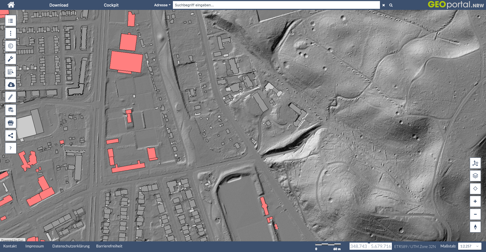

* auto-gen TOC:
{:toc}

```{r setup, echo=F}
library(knitr)
opts_chunk$set(warning = F, message = F, error = F, cache=F)
```

If you work with shapefiles a common practice is to use data provided by environment agencies or other official sources. Often you have to download complete shapefiles with national or county extent. A common theme is that you have to either download huge files and crop out the area of your interest or download a bunch of files that you have to piece together to get to the coverage you need. 

The [**Web Feature Service (WFS)**](http://www.opengeospatial.org/standards/wfs){:target="_blank"} standardized by the Open Geospatial Consortium (OGC) works like a database query for shapefiles. It allows you to download precisely what you need and you can limit the results to your study area.


We will be working with data from the German state Nordrhein-Westfalen (NRW). They provide a Web Feature Service for all their basic geo-data. This includes shapefiles of counties, streets, rivers, buildings etc. All those services can be previewed by going to [geoportal.nrw](https://www.geoportal.nrw/){:target="_blank"}. More can be read in their [manual about wfs](https://www.bezreg-koeln.nrw.de/system/files/media/document/file/geobasis_webdienste_anleitung_wfs.pdf){:target="_blank"} (German text).



# the wsf query

Let's start by loading all the packages that we need for this tutorial:

```{r load packages, cache=F}
library(tmap)      # for plotting maps
library(stringr)   # for string manipulations
library(sf)        # for working with shapefiles
library(plyr)      # for apply functions
library(dplyr)     # for the pipe operator
library(osmdata)   # for getting locations of landmarks
library(units)     # used by osmdata
```

We will start by downloading the [buildings data product](https://www.bezreg-koeln.nrw.de/geobasis-nrw/produkte-und-dienste/liegenschaftskataster/liegenschaftskataster-zentraler-5
){:target="_blank"}.

The base url for this service is `https://www.wfs.nrw.de/geobasis/wfs_nw_alkis_vereinfacht`. We will add the following options to the query:

- `Service=WFS` tells the server that we want to use the Web Feature Service
- `REQUEST=GetFeature` is the request type
- `VERSION=2.0.0` tells which version of the service we want to use
- `TYPENAMES=ave:GebaeudeBauwerk` or `TYPENAMES=ave:Flurstueck` defines the feature type we want to download.
- `COUNT=10000` limits the query and prevents downloads of huge data files. Omit this if you want to download all data.
- `BBOX=356037,5644775,357053,5645791,urn:ogc:def:crs:EPSG::25832` defines the bounding box of the data download. This includes information about the coordinate reference system (crs) in which these coordinates are stated.

# get a bounding box

To get a bounding box we will use the handy `getbb()` function of the [osmdata package](https://docs.ropensci.org/osmdata/){:target="_blank"}. We can give this function a name of a landmark or area and it queries the openstreetmap database and returns a polygon. We than calculate the center of that polygon and add a buffer of 500m around it.

```{r DOM_bbox}
# define coordinate systems that we will be using
UTM_crs <- st_crs(25832)
WGS_crs <- st_crs(4326)

# get polygon of the building "Kölner Dom" which is the central cathedral in Cologne, Germany.
Dom <- getbb("Kölner Dom", featuretype="building", format_out = "sf_polygon", limit=1)

# calculate the center of the polygon
Dom_location <- Dom %>% st_centroid()

# add a buffer of 500m around the center
Dom_location_500m_buffer <- Dom_location %>%
  st_buffer(dist = set_units(500, "m")) 

# calculate bounding box of the buffered zone in the original coordinates
Dom_location_500m_buffer %>% st_bbox()
```


```{r DOM_bbox_UTM}
# transform to UTM coordinates as required by the wfs query
Dom_bbox_UTM <- Dom_location_500m_buffer %>%
  st_transform(UTM_crs) %>%
  st_bbox() %>%
  round()

Dom_bbox_UTM
```


```{r DOM_bbox_UTM_txt}
# convert to a text line that we can use later
Dom_bbox_UTM_txt <- Dom_bbox_UTM %>% paste(collapse = ",")

Dom_bbox_UTM_txt
```

# download wfs data

We will use the `str_glue()` function of the [stringr package](https://stringr.tidyverse.org){:target="_blank"}. This allows us to insert the coordinates into the http request by using curly braces notation like for example `{insert_here}`. We pass the generated url directly to [`read_sf()`](https://r-spatial.github.io/sf/reference/st_read.html) function of the [sf package](https://r-spatial.github.io/sf/index.html){:target="_blank"}.

```{r load shapefiles}
buildings <- read_sf(str_glue("https://www.wfs.nrw.de/geobasis/wfs_nw_alkis_vereinfacht?Service=WFS&REQUEST=GetFeature&VERSION=2.0.0&TYPENAMES=ave:GebaeudeBauwerk&COUNT=10000&BBOX={Dom_bbox_UTM_txt},urn:ogc:def:crs:EPSG::25832"))

property_lines <- read_sf(str_glue("https://www.wfs.nrw.de/geobasis/wfs_nw_alkis_vereinfacht?Service=WFS&REQUEST=GetFeature&VERSION=2.0.0&TYPENAMES=ave:Flurstueck&COUNT=10000&BBOX={Dom_bbox_UTM_txt},urn:ogc:def:crs:EPSG::25832"))
```

# plot data

With the [tmap package](https://r-tmap.github.io/tmap/){:target="_blank"} we can produce a nice plot of this feature set:

```{r tmap plot of buildings}
tmap_mode("plot")

tm_shape(property_lines) +
  tm_graticules() +
  tm_borders() +
  tm_shape(buildings) +
  tm_fill(col="red")
```


# get capabilities

If you discover a new wfs service it is often not clear how it works. Every wfs service has a builtin function to describe it's capabilities, the `GetCapabilities` request. This returns an xml file that we can process in R in the following way:

```{r load capabilities, cache=F}
library(xml2)

capabilities <- read_xml("https://www.wfs.nrw.de/geobasis/wfs_nw_alkis_vereinfacht?VERSION=2.0.0&SERVICE=WFS&REQUEST=GetCapabilities") 
```

```{r show capabilities XML, eval=F}
#remotes::install_git("https://git.rud.is/hrbrmstr/htmltidy.git")
library(htmltidy)

xml_view(capabilities)
```

<style>
pre.highlight{
  max-height: 400px;
}
</style>

```xml
`r paste(readLines("https://www.wfs.nrw.de/geobasis/wfs_nw_inspire-verkehrsnetze_atkis-basis-dlm?VERSION=2.0.0&SERVICE=WFS&REQUEST=GetCapabilities"), collapse = "\n")`
```

We can generate a list of feature types with the following code:

```{r list featureTypes, cache=F}
featureTypes <- capabilities %>%
  xml_find_all("//wfs:FeatureTypeList/wfs:FeatureType")

featureTable <- function(x){
  c(
    Name = try_default({xml_find_first(x, "./wfs:Name") %>% xml_text()}, default = NA),
    Title = try_default({xml_find_first(x, "./wfs:Title") %>% xml_text()}, default = NA),
    Abstract = try_default({xml_find_first(x, "./wfs:Abstract") %>% xml_text()}, default = NA)
  )  
}

ldply(featureTypes, featureTable)
```

As you can see we can extract several features from this service.

We can extract the available coordinate systems (crs) with this code:

```{r}
capabilities %>%
  xml_find_all("//ows:Parameter[@name = 'srsName']//ows:Value") %>%
  xml_text() %>% cat(sep="\n")
```


<!-------
-----------------------------------

# atkis-basis-dlm

```{r}
atkis_capabilities <- read_xml("https://www.wfs.nrw.de/geobasis/wfs_nw_inspire-verkehrsnetze_atkis-basis-dlm?VERSION=2.0.0&SERVICE=WFS&REQUEST=GetCapabilities")
```

```{r show atkis capabilities XML, eval=F}
xml_view(atkis_capabilities)
```

<style>
table{
  max-height: 400px;
  overflow-y: scroll;
  display: block;
}
thead {
	position: sticky;
	top: 0;
	background: white;
}
</style>

```{r atkis FeatureTypes}
atkis_capabilities %>%
  xml_find_all("//wfs:FeatureTypeList/wfs:FeatureType") %>%
  ldply(featureTable) %>% kable()
```

```{r list atkis crsSupported, eval=F, echo=F}
atkis_capabilities %>%
  xml_find_all("//ows:Parameter[@name = 'srsName']//ows:Value") %>%
  xml_text() %>% cat(sep="\n")
```


```{r, eval=T, include=T}
rail <- read_sf(str_glue("https://www.wfs.nrw.de/geobasis/wfs_nw_inspire-verkehrsnetze_atkis-basis-dlm?
                            REQUEST=GetFeature&
                            SERVICE=WFS&
                            VERSION=2.0.0&
                            TYPENAMES=tn-ra:RailwayArea&
                            BBOX={Dom_bbox_UTM_txt},urn:ogc:def:crs:EPSG::25832") %>%
                     str_remove_all("\n")
                   )
```

```{r, eval=T, include=T}
road <- read_sf(str_glue("https://www.wfs.nrw.de/geobasis/wfs_nw_inspire-verkehrsnetze_atkis-basis-dlm?
                            REQUEST=GetFeature&
                            SERVICE=WFS&
                            VERSION=2.0.0&
                            TYPENAMES=tn-ro:RoadArea&
                            BBOX={Dom_bbox_UTM_txt},urn:ogc:def:crs:EPSG::25832") %>%
                     str_remove_all("\n")
                   )
```

```{r, eval=F, include=T}
road <- read_sf(str_glue("https://www.wfs.nrw.de/geobasis/wfs_nw_inspire-verkehrsnetze_atkis-basis-dlm?
                            REQUEST=GetFeature&
                            SERVICE=WFS&
                            VERSION=2.0.0&
                            TYPENAMES=tn-ro:Road&
                            BBOX={Dom_bbox_UTM_txt},urn:ogc:def:crs:EPSG::25832") %>%
                     str_remove_all("\n")
                   )
```

```{r}
tm_shape(buildings) +
  tm_fill(col="red") +
  tm_shape(rail) +
  tm_borders() +
  tm_shape(road) +
  tm_borders() 
```

```{r, eval=F}
read_xml("https://apps.geoportal.nrw.de/csw/service?Service=CSW&Request=GetRecordById&Version=2.0.2&outputSchema=http://www.isotc211.org/2005/gmd&elementSetName=full&id=552109b8-4c8f-41f4-83b0-9d7de8e22fa7") %>%
  xml_view
```

# strassen
```{r}
strassen_capabilities <- read_xml("https://www.wfs.nrw.de/wfs/strassen_nrw?REQUEST=GetCapabilities&SERVICE=WFS")
```

```{r}
strassen_capabilities %>%
  xml_find_all("//wfs:FeatureTypeList/wfs:FeatureType") %>%
  ldply(featureTable) %>% kable()
```


    https://www.wfs.nrw.de/wfs/strassen_nrw?REQUEST=GetCapabilities&SERVICE=WFS 

# ows4R

- [ows4R](https://eblondel.github.io/ows4R/)

```{r load ows4R}
library(ows4R)
```


```{r, eval=F}
inspire_traffic <- "https://www.wfs.nrw.de/geobasis/wfs_nw_inspire-verkehrsnetze_atkis-basis-dlm"
wfs_client <- WFSClient$new(inspire_traffic, serviceVersion = "2.0.0", logger="DEBUG")
```

```{r, eval=F}
wfs_client$getFeatureTypes(pretty = T)
```

```{r, eval=F}
wfs_client$
  getCapabilities()$
  findFeatureTypeByName("tn-ro:Road")
```

```{r, eval=F}
Dom_matrix <- getbb("Kölner Dom", featuretype="building", format_out = "matrix", limit=1)

Dom_bbox <- BBOX$new(Dom_matrix)

wfs_client$getCapabilities()$getServiceIdentification()$getTitle()
wfs_client$getCapabilities()$getServiceIdentification()$getAbstract()
wfs_client$getCapabilities()$getServiceIdentification()$getServiceType()
wfs_client$getCapabilities()$getServiceIdentification()$getServiceTypeVersion()
wfs_client$getCapabilities()$getServiceIdentification()$getKeywords()
wfs_client$getCapabilities()$getServiceIdentification()$getAccessConstraints()
wfs_client$getCapabilities()$getServiceIdentification()$getFees()
wfs_client$getCapabilities()$getFeatureTypes()[[29]]$getName()
wfs_client$getCapabilities()$getFeatureTypes()[[29]]$getTitle()
wfs_client$getCapabilities()$getFeatureTypes()[[29]]$getDefaultCRS()
wfs_client$getCapabilities()$getFeatureTypes()[[29]]$getKeywords()
wfs_client$getCapabilities()$getFeatureTypes()[[29]]$getDescription()
wfs_client$describeFeatureType("tn-ro:Road")

wfs_client$capabilities$getOperationsMetadata()$getOperations()

wfs_client$getCapabilities()$
  findFeatureTypeByName("tn-ro:Road")$hasGeometry
  getAbstract()
  
  
ft <- wfs_client$getCapabilities()$findFeatureTypeByName("tn-ro:Road")
ft.sp <- ft$getFeatures()

wfs_client$getFeatures("tn-ro:Road", count=100, TYPENAMES="tn-ro:Road", BBOX=str_glue("{Dom_bbox_UTM_txt},urn:ogc:def:crs:EPSG::25832"), logger="DEBUG")

read_sf(str_glue("https://www.wfs.nrw.de/geobasis/wfs_nw_inspire-verkehrsnetze_atkis-basis-dlm?Service=WFS&REQUEST=GetFeature&VERSION=2.0.0&TYPENAMES=tn-ro:Road&COUNT=10000&BBOX={Dom_bbox_UTM_txt},urn:ogc:def:crs:EPSG::25832"))
```

```{r, eval=F}
#https://sgx.geodatenzentrum.de/wfs_dlm250_inspire?SERVICE=WFS&VERSION=2.0.0&REQUEST=GetFeature&typeNames=hy-p:Crossing&COUNT=10

wfs_client_sgx <- WFSClient$new("https://sgx.geodatenzentrum.de/wfs_dlm250_inspire", serviceVersion = "2.0.0")

wfs_client_sgx$getFeatureTypes(pretty = T)
#wfs_client_sgx$describeFeatureType("tn-ro:Road")

rail <- wfs_client_sgx$getFeatures("tn-ro:Road", count=100)
class(rail)
tm_shape(rail) +
  tm_borders()
```


```{r}
alkis <- "https://www.wfs.nrw.de/geobasis/wfs_nw_alkis_vereinfacht"
wfs_client_alkis <- WFSClient$new(alkis, serviceVersion = "2.0.0")

#wfs_client_alkis$capabilities$getFeatureTypes()[[1]]$getName

wfs_client_alkis$getFeatureTypes(pretty = T)

#wfs_client_alkis$getDescription()

#wfs_client_alkis$describeFeatureType("ave:GebaeudeBauwerk")

buildings2 <- wfs_client_alkis$getFeatures("ave:GebaeudeBauwerk", count=10000, bbox=str_glue("{Dom_bbox_UTM_txt},urn:ogc:def:crs:EPSG::25832"))

tm_shape(buildings2) +
  tm_fill(col="red")
```


-----------------------
- https://www.bezreg-koeln.nrw.de/geobasis-nrw/produkte-und-dienste/landschaftsmodelle/aktuelle-landschaftsmodelle/digitales-basis
  - https://www.wfs.nrw.de/geobasis/wfs_nw_atkis-basis-dlm_aaa-modell-basiert

- Die INfrastructure for SPatial InfoRmation in Europe (INSPIRE) ist das Vorhaben der Europäischen Union für eine gemeinsame Geodateninfrastruktur in Europa.
- https://gdz.bkg.bund.de/index.php/default/inspire.html

- https://r.geocompx.org/read-write.html

- https://duckduckgo.com/?t=ffab&q=citygml+r&ia=web

- https://basemap.de/
  - https://basemap.de/web-vektor/
  - https://basemap.de/data/produkte/web_vektor/anwendungsbeispiele/baudenkmale_brandenburg.html

----------->
